 Complementar con las cosas de la carpeta

# Clase 1 - Intro a sistemas distribuidos
Ejemplos de arquitectura
- Cliente-Servidor: el servidor no conoce al cliente
- Peer-to-Peer
- Heterogéneo: hay asimetría. Algunos conocen a otros, pero no a todos los dispositivos

Que es un sist distribuido? Es aquel en el que un fallo de un computador que no conocemos, puede dejar al propio computador inutilizable. Por ejemplo, cuando solicito algo y me dice que no esta disponible

Desgloce de terminos:
- Coleccion de pcs -> multiprogramacion
- Independientes -> autonomos en cierta medida
- Un unico sistema -> el usuario se comunica con la interfaz, no conoce como es el sistema
- Sistemas aislados no son distribuidos
- Son colaborativos (comunican y coordinan)
- Intercambian mensajes, lo cual implica protocolo de comunicacion
- Dallo de ccomputador, es por nuevos problemas no deterministicos: RC, fallo hardware, etc

Parametros de diseño (nos dice que sist es mejor que otro)
- Transparencia: cuanto exponemos/ocultamos de lo que hay adentro del sistema. Transparente frente a la ubicacion por ejemplo, que es lo que conoce el usuario
- Tolerancia a fallos: Disponibilidad, Confiable, Seguro y Mantenible que otro sistema
- Acceso a rss compartidos: donde y como se va a dar el acceso a los rss comp, si pueden acceder de forma concurrente o no, etc 
- Sistemas abiertos: que tengan interfaces, interoperabilidad y portabilidad
- Escalabilidad

## Modelos para analisis

- Modelos de Estados: es el conjunto de estados y transiciones de un proceso. En el caso de un sistema distribuido/concurrente, hay que indicar el estado de cada nodo y si pasa una transición, donde se dio esta.

- Modelo de eventos: Modelo de que "ocurrió antes que" otro evento/cosa. Lo que se hace es una lineal de tiempo de como suceden los eventos, y como un evento de un proceso genera un evento en otro proceso. 

OBS-> En paralelismo, cada proceso tiene sus propios recursos y no comparten. Si comparte los rss, es concurrente

## Características de sistemas distribuidos

### Topologías
- Bus: Todos se comunican usando un mismo canal
- Estrella: Todo pasa por nodo central
- Arbol: Hay jerarquia
- Mesh: Todo contra todos. Implica muchas conexiones
- Secuencial
- Anillo

### Centralizado vs distribuidos
Centralizados:
- No tienen conexiones o si las hay, no hay un objetivo comun ni trabajo colaborativos
- Muy dificiles de escalar (mucha plata por escalar recursos)

Ventajas de centralizar:
Hay algunos componentes que no combienen distribuirlos debido a costos, complejidad, etc
- Control: mayor control porque la logica de control es simple, efectiva y eficiente. Es facil conocer todo lo que hace el sistema (distribuido require sist de monitoreo y deben estar sincronizados, sino mas complicado)
- Homogeneidad: Tengo mismo versiones de software y hardware
- Consistencia: Puedo controlar el estado completo del sistema de una forma más fácil, pero una falla en el sistema rompe todo
- Seguridad: disminuye superficie de ataque frente amenazas

Distribuidos:
- Componentes conectados realizando trabajo colaborativo y con objetivo en común
- Si falla un nodo, puede dejar el sistema inutilizable
- Se escala distribuyendo trabajo y recursos

Ventajas de distribuir:
- Disponibilidad: el sistema puede seguir funcionando aunque haya fallos aislados (por ejemplo puedo dar servicio limitado si cae la base de datos)
- Escalabilidad: Es mas facil hacer escalar el sistema si esta diseñado de forma distribuida
- Reduccion de latencia: EJ. Dejo una imagen en un servidor cercano al usuario
- Colaboracion: facil comunicarse con los sist distribuidos que usan interfaces, es facil comunicarse con componentes externos
- Movilidad: como disponibilidad.
- Costo: como los componentes son más simples (al escalarlas), se reduce el costo

Descentralizar vs distribuir
- La descentralizacion implica tener una estructura de "arbol", transfiriendo la toma de decisiones a eslabones inferiores.
- Distribuir implica que la coordinacion de las actividades se da en funcion de lo que nosotros queramos definir con nuestra arquitectura.

Ley de Conway: diseñamos de acuerdo a lo que conocemos y estamos acostrumbrados a hacer en el dia a diseñado

## Virtualizacion
Ver diapo, pero no es importante actividades

# Clase 2 - Multithreading y multiprocessing

## Multithreading 

- Comparten memoria (file descriptors, heap, data segment)

Ventajas:
- Facil compartir informacion entre threads 

Desventajas:
- Alto acoplamiento entre componentes del sistema 
- Escalabilidad limitada
- Poca estabilidad ya que 1 thread defectuoso afecta a todo el sistema 
 
## Multiprocessing

- Los procesos no comparten memoria 

Ventajas:
- Mas escalable y más estable que multithreading 
- Componentes más simples 

Desventajas:
- No es facil compartir informacion entre procesos 
- Sin tolerancia a fallos de hardware/SO

## Propiedades programas concurrentes 

**Safety**: se cumplen siempre 
- Exclusion mutua 
- Ausencia de deadlocks 

**Liveness**: eventualmente se cumplen 
- Ausencia de starvation
- Fairness 

## Mecanismos de sincronización

### Semaforo
- Es una variable usada para acceder a recursos compartidos
- Puede tomar valores >= 0
- Operaciones: signal (aumenta el valor del semaforo / lo libera) y wait (decrementa el valor del semaforo / lo obtiene)
- Si se usa wait sobre semaforo con valor 0, se queda bloqueado

EJ: el mutex, o semaforo binario

### Monitores
Es un mecanismo de sincro que nos permite abstraer al usuario de los mecanismos de sincro para acceder a una entidad.

Un ejemplo practico de esto, es una CondVar. Este tiene un mutex que debe ser adquirido antes de realizar una operación

Operaciones de CondVar:
- acquire(): para tomar el mutex
- release(): libero el lock
- wait(): espero haste que otro proceso despierte
- notify: despierta a un proceso que ese esperando por la condición

OBS-> esto debe estar dentro de un while por si hay spurious wake up

### Barrera
Intentar que un conjunto de procesos se sincronicen entre si para realizar algunas operaciones. Por ejemplo, si quiero que varias computadoras lleguen a la misma parte de código antes de seguir

### Rendezvous
Es un pasaje de mensaje entre 2 procesos, para que ambos procesos puedan seguir. Un proceso se queda bloqueado hasta recibir un mensaje de otro proceso.

Es muy beneficioso usar pasaje de mensaje como mecanismo de sincro.

## InterProcess Comunication (IPC)

- Permiten la comunicacion entre 2 o más procesos
- Salvo sockets, solo sirven para comunicar procesos
- La vida del IPC excede a la vida del proceso, por lo que el usuario debe crearlos y destriurlos

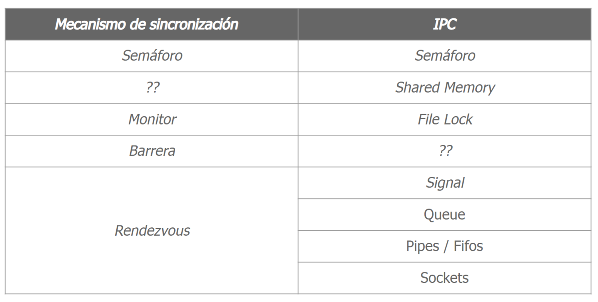

### Signals
- Con comando KILL se le manda a un proceso una señal
- Si tu proceso no handlea la señal, la ignora, salvo SIGSTOP y SIGKILL
- La señal la recibe el thread principal por default, pero se puede cambiar para que otros la reciban o se propaga la signal

### Share memory
- Es un mecanismos del SO para compartir recursos
- Tiene un tamaño y nombre
- Debe usar mutex si 2 procesos quieren escribir al mismo tiempo

### File locks

- Es un mutex para acceder a un archivo
- El lock puede ser exclusivo o no (modo lectura o escritura)
- Todos pueden leer si no hay nadie escribiendo y solo puede escribir si nadie esta escribiendo

### Pipes y FIFOs

- Permite el pasaje de informacion entre 2 procesos
- Unnamed Pipes (pipes): Solo comunica procesos padre e hijo y no excede la vida del procesos
- Named Pipes (FIFO): Comunicacion entre 2 procesos cualquieras y viven en el SO, por lo que excede la vida del procesos

### Messages queues

- Hay proceso que recibe y otro que escriben bloques de bytes
- Campo **mtype**: Indica el tipo del mensaje, donde el sender debe enviar el msg con el campo mayor a 0, mientras q el receptor puede recibir mtype=0 (recibo sin que importe el mtype) o con otro valor > 0 (si importa el mtype)
- Se define el tamaño al crearlos

### Sockets

- Permite la comunicacion entre 2 procesos a traves de un canal de comunicacion
- Doimain: indica el tipo de socket (Unix socket o Network socket -> IPv4 o IPv6)
- Type: define el protocolo a usar (SOCK_DGRAM = UDP, SOCK_STREAM = TCP, SOCK_RAW = da los mensajes pelados, lo usa wireshark por ejemplo)

Una vez creado solo importan 5 parámetros:
- IP y puerto del emisor
- IP y puerto del receptor
- Protocolo usado

## Congestion de red 

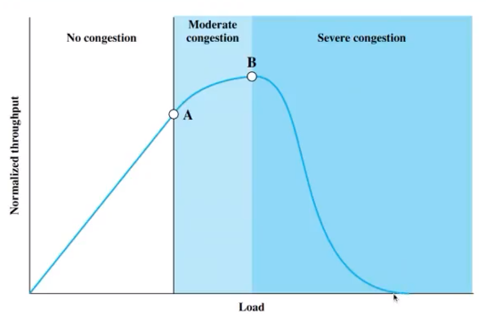

Thtoughput: nos da una medicion de cuanto podemos procesar en el sistema

- Cuando se llege a una congestion moderada, se van a seguir respondiendo más paquetes, pero la velocidad va a ser menor 
- Cuando llegamas a congestion severa cada vez se van a empezar a responder menos paquetes

Una decision que podemos tomar es:
- Escalar el sistema para dividir la carga 
- Descartar paquetes: Si yo se que a partir de cierto punto mi sistema no va a responder porque no puede procesar más, es mejor responder algunos paquetes que no responder ninguno.

## Delay 

- Se mide la latencia que tardamos en responder paquetes 
- Lo que nos interesa es que si la carga va aumentando, el tiempo de delay puede aumentar pero al llegar a un punto debe mantenerse constante. Tenemos que asegurar que el tiempo este bajo un cierto umbral 

# Clase 3 - Multiprocessors, Multicomputing, Comunicaciones y virtualizacion

## Paralelización de tareas

### Objetivos 
- Reducir el tiempo de computo de una tarea
- Incrementar cantidad de tareas que pueden realizarse en paralelo 
- Reducir la potencia consumida al realizar todas las tareas (aprovechar todo el computo)

El camino critico es la maxima longitud de potencia consumida al realizar todas las tareas.

Hay algunos datos que pueden paralelizarse y otros secuencial.
Esta longitud máxima es la que actua de cuello de botella (cota superior sobre la optimizacion)

También define el mejor rendimiento que se puede obtener al realizar un conjunto de tareas

### Ley de Amdhal

Nos dice que toda tarea tiene una parte serial y otra que puede paralelizarse. La parte que se puede paralelizar se la divide en la cantidad de unidades de computo para incrementear el tamaño total de la tarea

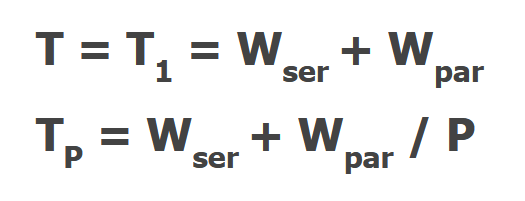

T_p = W_serial + (W_paralelizable)/ P, P = unidades de computo

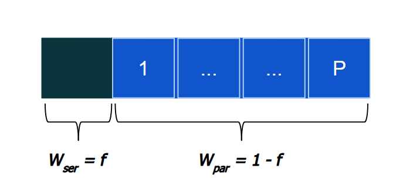

Speedup(S_p): es el ratio de optimizacion maximo de una operacion. En otras palabras, el speedup es el tiempo que nos va a llevar la tarea teniendo 1 sola CPU  (T_1) , dividido por el tiempo que nos lleva la tarea usando P CPUs:

S_p = T_1 / T_p       |         S_p = 1 / f 

OBS -> f = Wserial = # tarea-no-paralelizable / T_1  (o esto esta mal o en las diapos esta mal)

Obs -> si tenemos inf. unidades de computo, nos encontramos con una cota superior, la cual es 1 / fraccion-de-tiempo-no-paralelizable

OBS 2: Amdhal usa muchas suposiciones. Una de ellas es que simplifica el problema (parte serial, parte paralelizable)

### Ley de Gustafson
- Uno no deberia hablas de la # de procesadores disponibles, sino que ver como modelar el problema y ver que hardware necesita para poder resolver ese problema
- Corolario: auentar el paralelismo puede permitir la modificacion del problema original para ejecutar mas trabajo
- Si el paralelismo aumenta, podemos realizar mas trabajo (mayor speedup)
- Si la parte serial disminuye, aumenta el speedup

### Modelo Work-Span

- Es un modelo más cercano a la realidad para estimar optimizaciones que Amdhal
- Provee cota inferior y superior para el Speedup

Supuestos:
- No todo el trabajo paralelizable puede ejecutarse al mismo tiempo (Paralelismo imperfecto)
- Cualquier proceso disponible puede agarrar una tarea (Greedy scheduling)
- Tiempo de acceso a memoria y de comunicacion entre procesos despreciables

Definiciones:
- T_1(work): es el tiempo de ejecutar el trabajo con 1 solo procesadores (todo secuencial)
- T_inf(span): tiempo en ejecutar el camino critico de la operación (camino serial mas largo si hay paralelizacion)

Cotas:
- Superior: min(P, T_1 / T_inf) con P = cantidad de procesos/ unidades de computo
- Inferior: (T_1 - T_inf) / P + T_inf -> Es la paralelizacion perfecta + la paralelizacion  imperfecta. 

OBS-> Mientras más perfecto el paralelismo, menor es la cant de procesos que necesito ejecutar. Si es más imperfecto, no va a cambiar mucho la cant de procesos

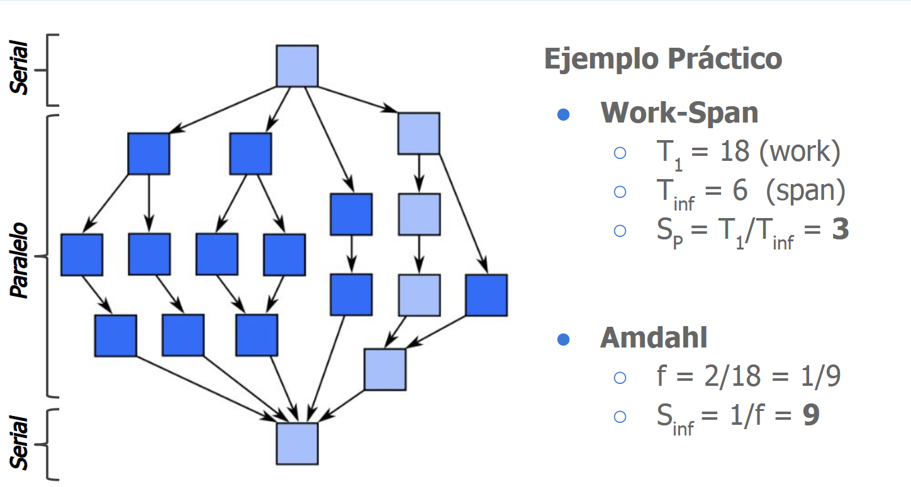

OBS -> En el ejemplo se puede ver que el camino critico es de 6 (azul claro)

Como Work-span tiene en cuenta la topologia del problema, puede hacer mejores estimaciones del speedup (y cuantos procesos vamos a necesitar para realizar la tarea) 

El modelo este nos sirve para poder reducir la potencia de nuestro sistema, es decir, para entender que tipo de hw o procesos necesito asignar al sistema para que funcione de la forma más optima posible y cuando dejar de agregar CPUs por ejemplo.

El peso de cada tarea no esta tenido en cuenta en este modelo (asume que todo tarda lo mismo), por lo que hay que agregarle pesos para que sea más correcta o para ver cual es el verdadero camino critico (al agregar pesos)

### Estrategias de paralelizacion

- Descomposicion funcional: si uno quiere aplicar una funcion a la data, partimos la funcion y la vamos haciendo de forma secuencial. Esto puede ser util si, por ejemplo, necesitamos distintas vistas de la data. (proceso la misma data con distintas funciones paralelamente)
- Particionamiento de datos: Si tengo que procesar un conjunto de datos grande, parto la data en N chunks y asigno cada uno a un thread/proceso, etc. 

### Patrones de procesamiento

- Basados en algoritmos, pero no son muy abstractos, no tienen detalles de implementación y son para un lenguaje x
- Patrones que incluyen otros patrones (nesting)
- Herramientas basicas de trabajo tambien en multi-computing

Patrones:
- Fork-Join
- Pack: me quedo con algunos valores de un array y los agrupo
- Split: Agrupa los valores en 2 cunjuntos separados
- Pipeline
- Map
- Reduction

## Multicomputing
### Taxonomia de Flynn

Es una clasificación de acuerdo a la cantidad de procesadores disponibles y flujos de datos (memoria)
- SISD (Single Instruction Single Data): procesador sin paralelismo
- SIMD (Single Instruction Multiple Data): EJ: GPU o intrucciones que use vectores de procesamiento (operaciones punto flotante, oonde accede a datos de multiples datos de memoria)
- MISD (Multiple Instruction Single Data): Por ejemplo al realizar un misma operacion multiples veces para buscar fallos. Poco comunes
- MIMD (Multiple Instruction Multiple Data): Hay 2 modelos, multiprocessors (memoria y clock compartidos) y multicomputers (no comparten memoria ni clock)

### MIMD

Multiprocessing:
- Symetric: un solo canal de comunicacion entre procesadores y memoria. Problemas: bus de datos limitado (si uno lo usa mucho) y hay varios accediendo al mismo tiempo al banco de memoria
- Asymmetric: Varios buses, un bridge para comunicar con memoria que no le pertenece y un procesador "cerca de un banco de memoria"

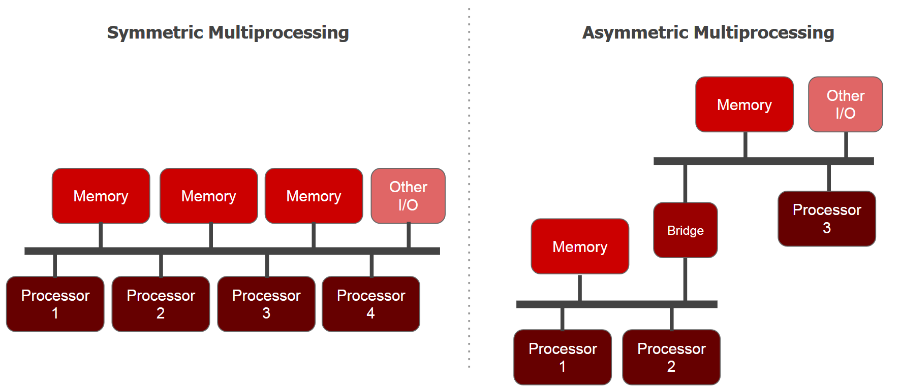

UMA vs. NUMA
- Uniform Memory Access (UMA): mismo tiempo de acceso a memoria a todos los procesadores (1 solo bus compartido)
- 
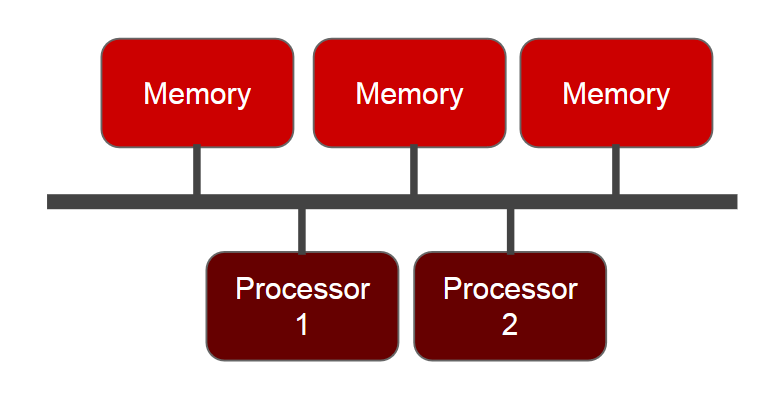

- Non Uniform Memory Access (NUMA): cada CPU tiene su banco de memoria (home agent). Si necesita acceder a memoria de otra, debe comunicarse con ese procesador (costoso). Además, esto es mucho mas escalable.

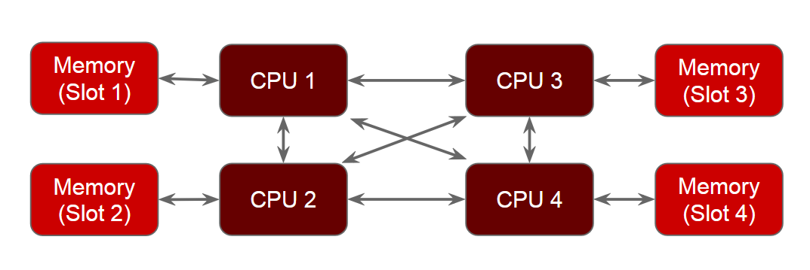

Multicomputing:
- Cada pc tiene su propia memoria local
- Cada pc falla de forma independientes (o falla de red)
- No hay reloj central para ejecutar instrucciones
- Requiere comunicación entre computadoras

## Nombres y direccionamiento

Nombres
- Permite identificar a una entidad dentro de un sistema
- El nombre debe describir a la entidad
- Abstraen el rss de las propiedades del sistema, como por ejemplo las direcciones, el lugar geografico, etc.

Direccionamiento
- Es el mapeo entre un nombre y una dirección 
- La dirección de una entidad puede cambiar, pero no el nombre. 
- La dirección puede ser reutilizada

[Ejemplos en pdf]

# Clase 4 - Interfaces y protocolos
## Layers & Tiers

### Arquitectura de capas
Estas arquitecturas se suelen hacer porque:
- Permite dividir el problema en sub-problemas. Cada capa es una solucion de un sub-problema 
- Fomentar el uso de interfaces para que se comuniquen las capas (permiten el intercambio de componentes)

Hay 2 tipos de separacion de capas:
- Layers (capas logica)
- Tiers (capas física)

### Layers

Es la separacion logica que se le da a un sistema y permite agrupar componentes y funcionalidades en pequeñas capas.

[img](images/image-20250121200122.png)

Esta division pueden ser verticales (hay jerarquía) y horizontales (tocan varias capas verticales). Hay una jerarquia en las capas verticales, porque establecen la comunicación entre estas. Una capa N le provee servicios a la capa de arriba y usa las capas inferiores (N-1). La funcionalidad de las capas más bajas, son muy sencillas (mientras más arriba, más compleja son las cosas implementadas)

La capa N puede hacer llamadas hacia abajo (downcall) y responder a llamadas de la capa N+1 (response). La capa N puede hablar con la capa de arriba excepcionalmente (Upcall), lo cual puede traer problemas porque implicaría hacer por ejemplo, un import circular: la capa N importa a N+1 y N+1 importa a N, lo cual confunde quien depende de quien. (Quizás en este caso es mejor tener 1 sola capa)

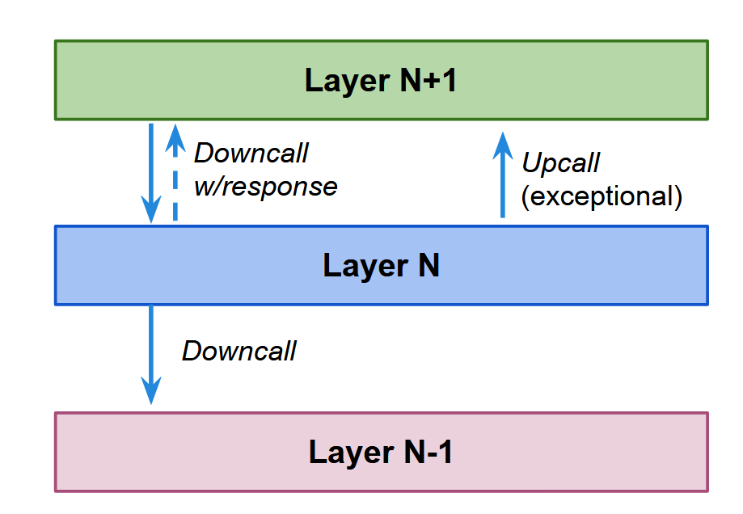

OBS-> para hacer una Upcall, es necesario tener una especie de callback para disparar el evento en la capa de arriba. 

__Responsabilidades__:
Cada capa/modulo debe tener un conjunto limitado de cosas que hace (y hace bien) y debe haber coherencia y cohesión entre las funciones 

### Tiers

Describen la distribución física del sistema. Cada caja/tier es un nodo o servidor y estos se puede comunicar entre sí (puedo indicar el protocolo usado en el diagrama). Por lo gral, hablan de relación de dependencia (aristas dirigidas).

Dependiendo de cuantos tiers tenga el sistema, se puede decir que tengo una arquitectura de 2-Tiers (cliente -> DB por ejemplo), 3-Tiers (Client-> logica de negocio -> DB), etc.

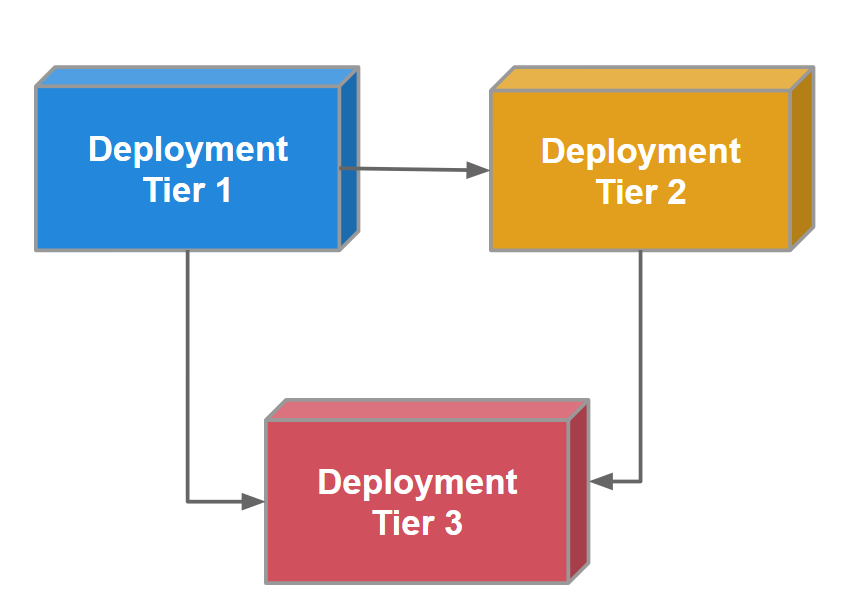

### ¿Como combinamos ambos modelos?

Como son dos vistas distintas del mismo problema, pueden combinarse. Dentro de cada Tier, tenemos los layers que le corresponden a ese Tier 

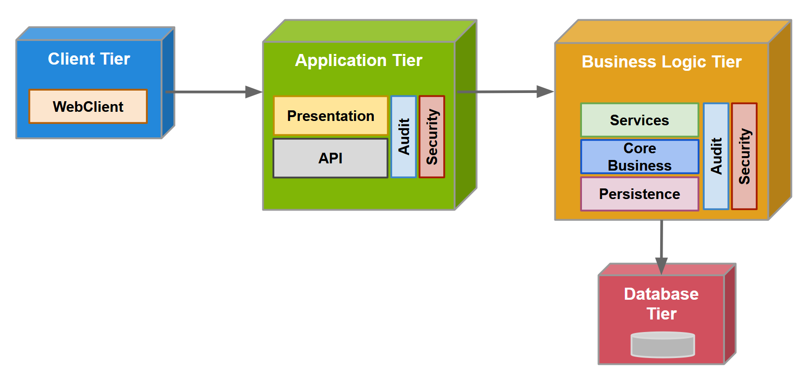

## Interfaces
- Son elementos que nos permiten comunicar 2 o más componentes y definen un contrato
- Dentro del contrato, la interfaz solo expone un parte del sistema (lo que queremos que sea publico), no todo. La parte que queremos que sea privada, no queremos que la use cualquiera y me permite hacer cambios internos sin avisar (ya que sigo cumpliendo el contrato)

**Tipos de interfaces**

- Inter-Aplicaciones(API): contrato entre distintas apps. Me da un punto de acceso para que otra app reutilice la API que es un aplicación que esta sola.
- Intra-Aplicaciones: Layers que hablan entre si, mensajes entre objetos (algunos remotos), pero la aplicacion es única. Si no esta todo, no funciona como aplicación

**Problemas a resolver** (consideraciones al escribir el contrato)

- Software es dificil de integrar, ya que si yo expongo todo el sistema con la interfaz, la complejidad de integrar aumenta exponencialmente con esos elementos que estoy mostrando. Mejor es hacer interfaces pequeñas que vayan al grano.
- Software es dificil de cambiar: si yo defino una interfaz y luego nos damos cuenta de que tenemos que cambiarla, tenemos un problema grande. Una intefaz flexible se adapta a los cambios que hacemos, pero un interfaz cerrada que no se adapta a los cambios, hace complejo su uso (alto acoplamiento). 

__Orientacion del contrato__ (orientado a API)

- **Orientado a entidades**: apunta a los objetos/entidades/clases que viven en la aplicacion. La ventaja de esto es que hay desacoplamineto entre sistemas, es flexible y admite extenciones a funcionaidades no definidas completamente
- **Orientado a procesos**: apunta a las acciones/tareas de procesamiento que puede ejecutar la app. En este caso, los componentes estan altamente acoplados y se conoce la funcionalidad, tiene como objetivo la performance

__Clasificacion de interfaces__
- Web APIs: REST(HTTP + JSON) o Web services based API (HTTP + SOAP)
- Remote APIs: Custom TCP/UDP, Object Oriented (CORBA, JavaRMI), Procedure Oriented (RPC, gRPC)
- Frameworks (library oriented): Java API, Android API
- OS related: POSIX

## Protocolos

### Modelo HTTP

Es un modelo cliente-servidor donde hay un elemento que hace el request (cliento) y otro elemento que responde (servidor). El servidor no manda pedidos a cliente (request-reply). 

Es un modelo sin estado en el protocolo (los request son idependientes) y se usa un verbos para los pedidos (GET, POST, PUT, etc.)

### Responsabilidades por capa

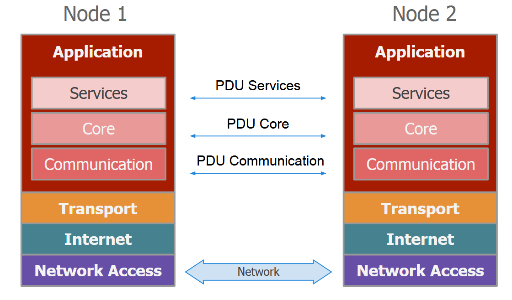

- Aplicación: Esta capa sabe que usa HTTP, las demás no (solo encapsulan)
- Transporte
- Internet
- Network Access
- Network: manda mensajes HTTP

__Protocol Data Unit (PDU)__
Son los elementos que intenta mandar.

Tipos de encapsulamiento:
- Encapsulacion exacta: el payload de mi capa es todo lo de la capa anterior. Reservo el espacio exacto de lo de la capa de arriba
- Segmentacion de paquetes: sirve si tengo que enviar un paquete mayor al limite. Lo que se hace es dividir el paquete en varios trozos (aumenta chattiness y tamaño de mensajes)
- Blocking de paquetes: espero muchos paquetes de la capa superior y los voy guardando  hasta que se llene el bloque reservado

Estos encapsulamientos, pueden hacerse en la capa de aplicacion (debe tenerlo enconsideracion)

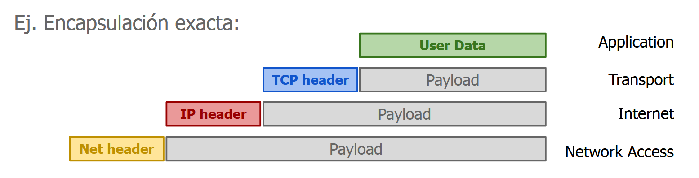

## RESTful

- Protocolo basado en entidades donde cada recurso se lo representa en una URL y  utiliza HTTP/S YJSON/XML para serializar.
- Los cambios de estados se hacer mediante operaciones CRUD

Objetivos 
- Alta performance, escalabildad y confiabilidad

Principios de arquitectura
- Cliente-Servidor
- Cachear objetos para optimizar performance
- Interfaz uniforme (HATEOAS)
- No tiene estado 
- Sistema en capas

 Identidad
 - No es el nombre del objeto, es un identificador único para poder identificarlo univocamente.
 - El identificador debe tener informacion sobre la identidad que referencia
 - El nombre puede cambiar, pero la identidad no
 - La URL nos define la identidad de la entidad, no el identificador (URI)

Relaciones
- Identificar correctamente una entidad ayuda a integrar sistemas
- Usar URIs para identificar entidades (EJ: /pet/{ID})

Verisonado de APIs
- Se usa semantic versioning
- MAJOR.MINOR.PATCH

Tipos de versionados de API:
- Explicito en URL: facil de usar y testear y RESTful
- Versionado en el HTTP Accept Header: dificil de testear

Vesionado de Objetos
- Format versioning: la API brinda distintas representaciones de una misma entidad con distinto formato
- Historical Versioning: la misma entidad tiene distintas versiones que fueron almacenadas

# Clase 5 - Mensajes, Grupos, Middlewares y MOMs

## Mensajes

### Formatos de mensajes

__Binario__
- Las ventajas de usar este tipo de mensajes, es la alta performance (tamaño de mensajes es eficiente. Encodeo int como un int y no como string)
- Uno de los problemas que tiene es la serialización, ya que necesitamos de una herramienta para serializarlos las cuales pueden no tener soporte para todos los lenguajes
- Respecto a la interaccion, enviar mensajes binarios requiere de un cliente especifico ya que necesitamos poder decodear los mensajes para leerlos

__Texto Plano__
- Una desventaja es que tiene baja performace (throughput bajo) ya que hay datos que al ser enviados como string no tienen tamaño eficiente y en el caso de comprimir los mensajes, se agrega un overhead.
- La ventaja es que es facil de serializar y se pueden usar formatos human-readable como JSON y XML
- En cuanto a la interacción, es muy facil de debuggear y es facil trabajar con nuestros servidores ya que requiere de un clinete único que sepa a trabajar con el protocolo

### Longitud de paquetes

- Bloques fijos: cada dato a enviar tiene una longitud fija, son faciles de serializar (sabemos que primero viene un int y que ocupa x), pero no es óptimo con strings de longitud variable (me limita la cantidad maxima y si envio algo menor desperdicio espacio)
- Bloques dinamicos: consiste en usar un separador o enviar la longitud del parametro para poder ver cuando empieza y termina un campo (agrega overhead estos metodos)
- Mixto: consiste en dejar a los parametros fijo y otros variables (con delimitador o longitud)

## Grupos de comunicacion

- Nos permiten ver un grupo de proceso como una abstraccion, para comunicarse con todos a algunos de los procesos del grupo.
- Los grupos deben ser dinámicos, es decir, debemos poder crearlos y destruirlos en cualquier momento. Para esto se necesita 2 primitivas: que las entidades puedan suscribirse y desuscribirse al grupo 

### Difusion de mensajes

Uno a uno
- Unicast: comunicacion punto a punto (cliente servidor por ejemplo)
- Anycast: uno solo del grupo recibe el mensaje, por lo general es enviar al "nodo más cercano" (ECMP)

Uno a muchos
- Multicast: solo aquellos que se encuentran en el grupo reciben el mensaje. El mensaje se envía a algunos
- Broadcast: todos reciben el mensajes (entiendo que todos los del grupo, pero es asi?)

### Topologia

Para poder comunicarse, existen diferentes topologías
- Anillo: un nodo solo se conecta a otro. Ventaja, disminuye conexiones, pero aumenta chattiness
- Punto a punto: todos se conectan con todos
- Grupo jerárquico: estructura de arbol, donde la raiz envia mensaje hasta que se propaga a todos los nodos necesarios. 

La difusion de mensajes puede ser descentralizada, donde un nodo le envia un mensaje a otro y ese le envia los mensajes a los demas, y difusion centralizada, donde la raíz manda el mensaje a los nodos que quiere que reciban ese mensaje.

### Atomicidad de mensajes

En caso de que queramos enviar consistencia fuerte al enviar un mensaje, debemos garantizar que el mensaje le llegue a todos o a ninguno.

En caso de que no llegue, necesitamos hacer reintentos, lo que requiere saber quienes no lo recibieron. Por eso, se usa ACK en los mensajes.

Se debe hacer reintentos ante la caída de receptores, del coordinador o al no recibir mensajes o un ACK.

## Middlewares

Es una capa de software que permite comunicar componentes de un sistema a traves de la red. Esta se encuentra entre el sistema operativo y la capa de aplicación y nos abstrae la comunicación en el sistema.

### Objetivos
- **Transparencia**: queremos ocultar la distribucion del sistema para que responda como si fuese una unica computadora 
- **Tolerancia a fallos**: queremos sistemas confiables que se comporten de manera predecible aunque haya fallos (que el sistema siga funcionando ante fallas, aunque implique que no se completo).
- **Acceso a recursos compartidos**: de forma eficiente (respuestas esperables), transparente (no me importa donde esta guardado) y controlado
- **Interfaces**: deben ser conocidas y en caso de cambiar una tecnología, se siga respetando la interfaz. Deben ser claras y favorecer la portabilidad
- **Comunicacion de grupos**: permitiendo broadcasting y multicasting en los grupos, facilitando la localizacion de elementos y coordinacion de tareas

### Tipos de Middleware

__Centralizado__
- El middleware es un conjunto de servicios
- Esta centralizado en un grupo de hosts
- Se usa una librería para que los clientes se comuniquen con el middleware

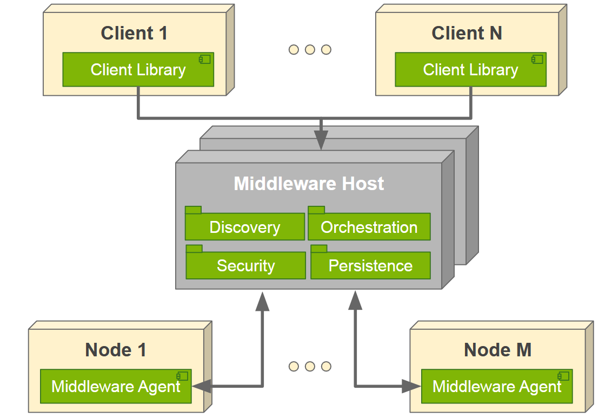

__Distribuido__
- Los nodos tienen codigo enbebido del middleware
- Es más compleja
- Los componentes del discovery, etc estan distribuidos en los nodos. Es decir, el middleware esta en todos los nodos
- El sistema es más flexible (escalable)
- Es dificil de mantener

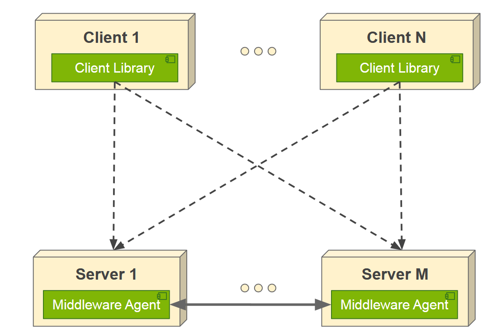

### Clasificacion de middlewares

Clasificacion segun lo que ofrece/hace el middleware

#### Transactional Oriented

- Garantizan transaccionalidad de operaciones respecto a datos 
- Conectan fuentes de datos y permiten acceso transparente al grupo
- Poseen politicas de reintentos y retencion de datos frente a caidas

(Se usaba mucho con DBs)

#### Object Oriented

- Se tienen objetos distribuidos que se comparten entre nodos
- Los objetos viven en el middleware y los clientes lo modifican mediante mensajes. Si lo cambia un cliente, se debe cambiar en todos (clientes tienen referencia al objeto)
- Para poder transmitir los cambios, se usa un esquema de marshalling

#### Procedure Oriented

- La idea es similar a la de objetos, pero el middleware guarda servicios/funciones que que no requieren estado interno
- Trabaja como si fuese un servidor de funciones 

#### Message Oriented

- Funcionan como sistema de mensajeria (de grupo) de forma transparente entre las apps que lo usen
- Pueden enviarse mensajes bajo un tópico para que los interesados lo reciban (modo Information Bus)
- Pueden enviarse mensajes a una queue definida (modo Queue)

## Message Oriented Middlewares

- Resuelven problemas de transparencia respecto a ubicacion, fallos ,performance y escalabilidad

### Centralizado vs distribuido 

- En el caso centralizado, tiene la ventaja de que es facil de monitorear el pasaje de mensajes mediante el broker
- La desventaja del centralizado es que es menos performante y dificil de escalar el broker (mientras mas apps y msg hay que agrandar el broker)

- Si el sistema es distribuido, mientras mas apps, va a aumentar la infra del middleware

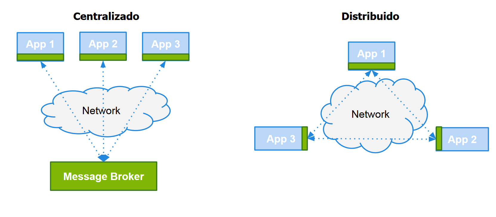

### Tipo de pasaje de mensajes

Bus de Informacion
- La app se conecta al Bus de mensajes y agrega mensajes con un identificador
- Los procesos que requieren leer mensajes, le piden mensaje al Message Bus con una etiqueta específica (como publisher-subscriber)
- No garantiza que los mensajes lleguen ordenados

Colas
- Hay orden de los mensajes
- Los nodos se comunican mediante colas (con nombre). Uno manda mensajes a una cola y otro lee de esa cola 
- Puede garantizar persistencia si se lo indica, para que no se pierda el mensaje si no hay nadie consumiendo de la cola 

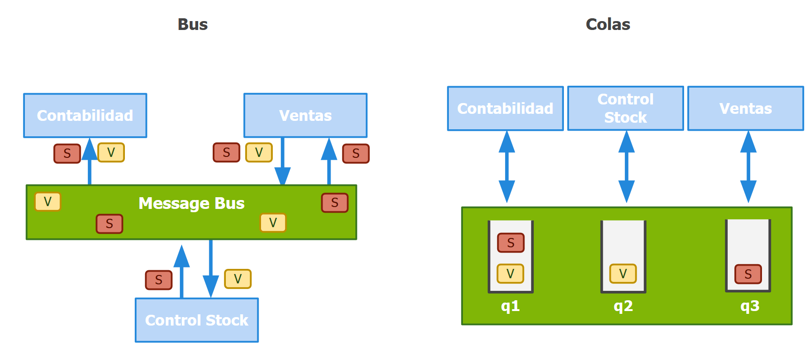

### Sincronico vs asincronico

Sincronico
- La conexion entre sender y receiver se modela como punto a punto (con ACKs), lo que permite obtener respuestas instantaneas ante un pedido
- La desventaja es que si el receiver esta caido o no esta conectado, no se guarda el mensaje hasta que lo reciba, sino que tiene que reintentar cuando vuelva a conectarse

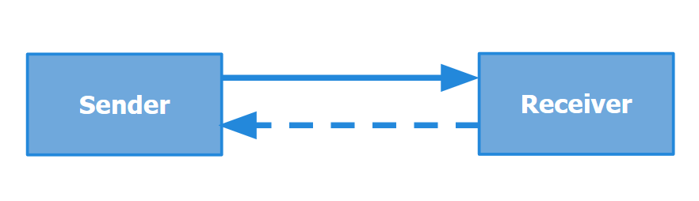

Asincronico 
- La ventaja es que se modela con colas, garantizando orden y persistencia del mensaje si no esta activo el receiver (soporta periodos de discontinuidad)
- No hay comunicacion directa, una envia a una cola y otro recive de la cola.
- La desventaja es que el sender nunca sabe que el mensaje le llego al receiver, pero se se puede hacer creando una nueva cola para avisar eso

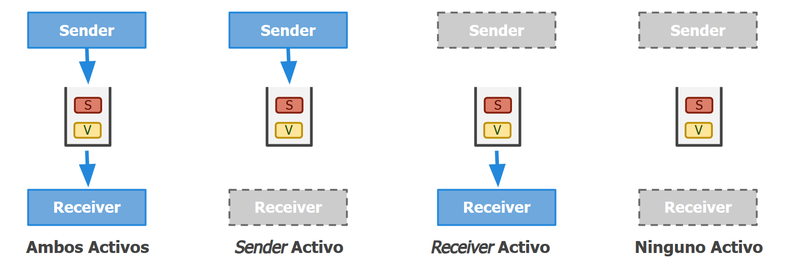

### Operaciones
- Put: publico mensaje
- Get: espero bloqueado hasta recivir mensaje
- Poll: reviso si hay mensaje pendiente, sin bloquearme
- Notify: asocio un callback que se ejecuta cuando se reciven ciertos mensaje

### Colas y brokers
- Debido a que el sender y receiver no se conocen. Entonces, para comunicarse necesitan de una cola (conociendo el nombre generalmente)
- Las colas no son infinitas, tienen un limite.
- Puede haber varias colas dentro del MOM
- El broker nos garantiza que el mensaje se persista en el middleware hasta que alguien lo lea.
- El receiver puede enviarle al middleware un ack para indicar que ya proceso el mensaje 
- Algunos clientes tienen colas privadas/anonimas intermedias para facilitar los mecanismos de comunicación

### Brokers 
- Provee transparencia de localización tanto al emisor como al receptor (tiene colas y mensajes guardados)
- Soportan logica para filtrar mensajes
- Brindan un punto de control y monitoreo 

# Clase 6 - RabbitMQ, Diagramas y documentación técnica (Omitido)

- La documentacion verlo despues, por lo gral no toman nada de eso (salvo DAG)
- Lo de rabbit es un ejemplo de como hacer cosas y como funciona (ver si hace falta)

# Clase 7 - Patrones de Comunicación y ZeroMQ (MOMs )

## Patrones de comunicación

### Request-reply

- Es el protocolo usado al hacer Cliente-Servidor
- Por default, ss un protocolo sincronico (bloqueante), donde el cliente envia una request al servidor y el servidor recibe el request, lo procesa y envia la respuesta. 
- El cliente queda bloqueado hasta que reciba la respuesta del servidor. 
- El reply message funciona como un ACK

Tambien puede implementar de forma asincrónica, donde se necesita 2 Request-Reply sincrónicos:
- Primero se envia la operacion a realizar 
- Luego se envia una request para obtener los resultados

En este caso, el servidor encola el request recibido y envia un ACK al cliente. Al enviar la primera request, el cliente debe esperar el ACK bloqueado, pero es mucho más rápido que esperar la respuesta. Cuando pregunta el estado, puede recibir el estado o que no esta disponible todavía.

OBS -> En algunos casos, el server puede rechazar el request si, por ejemplo, tiene la cola de requests llena

#### Estructura de los mensajes

Por lo general, los siguientes campos son obligatorios:
- messageID: 0 o 1 si es request o reply respectivamente
- requestID: autoincremental o UUID (no debe colisionar)
- operationID: identifica la operacion a realizar 
- Argumentos: relacionados a la operación

#### Tolerancia a fallos 

Cuanto se debe esperar por un reply? Pudo haberse perdido el request o el el ACK (en el caso async)
- Timeouts con Retry (usando exponential backoff + jitter). El jitter agrega ruido a los valores del backoff

Que pasa si pierdo request o reply?

| Reintento Request | Filtro duplicados | Retransmision | Mensaje recibido?  |
| :---------------: | :---------------: | :-----------: | :----------------: |
|        No         |   No implementa   | No implementa |       No se        |
|        Si         |        No         | Re-ejecucion  | Por lo menos 1 vez |
|        Si         |        Si         |  Retransmion  |     Solo 1 vez     |

OBS -> Hay que tener encuenta si al realizar una operación cambia el estado de un sistema, si la operación es idempotente, no pasa nada si recibo la operacion duplicada.

### Publisher-Subscriber 

Es un modelo de comunicación por eventos entre productores y consumidores

- **Publisher (Producor)**: son los emisores información o generan un evento.
- **Subscriber (Consumidor)**: son los receptores y espera a que aparezca un evento de su interés sobre el cual van a realizar alguna acción

#### Arquitecturas

- **Basada en tópicos**: la publicación y suscripción indicando el tópico/tag del mensaje. A los clientes le llegan los mensajes de los tópicos a los que se subscribió
- **Basado en canales**: publicaciones y subscripciones orientados a canales específicos. Al cliente se subscribe a un canal y recibe lo que se envía a ese canal. Ejemplo: para enviarle a un cliente en especifico, donde el cliente tiene su propio canal/cola

### Pipelines & Filters

- Los datos de entrada forman un flujo donde distintos filters (transforman los datos) se conectan entre si para procesarlos de forma secuencial.
- Ejemplo: cat in | grep pattern | sort | uniq > out 

#### Modelos de procesamiento

- **Worker per Filter**: se asigna 1 pool de workers (o uno solo) a cada filtro/etapa del pipeline. Los items los recibe el worker, lo procesa y lo manda a la siguiente etapa 
- **Worker per Item**: se asinga q unidad de procesamiento (o pool de workers) a cada item, donde un worker toma un item y lo acompaña por todo el pipeline, aplicandole los filters paso a paso.

Desde el punto de vista del item, va a tener menor tiempo hasta que sea procesado en el worker per filter, ya que en worker per item tengo que esperar a que termine todo el pipeline antes de que agarre otro.

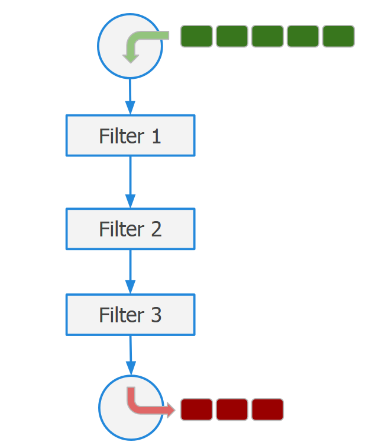

#### Etapas del pipeline

Cada filter funciona como una etapa, pudiendo ser del tipo:
- **Paralela**: cada item a procesar es independiente de los anteriores y no nos interesa el orden 
- **Secuencial**:  no puedo procesar más de un item a la vez, y cuando ya los proceso los puedo devolver ordenados o no.

Si hay cuello de botella, podemos escalar horizontalmente ese filtro.

El tiempo de ejecución va a estar limitado por el stage más lento

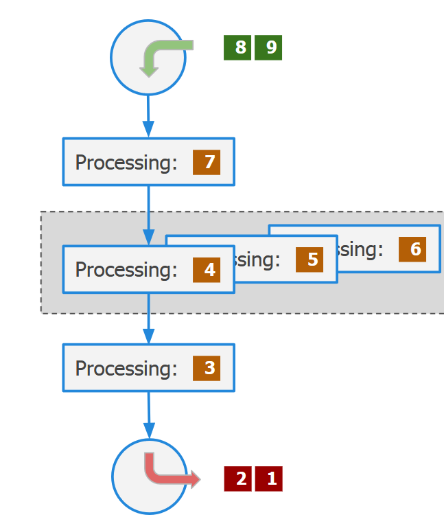
#### Ventajas
- Podemos procesar datos sin que estén todos todavía.
- Permite trabajar con flujos ilimitados de información con cantidades constantes de memoria

### Direct Acyclic Graphs (DAGs)
- Se usa para modelar un flujo de datos, donde cada nodo es una tarea y cada arista el flujo de información
- Permite indicar dependencia entre tareas: A se ejecuta después de B
- Permite identificar camino crítico (camino más largo de tarea secuencial que podemos hacer)
- Permite ver que tareas puedo paralelizar
- Admite *lazy loading*: una operación solo se va a ejecutar cuando sea necesario (cuando están listas las dependencias)
- Se pueden usar lineas de puntos para modelar dependencias y ver si hay deadlocks entre los procesos. Las dependencias implican la posibilidad de bloqueo frente al pedido del recurso de un proceso a otro.

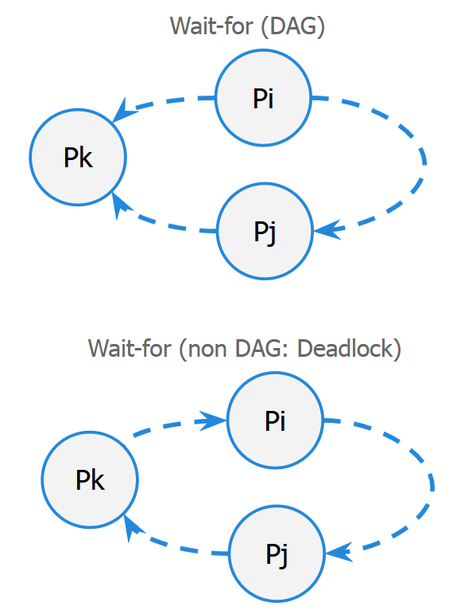

# Clase 8 - Arquitecturas distribuidas simples
Ejemplos de CORBA Y RMI ??

## Cliente-Servidor

- Hay dos roles (jerarquía):
  - Servidor que provee servicios y es pasivo
  - Clientes que envían pedidos al servidor y son activo, es decir, inicia la conversación con el servidor
- Permite la centralización en la toma de decisiones. Tambien se puede extender donde el server es cliente de otro server.
- Se asume que el servidor tiene mayor capacidad de hardware que los clientes

### Flujo de comunicación

- Los clientes deben conocer la ubicación del servidor para comunicarse.
- En caso de que un cliente quiera hablar con otro, deben hablar con el servidor, por lo que no pueden establecer un flujo directo para optimizar el flujo de red.
- Variante: cliente envia request a un servidor , el servidor demora la respuesta hasta que pueda responderla (el cliente se bloquea). Esto se llama long polling.
- Otra variante es que el cliente haga polling, preguntando hasta que este la respuesta 
- Push notification:  los clientes saben que puede haber mensajes para ello, haciendo long polling o un polling normal esperando la notificación. Luego dentro del cliente se ejecuta las acciones de respuesta.

## Peer-to-Peer

- No hay jerarquia entre elementos, todos son pares porque estan realizando trabajo colaborativo (procesar, decidir, compartir algo) y tienen capacidades similares. 
- Tienen un protocolo acordado entre las partes (mensajes y como ubicar a las otras partes)
- Un nodo puede no hablar con todos si quiere para optimizar la cantidad de conexiones 

### Flujo de comunicación
- Protocolo define el discovery, por lo que es más dificil hacer la comunicación entre pares
- Por lo general, se usa en un esquema mixto con cliente-servidor, donde el servidor se usa como registro para que diga con quienes puede hablar. Esto implica que se debe preguntar cada tanto si cambió algo relacionado al registro y con quien hablo
- Por lo gral, se requieren mayores permisos de networking cuando se comunican peer-to-peer ya que no hay un sysadmin que regule eso en los distintos peers ya que no son servidores.

## RPC (Remote Procedure Call)
Complementa a las arquitecturas anteriores.

- Es una arquitectura orientada a que pueda existir la ejecución de un procedimiento de forma remota. La idea es que no tengo los recursos para resolver algo, entonces ejecuto el procedimiento (funcion o procedure) que puede retornar resultado en otro limitado
- Los procedimientos tienen argumentos y el que los ejecuta debe esperar a que termine para poder interactuar con ese resultado.

La idea es tener un modelo cliente-servidor donde alguien quiere invocar una operación en el servidor y tanto la invocación como el resultado deben tener algún esquema tipo protocolo patrón que se pueda usar y reutilizar. Este protocolo debo poder encapsularlo como middleware para que la ejecución sea transparente frente al resto del código.

### Interface Domain Language (IDL)

La idea es que con un lenguaje se pueda definir cuales son los elementos que transforman una entrada en una salida y cual es la estructura de los datos de entrada y salida esperados para esa operación.

De esa forma se definen los procedimientos, y el pasaje de argumentos es por valor y no pueden ser modificados del otro lado, por lo que no tiene sentido usar punteros o referencias.

El protocolo es importante y debe ser igual para ambos extremos para simplificar todo, eligiendo alguno de los estándares existentes (algunos pueden serializar a binario o texto plano).

[Ejemplo: min 7]

- Hay funciones que se pueden extraer ya que no afectan al uso del código que lo invocan y permite dejar definido algo que puede hacerse muchas veces.
- Permite cambiar de un lenguaje a otro sin cambiar la definición, el nombre del método y el tipo de retorno, ni como se serializa la información, hace que sea fácil  adaptarlo a múltiples lenguajes

### Tolerancia a fallos

- A diferencia de las llamadas locales (LPC), la operacion puede o no ser ejecutada
- Se debe ser tolerante a fallos como que un mensajes se caiga en el camino, teniendo que reintentar. 
- Se puede tener un escenario request-Retry, teniendo en cuenta que pueden haber duplicados (el server debe poder filtrarlos o garantizar que no se ejecuta varias veces la misma operación. Tambien puede hacerse del lado del cliente).
- Hay que tener en cuenta timeouts o cantidad de respuestas con el fin.

[Tabla que esta en la clase anterior sobre retransmisión]

### Entidades / Implementación

- **Cliente**: se conecta a un stub/proxy para realizar llamadas al servidor
- **Servidor**: Se encuentra conectado a un stub del cual recive parametros y tiene la logica para ejectuar determinados procedimientos 
- **Stubs**: se encarga de serializar/deserealizar la operacion (marshalling), enviar la informacion al modulo de comunicación para transferir la información
- **Modulo de comunciación**: abstrae al stub de la comunicación con el servidor

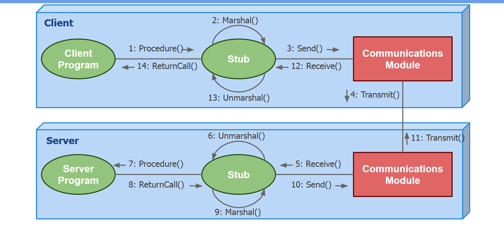

OBS -> este diagrama se llama "Diagrama de colaboración", los mensajes tienen orden temporal y están en proximidad física (no temporal como en el diagrama de secuencia)

### gRPC
(Es un ejemplo nomas)

- Se esta volviendo más popular este protocolo de RPC.
- Usa HTTP2, protocol buffers para encodear
- Realiza conexiones punto a punto donde se debe conocer al servidor
- Los servicios y mensajes estan definidos en archivos .proto (Para generar los archivos en los distintos lenguajes)
- Esta diseñado para alta performance y micro servicios

## Distributed Objects

Los servidores no ofrecen servicios/procedimientos sino objetos 

- Debe haber un middleware que hay un objeto remoto al que le puedo invocar operaciones. Este middleware oculta la complejidad de referencia a objetos remotos, invocación de acciones, excepciones y recolección de basura.
- Puede guardar varios objetos.
- Permite realizar manejo de errores, arrojando una excepción del lado del cliente.

Ejemplo de estándar: CORBA (min 8:10)
Ejemplo RMI (java). (min 20) 

## RPC vs Distributed Objects

RPC
- Es stateless

Distributed Objects
- Es stateful, los cambios en los estados del objeto deben perdurar mientras se use el objeto
- Se puede hacer migración y replicación de objetos para optimizar la performance

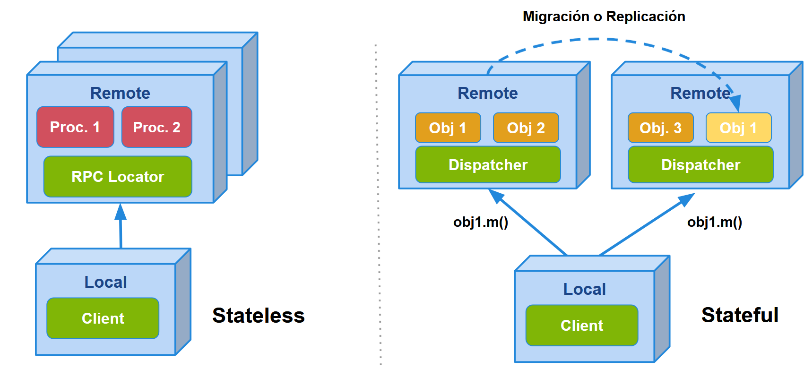

Se podría buscar en todos los servidores los procedimientos/objetos, con el fin de que los clientes sepan donde esta, como se invocan y que tienen.
 
# Clase 9 - Distribución y coordinación de procesos 

## Coordinación de actividades

 **Coordinación**: escenario donde las tareas se dividen. Una tarea tiene subtareas y el nodo que se encarga de dividir las tareas termina funcionando como un orquestador y define como se fragmenta la tarea, para que luego otro elemento lo consolide (hace un join de las respuestas) y de un resultado final.
 
 **Replicación**: Las tareas se replican para que en cualquier caso nos de el mismo resultado. Se utiliza cuando se debe tomar una decisión importante, la cual esta afectada por la randomicidad de la información o cuando se quiere tener un resultado si o si luego de cierto tiempo. Puede que los distintos nodos en los que se replica la info, pueden tener distintos algoritmos. También pude ser por desconfiar del resultado ya que los componentes pueden fallar, etc.

**Acceso a recursos compartidos**: una estrategia utilizada cuando todos tiene que acceder a un elemento, lo mejor es poner colas y serializar los pasos, para luego ejecutar los pasos.

 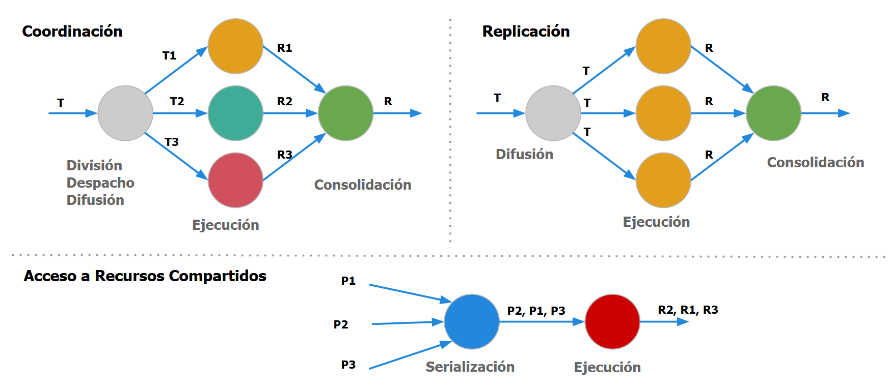

## OpenMPI

 Es una interfaz que permite realizar operaciones simples que permiten serializar/difundir/replicar, etc. y dejar que la lógica de transporte de información y ejecución de esos procesamientos ocurra en paralelo mediante el framework.

Se usa como una librería (es un middleware) con abstracciones de uso general. Son operaciones para recibir, enviar, broadcastear, gather o esparcir informacion de alguna manera.

OBS -> OpenMPI implementa un middleware de comunicación de grupos.

Todo esto tiene la siguiente arquitectura de despliegue:

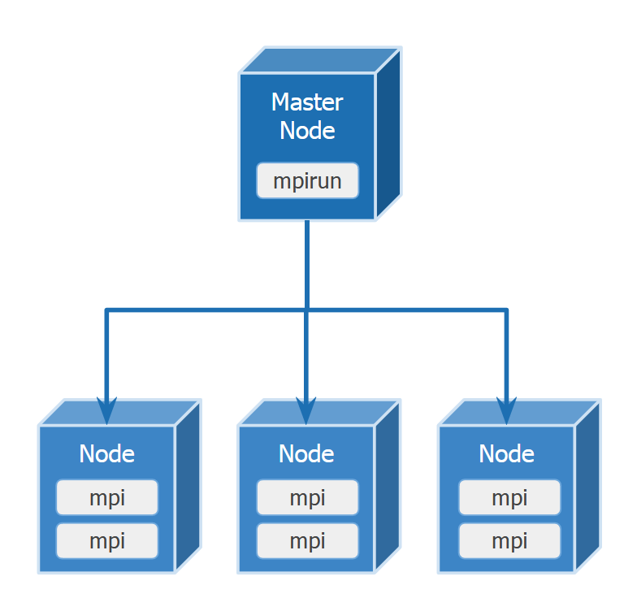

Hay N nodos donde MPI va a estar corriendo y el nodo maestro.

Algunos comandos:
- Send 
- Recv 
- Bcast 
- Scatter: dado que quiero separar la informacion, lo que hace es un split de la información a los distintos nodos. La operacion se realiza en todos los nodos. Solo el master envía y tiene un buffer con la info. Hay datos de ese buffer que se lo envía a si mismo
- Gather: para consolidar los datos que fueron procesados de forma distribuida. Todos envian algo.
- Allgather: queremos que todos los nodos tengan la misma info (todos tienen todo)
- Reduce: de todos los valores, obtengo solo 1 aplicando una función de agregación

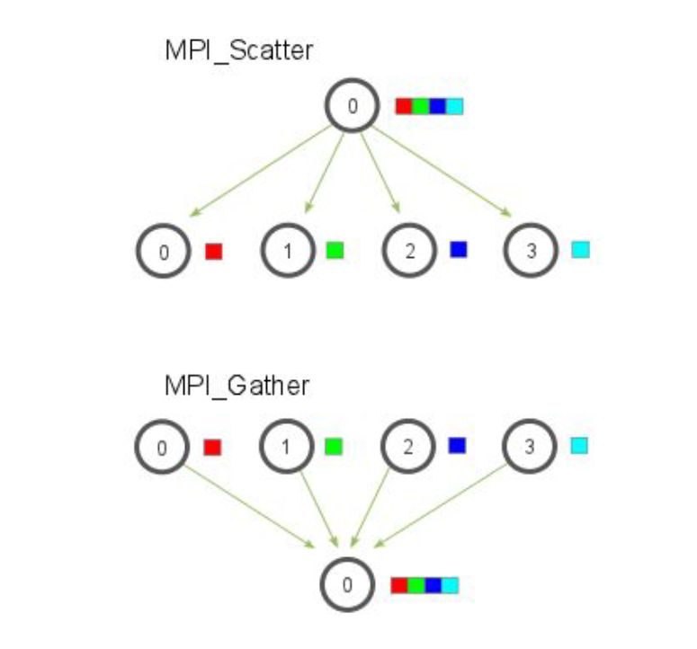

[Ejemplo OpenMPI (min 28:50)]

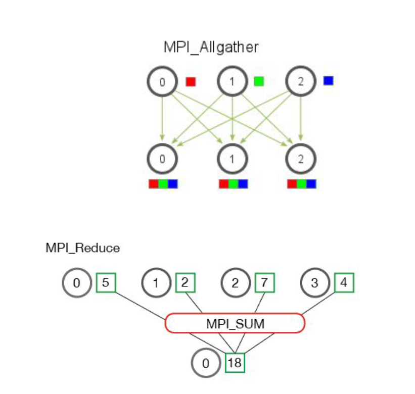

# Clase 10 - Modelado de computo distribuido 

## Apache flink

Es una plataforma de procesamiento distribuido de datos mediante el uso de pipelines. Brinda un framework, la posibilidad de usar SQL y un motor de ejecución (servidor para correr las cosas)

El pipeline tiene un origen de datos (source), un sumidero (sink) y varios pasos de transformacion que se le aplican a los datos.

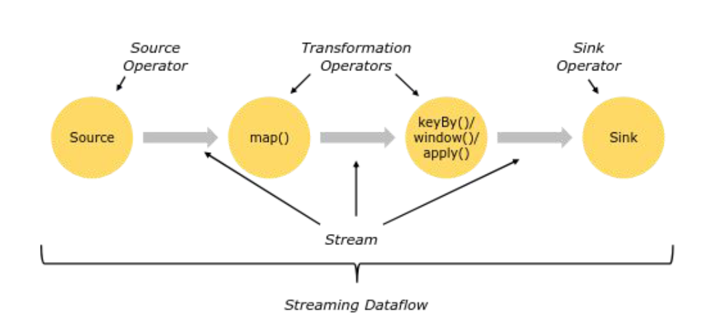

**Dataflow**: es un DAG de operaciones sobre un flujo de datos. Es el pipeline entero.
**Stream**: es el flujo de datos
**Batch**: es un bloque de información.

En base a lo anterior, los pipelines pueden ser de 2 formatos distintos:
- **Flujo continuo**: el flujo de informacion nunca finaliza 
- **Batch**: el conjunto de datos tiene un tamaño conocido desde que se ejecuta. Esto es importante cuando se necesita terminar de procesar todos los datos antes de continuar la siguiente operación.

### Ventanas para streaming

Cuando uno tiene eventos que no terminan nunca, uno tiene que saber donde cortar para poder ejecutar alguna función de agregación (min, max, sum, etc). Para eso, debo definir una ventana. Hay dos tipos de ventanas posibles:
- Por tiempo: defino que en N segundos, hago un corte y se aplica a eso la función de agregación
- Por cantidad de elementos: Se espera que haya N elementos antes de cortar y hacer la agregación

### Casos de uso 

- Extraxt Transform Load (ETL): operaciones programadas de carga y modificación de datos para posterior análisis 
- Data Pipelines: tareas de procesamiento recurrentes, basado en ocurrencia de eventos 

OBS -> todo se conecta por colas, por eso tanto enfoque en MOM 

## Apache Beam 

Es un modelo de definicion de pipelines de procesamiento de datos con portabilidad de lenguajes y motores de ejecución (runners)

Solo nos brinda un framework, el motor lo tenemos que conseguir nosotros. Se puede corrern en Hadoop, etc o en cloud.

### Bloques de un pipeline 

- **Input y output**: Source & Sink 
- **PCollection**: coleccion paralelizable de datos (Stream) 
- **Transformations**

## Map-Reduce

La idea para utilizar map reduce, es identificar que tareas pueden ser paralelizadas e identificar un grupo de datos que puedan ser procesados de forma concurrente.

 Esto esta basado en las funciones map y reduce:
 - **Map**: le aplica una funcion *f* a cada dato del conjunto de dato
 - **Reduce**: agarramos un conjunto de datos y aplicamos de forma recursiva la operación sobre cada uno de los datos usando el output de uno como el input del otro (Inicialmente, un elemento es NULL).

### Arquitectura Naive
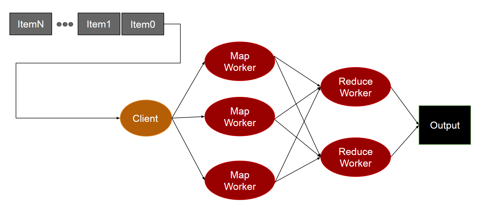
OBS -> No es buena idea procesar de a un dato a la vez. Puedo agrupar los datos en chunks si son independientes y pasarle los chunks a los mappers.

OBS-> Como es probable que los datos los tengamos que procesar varias veces, no es eficiente inyectarle los datos otra vez. Es mejor guardarlos en un archivo y que los mappers sepan donde ir a buscarlos.

### Caso ideal (Mater-Worker)

- No hay dependencia entre los datos, por loque los datos se los puede partir en chunks del mismo tamaño y se pueden distribuir de forma uniforme.

**Master**: 
- Funciona como si fuese un proceso coordinador
- Parte la data en chunks 
- Envía la ubicacion de los chunks a los Workers 
- Recibe la ubicacion de los resultados a todos los Workers 

**Worker**:
- Recibe la ubicación de los chunks del master 
- Procesa los chunks 
- Envia la ubicación del resultado de procesamiento al master 
- Puede ser Mapper o Reducer 

### Funcion Map 

- La data es particionada en K chunks y procesada por M workers ejecutando la funcion Map 
- La funcion Map  define como filtrar los datos provistos en los chunks (no siempre queremos agarrar todos los datos)
- Recibe un stream de datos y produce un conjunto de valores intermedios (clave, valor)

### Funcion reduce 

- Recibe un conjunto de (clave, valor) y les aplica una agregación 
- Agarra todos los datos por cada clave para formar un set de datos menor 
- La funcion Reduce es distribuida particionando la keys en R reduce workers
- La cantidad de workers la define el usuario 

### Arquitetura 

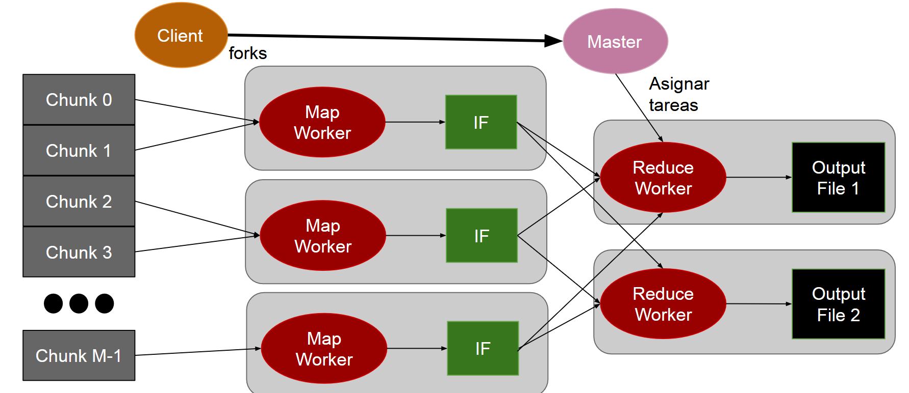

- El cliente se comunica con el master 

**Paso 1**: Partir los datos de entrada en N chunks. Para esto, alguien debe cargarlos

**Paso 2**: El cliente pasa la funcion de Map y de Reduce al master para iniciar. El master funciona de scheduler y coordinator y define cuantos mappers y reducers va a haber en el sistema y quien procesa cada dato.
Idealmente, queremos tener tantos mappers como chunks, ya que es CPU intensive. Con los reducers, no es tan sencillo porque no sabemos cuantas keys necesitamos. Por este motivo, se encarga el usuario de definir la cantidad de Reducers. 

**Paso 3**: El mapper lee los datos de input (posiblemente del storage), filtra esos datos en formate (key,value) y con los que pasan el filtro, les aplica la funcion map que brinda el usuario y pro cada par produce un (key,value). Esta para se lo conoce como *Valor intermedio* para el sistema 

**Paso 4**:
- **Paso 4a**: Cada mapper guarda los valores intermedios en Achivos intermedios. Esto es porque los reducer no puede llamarse hasta que no esten todos los datos. Cuando se termino de procesar todos los datos, el mapper le avisa al Master y cuando estan todos, comienzan los Reducers. 
- **Paso 4b**: Los map workers particionan a los datos en R regiones segun la key mediante una funcion de particion (por ejemplo un hash(clave) / R). Luego, cada Reducer va a leer la particion que le corresponda.
- 
OBS -> la ubicacion de los Archivos intermedios se guardan en un storage distribuido o en la ubicacion del mapper.

**Paso 5**:
- Los Reduce Workers reciben la ubicación de los archivos intermedios para la partición que deben procesar (mediante RPC, HTTP, etc)
- Luego, los reducer ordenan la data por key y agrupa por key.

**Paso 6**: Reduce Worker llama la funcion reduce por cada clave y guarda los resultados en un *Output file* y le avisa al master

[Ejemplos de map reduce en otro video. De este estilo se toman en los finales]

## Tiempo y Relojes

### Tiempo 

- Es una magnitud para medir duración y separación de eventos
- Es una variable monotona creciente (siempre aumenta, nunca retrocede) y puede no estar vinculada a la hora de la vida real 

OBS -> Si queremos modificar el tiempo, tenemos que aumentarlo, pero nuca retrocederlo.

La medicion del tiempo permite:
- Ordenar y sincronizar
- Marcar la ocurrencia de un suceso (mediante timestamps)
- Contabilizar la duración entre sucesos (timespan)

### Relojes físicos

- Cada computadora tiene su reloj físico **Local** y no esta sincronizado con otras computadoras salvo que haya un reloj **Global**, en ese caso todos se sincronizan a ese reloj
- Nos brindan la fecha y hora del día
- Los cambios de temperatura, presión y humedad descalibran relojes. A esto se lo conoce como **Drift** y tenemos que tenerlo en cuenta para sincronizar tanto el reloj global como el local

#### Algunas referencias globales
- Greenwich Mean Time (GMT): no es muy exacta
- Universal Time Coordinated (UTC)
- GPS time: permite ajustar satelites
- Temps Atomique International (TAI)

#### Drift
- Los relojes físicos no son confiables debido al Drift, por lo que hay que sincronizarlos periódicamente
- Para sincronizarlos se debe mirar el desvío respecto a un reloj de referencia, y aplicar una corrección lineal cambiando la frecuencia del reloj local.
- Nunca atrasar el reloj. En caso de estar más adelantado, se debe avanzar el tiempo más lento hasta sincronizarse.

En resumen, el drift es el corrimiento del valor de un reloj respecto de otro de referencia que produce la desincronización entre sistemas. Esto es inevitable y puede pasar por cambios en temperatura, presion, humedad, etc.

Para calibrarlo se debe conectar con un servidor, el problema es que comunicarse con el servidor toma tiempo, por lo que hay que tenerlo en cuenta. Un algoritmo usado para esto es el Algoritmo de Cristian

#### Algoritmo de cristian

Hipotesis:
- El delay de la red son constantes 
- El servidor responde inmediatamente 

Por lo tanto, el nuevo tiempo de la pc va a ser 

T_new = T_Server + (RTT) / 2

OBS -> El tiempo nunca va a ser exacto en todos los servidores, por lo que se usa un umbral.

### Network Time Protocol (NTP)

#### Objetivos 

- Clientes sincronizados aunque existan delays en la red 
- Alta disponibilidad (redundancia). Si falla algún servidor, debe existir una forma de apagarlo de forma fácil. El servicio debe sobrevivir a caída largas de conectividad
- Escalabilidad: como tenemos muchos clientes sincronizados de forma frecuente y tener en cuenta el drift.

#### Estructura de Servidores

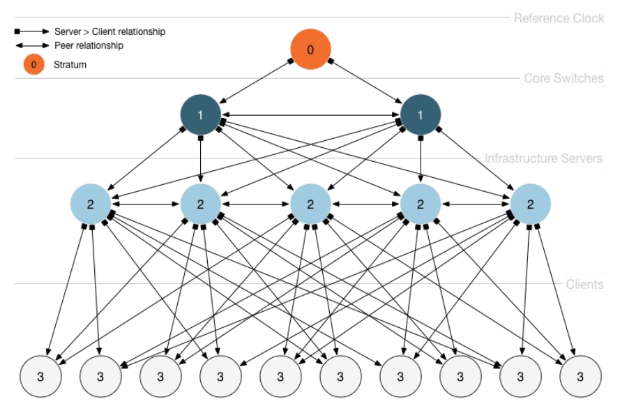

**Estrato 0**: es el Master Clock. No se sincroniza con nadie, asi que una persona debe sincronizarlo 

**Estrato 1**: Servidores que se sincronizan con un Master Clock (cliente-servidor) y también se conectan con otros servidores de estrato 1 (peer-to-peer) para pedir info si no puede comunicarse con el Master

**Estrato N**: Servidores sincronizados con el del estrato superior.

OBS -> NTP esta basado en UDP no reliable

#### Modos de sincronización 

- **Modo cliente-servidor (RPC)**: cliente se conecta a servidor y pide el tiempo. Usa algoritmo de Cristian. Este modo se pude usar con grupos de aplicaciones para que estén sincronizados con el mismo NTP. Las apps no pueden sincronizarse entre si. 
- **Modo Simétrico(Peer-to-Peer)**: Peers se sincronizan entre si, por si se cae un estrato superior
- **Multicast/Broadcast**: los servidores de estrato 2 envian el tiempo a todos los clientes. Se necesita una LAN de alta velocidad y es eficiente pero no preciso (no puede usarse el RTT)

## Relojes Lógicos

### Definiciones 

- **Evento**: es un suceso relativo al proceso P_i que modifica su estado 
- **Estado**: valores de todas las variables del proceso P_i en un momento dado 
- **Relacion *Happen Before***: es una relación de causalidad entre eventos o estados tales que:
  - a -> b, si **a** y **b** pertenecen al mismo proceso P_i y **a** ocurre antes que **b**. El proceso conoce cual sucedio antes desde un punto de vista físico
  - a -> b, si **a** es un evento de P_i y **b** es un evento de P_j, a es el envío de un mensaje **m** a P_j y **b** es la recepción del mensaje **m** desde P_i (el envio de mensaje ocure antes que la recepción)
  - a->c si a -> b y b -> c (Transitividad)

### Relojes Lógicos 

Dado s = el conjunto de todos los estados locales posibles del sistema, el reloj lógico es una funcion (C) monotona creciente que mapea estados a un numero natural y se cumple que 

	Si s -> t, entonces C(s) < C(t)

Es decir, mientras mayor el valor del reloj lógico, más tarde pasó
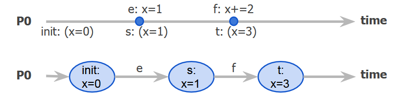

#### Algoritmo de Lamport

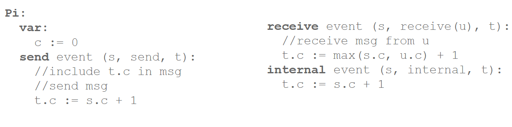

Este algoritmo nos dice que dado un conjunto de procesos:
- Todos los procesos inician con un reloj lógico de 0
- Cada vez que se produce un evento interno de cualquier proceso, ese proceso va a aumentar en 1 el valor de su reloj lógico
- Si se da un intercambio de mensajes, el proceso que envia el mensaje incrementa su reloj lógico y incluye ese valor en el mensaje que envía. Cuando el otro proceso recibe el mensaje, toma el valor que tiene y el del mensaje, se queda con el máximo entre ambos y le suma 1.
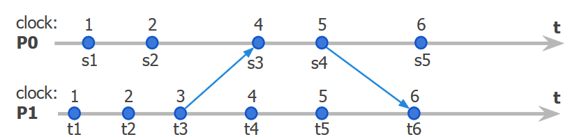

En si el algoritmo se usa para poder ordenar eventos de forma parcial y nos garantiza que si S ->T entonces C(S) < C(T).  Además, permite detectar eventos concurrentes en el caso de que los relojes tengan el mismo valor

==Para que quiero usar este algoritmo? Este algoritmo se usa para, dado el vector lógico de los N procesos, poder garantizar la inversa, es decir, si el reloj lógico de t es mayor al de s, se cumpla que s sucedió antes que t. Esto permite ver si dos eventos son concurrentes o no.==

==(No cumple la inversa, entonces no sirve para nada?????????)==

Sin embargo, esto no es condición suficiente para garantizarlo.

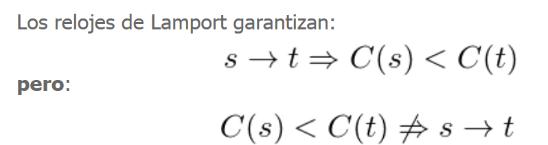

Para poder garantizarlos, se necesita más información que el algoritmo de lamport no guarda.

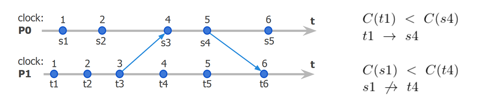
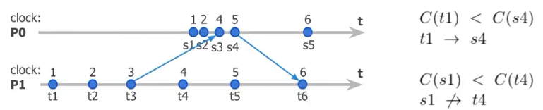

**Corolario**: conociendo los relojes de Lamport se pueden detectar eventos paralelos. Dos eventos s y t son paralelos si C(s) == C(t)

#### Vector de relojes

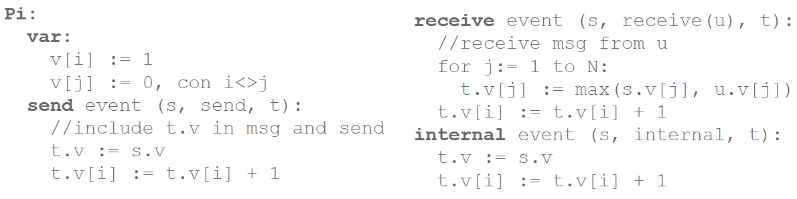

Los vectores de relojes se basan en el algoritmo de lamport para poder determinar si 2 estados sucedieron uno antes que el otro. (determinan causalidad entre estados)

En vez de tener un unico contador, ahora vamos a tener un vector que contiene un reloj por cada procesos (K procesos -> K relojes en el vector)

Es el mapeo de todo estado del sistema compuesto por K procesos, con un vector de K numeros naturales y nos garantiza que para todo estado **s** y  **t** que pertenecen a todos los estados del sistema, s -> t si y solo s s.v < t.v, siendo s.v y t.v los respectivos vectores de relojes. Es decir, que nos garantiza que s -> t si el vector de relojes de S es menor al de T. 

Para que sea menor implica que, comparando por posicion del vector, si cada valor del vector de S es menor o igual que cada valor  vector de T y al menos tenemos uno que es menor estricto, entonces S -> T

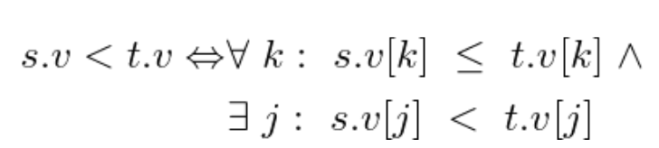

Si hay un entrecruzamiento entre valores mayores y menores (el primero es menor y el segundo es mayor por ejemplo) o si todos los valores son iguales, entonces no se puede determinar que uno ocurrió antes que otro. En este caso, los eventos son concurrentes

Ejemplo: 
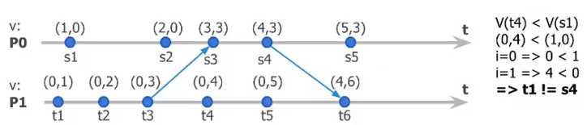

##### Implementación

Es una extrapolación al algoritmo de lamport:
- Cuando ocurre un evento interno, aumenta el contador asociado a si mismo
- Cuando el proceso envia un mensaje, el proceso incrementa el contador asosciado a su indice e incluye su vector lógico
- Cuando el proceso recibe un mensaje, por cada posición del reloj agarra los elementos, se queda con el máximo y le suma 1 (si es su contador). SI no es el contador que le corresponde a si mismo, solo se queda con el máximo.

# Clase 12 - Sincronismo, Orden y consistencia

## Sincronismo

La definición depende del contexto. En sistemas distribuidos, un protocolo es:
- **Sincrónico**: los mensajes que se entregan tiene un timeout conocido. El mensaje llega dentro de un timeout o no llega. 
- **Parcialmente sincrónico**: Tiene un timeout variable o conocido 
- **Asincrónico**: El mensaje no tiene un timeout asociado

OBS -> en comunicación entre grupos, es sincrónico si las entidades interactúan entre sí y asincrónico si las entidades son independientes

Para tener una noción de sincronismo de un protocolo tenemos 2 propiedades:
- Steadiness
- Tightness

### Propiedades

- **Tiempo de delivery**: Es el tiempo que tarda un mensaje desde que es enviado hasta que es recibido 
- **Timeout de delivery**: Es una cota superior que nos dice que todo mensaje enviado va a llegar antes de este timeout 
- **Steadiness(σ)**: es la máxima diferencia entre el mínimo y máximo tiempo de delivery de cualquier mensaje recibido por un proceso. Esto tiene en cuenta los varios procesos que envian mensajes. Esta propiedad nos define la varianza con la que se observan los mensajes y que tan constante es la recepcion de mensajes (mientras menor sea, mas rápido todos los procesos reciben los mensajes)
- **Tightness(τ)**: es la máxima diferencia entre los tiempos de delivery para cualquier mensaje m. Agarramos un mensaje m y verificamos cual es la mayor diferencia de tiempo entre cada delivery de ese mensaje para varios procesos. Además, nos define la simultaneidad con la cual un mensaje es recibido por multiples procesos (mientras menor sea, menor la diferencia de tiempo en la que todos recibieron ese mensaje)

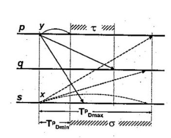

En este ejemplo, x e y son los mensajes enviados.

Estas propiedades nos permiten realizar algoritmos y operaciones de manera más controlada.

### Protocolos Time-Driven

- No hay aseguramiento de steadiness y tightness
- Hay un timeout conocido en el cual si no todos los procesos reciben el mensaje se hace un retry. Hacer retries no hace que el timeout sea variable porque podemos asumir que el timeout total va a ser cant_retries * timeout que son conocidos.

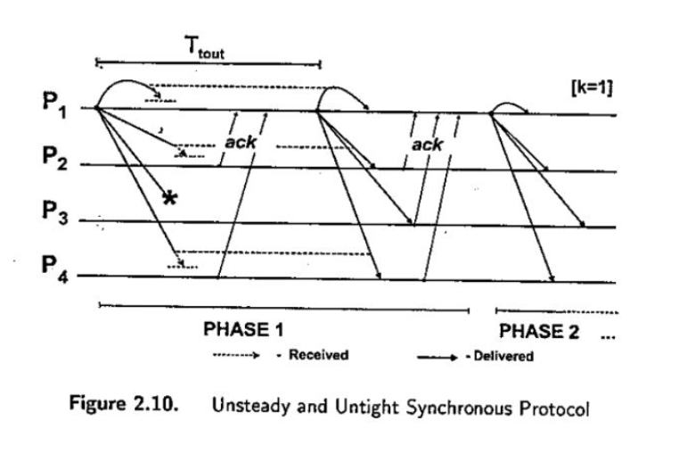

### Protocolo clock-driven

- Provee steadiness y tightness de manera controlada y permite manejar esos parámetros 
- Tenemos un reloj global
- Supongamos que el proceso manda un mensaje m con el estado del clock que lo mando y le llega a todos, el mensaje solo se entrega para procesar en un tiempo t + Δ.
- Si todos los relojes están sincronizados, nos aseguramos que todos los procesos van a tener que esperar a que pase el tiempo t + Δ para procesar el mensaje, lo que nos permite asegurarnos cierto steadiness y tightness ya que todos son delivereados dentro de t + Δ tiempo.

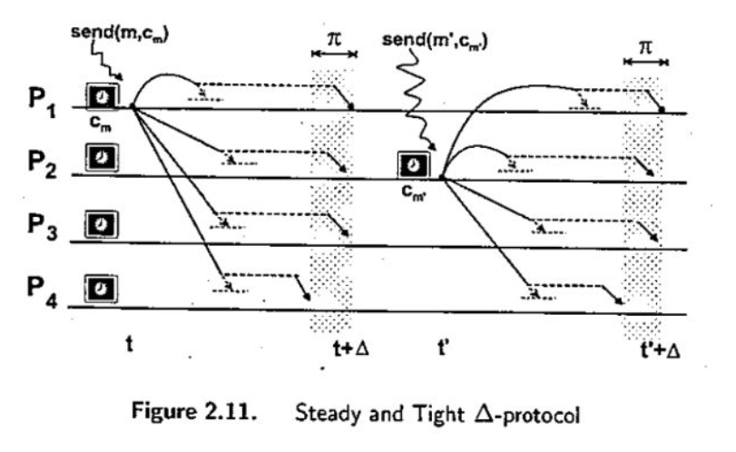

Otros protocolos clock-driven tiene además un periodo de tiempo que nos dan un slot de tiempo (π) que nos indica cuando puede cada proceso enviar mensajes.

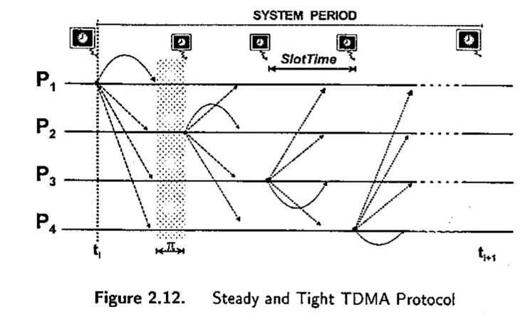

## Holdback queue 

- Es una cola que nos permite diferenciar la recepción del delivery de los mensajes
- El delivery consiste en procesar el mensaje provocando cambios en el estado del procesos.
- Los mensajes en vez de llegar al proceso, se lo pone en una holdback queue y cuando se cumple alguna garantía que deba cumplirse, se lo manda a la delivery queue que envia mensajes al proceso .
- La holdback queue nos permite re-ordenar los mensajes en esa cola. TCP por ejemplo tiene una holdback queue y  cuando recibe un mensaje con numero de secuencia se queda esperando al paquete que falta antes de seguir enviando a la delivery queue.

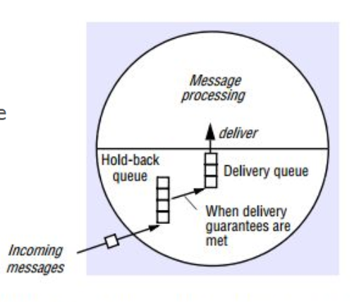

En otra palabras, la hold back queue es una instancia previa a que el proceso use los datos para aplicar cualquier operacions/algoritmo que necesitemos para garantizar cierta funcion en el delivery (ordenar, filtrar duplicados, etc)

## Orden 

### Orden Sincrónico (no esta en video)

La transmision de mensajes no toma tiempo, es decir que se envia y se recibe al mismo timestamp 

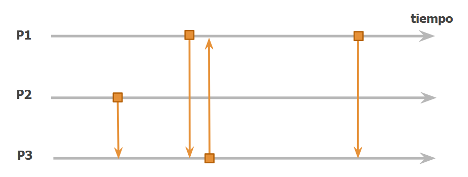

### Orden FIFO 

Si todo par de mensaje es enviado desde un mismo emisor a un mismo receptor, se entregan en el orden que fueron enviados. Esto no tiene restricciones entre distintos emisores, es decir, el emisor 2 puede enviar antes un mensaje que el emisor 1, pero se recibe primero el del emisor 2.

Lo importante es que se mantiene la relacion de x sucedió antes que y

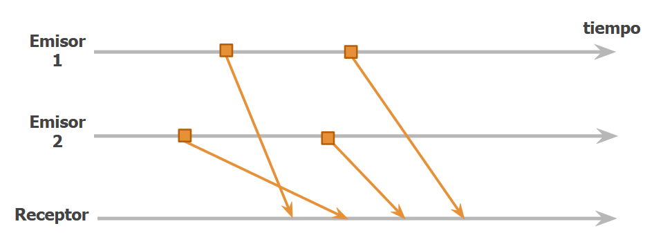

### Orden Causal 

Todo mensaje que implica la generación de un nuevo mensaje, este es entregado manteniendo esta secuencia de causalidad sin importar el receptor. En otras palabras, si un mensaje genera otro mensaje, para el resto de procesos que reciban mensajes, la causalidad de que m1 genero m2, debe verse reflejada en la recepción de todos los procesos. 

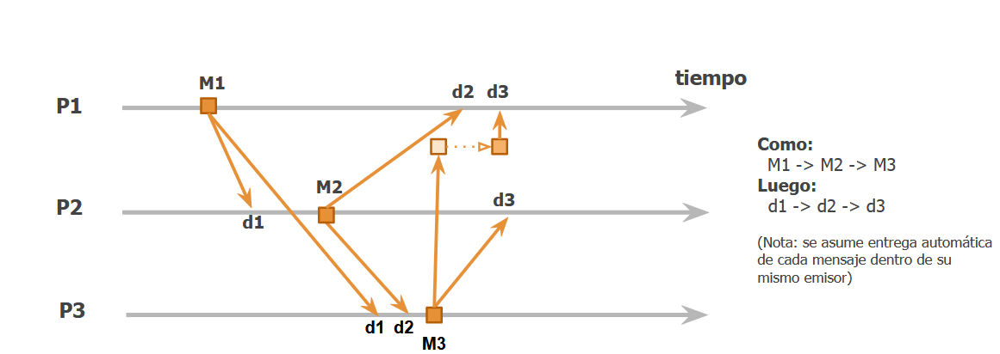

En este ejemplo, se puede ver que cuando P2 le llega el mensaje M1, va a generar el envió del mensaje M2 al resto de procesos. Para que el orden se cumpla, P3 debe esperar a recibir los mensajes M1 y M2 antes de enviar M3 y en el caso de que algun proceso (P1 en este caso) vaya a recibir M3 antes que M2, M3 no se deliverea hasta que llegue M2 usando una Holdback queue.

OBS -> En el ejemplo, M1 genera M2 y M2 genera M3
OBS-> Para hacerlo en la vide real, se puede tener una lista de dependencias de mensajes y una holdback queue.

### Orden Total

Es un orden que no es excluyente con el orden causal ni lo engloba, es decir, el orden total no nos garantiza el orden causal.

Este orden nos dice que todo par de mansajes entregados a los mismos receptores es recibido en el mismo orden por los receptores ,es decir, todos los procesos van a ver lo mismo

Si M1 y M2 envían los mensajes, si M2 llegó primero nos define que TODOS los procesos van a ver M2 antes que M1.

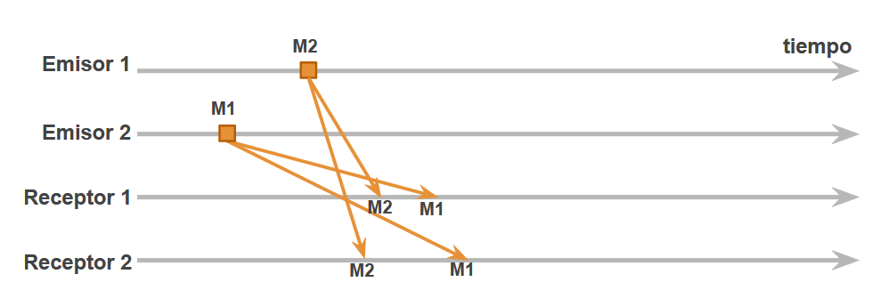

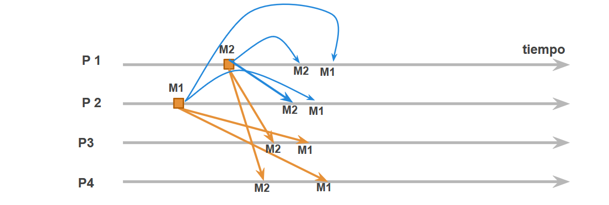

## Estado y consistencia

### Estado

- **Estado local**: es el conjunto de los valores de todas las variables de un proceso determinado en un instante t
- **Estado global**: es la unión de los estados locales de todos los procesos del sistema en un instante t

#### Sistema como maquina de estado 

Consiste en modelar a un sistema como una serie de estado, donde el sistema va cambiando de estado a partir de eventos. Si tenemos instrucciones determinísticas, el procesamiento de cualquier evento bajo el estado actual se puede reproducir.  

OBS -> si tengo los eventos y el estado inicial, puedo replicar el comportamiento de un sistema.

Ej con 1 solo proceso: 

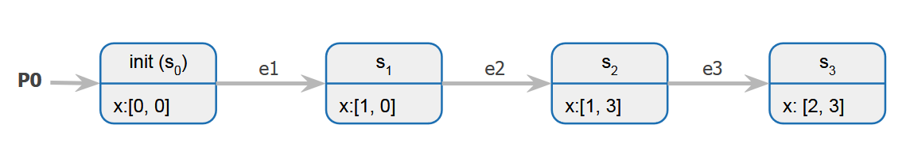

Cuando tenemos multiples procesos, es más complicado determinar el estado global ya que hay distintas posibilidades para el estado global. 

También puede haber estados globales que son imposibles que pasen ya que puede haber dependencias entre los procesos debido al intercambio de mensajes entre estos, donde ese intercambio de mensajes genera un nuevo estado del sistema: 

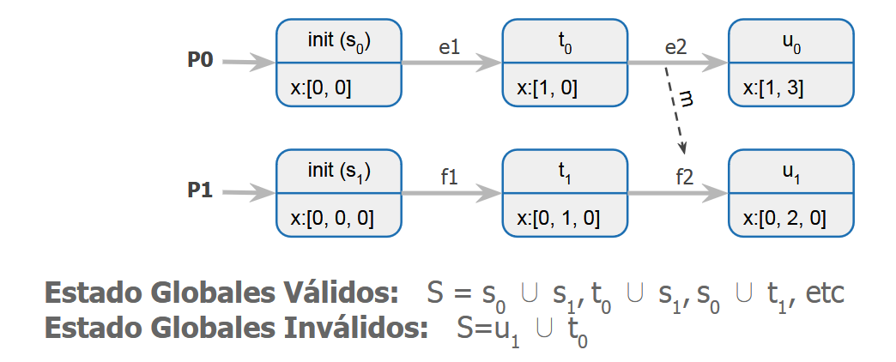

#### Historia y Corte de Estados de un sistema 

- **Historia**: caracteriza al proceso mediante la secuencia de todos los eventos procesados hasta el momento, es decir, son todos los eventos que vio el proceso P
- **Corte**: es la unión de las historias de todos los procesos del sistema hasta un cierto evento K de cada proceso .

Un corte es consistente si por cada evento que este en el corte, también contiene a todos los eventos que hayan pasado antes. Es decir, si un evento a es generado por un evento b y el evento a esta dentro del corte, b debe estar dentro del corte.

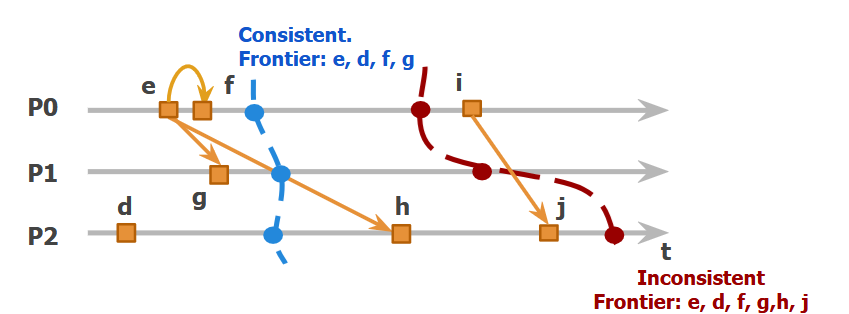

OBS -> si hay un mensaje en curso, no implica que sea inconsistente el corte (caso de evento h en la frontera azul)

##### Algoritmo de Chandy & Lamport 

Es un algoritmo que permite obtener snapshots de estados globales de un sistema distribuido. 

Tiene como objetivo almacenar los estados de los procesos y los canales con el fin de tener un estado global consistente

**Hipotesis**
- Procesos y canales de comunicación no falla (mensajes siempre llegan) 
- Canales son unidireccionales y orden FIFO 
- Todos los procesos pueden comunicarse con todos (grafo fuertemente conexo con caminos de ida y vuelta)
- Los procesos pueden iniciar una snapshot en cualquier momento 

**Algoritmo**
**1-** Tenemos varios procesos con canales para envio y recepción de mensajes, una variable que indica el corte y un lugar para guardar el estado (mensajes en pseudocodigo)
**2-** El proceso que inicia la snapshot le manda un marcador a todos los procesos (y a si mismo) y guarda su estado en un corte
**3-** Si un proceso recibe el marcador, este envia un marcado al resto de procesos. Si es la primera vez que el proceso recibe el marcador, el proceso guarda su estado interno y activa el log de mensajes de los canales de input (forma parte del corte). Si ya había recibido el marcador, agrego los mensajes al corte.

La condición de corte del algoritmo es recibir un marcador de los demás procesos en los canales de input. Si todos lo reciben, termina el algoritmo.

OBS -> los mensajes son los que fueron enviados entre los procesos mientras se ejecuta el algoritmo

Ejemplo:

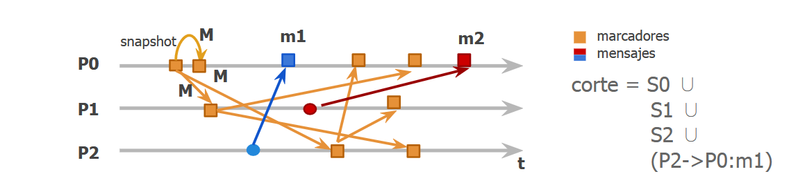

- m2 genera un estado nuevo que sucede luego del hacer el corte, por lo que no se guarda en el corte que paso 
- m1 se recibe luego del marcador P0 y antes del de P2, por lo que se loggea

## Comunicación Reliable

Una comunicación es reliable si se garantiza integridad, validez y atomicidad en el delivery de mensajes.

Si tengo una comunicacion uno a uno, es trivial si usamos protocolos sobre TCP y una red segura. En cuanto al orden, solo podemos pensar en el orden FIFO, los demas no porque hay 1 solo receptor.

Si tengo una comunicacion de uno a muchos (un grupo), es más complicado ya que la atomicidad implica que le llegue a todos o a ninguno. Además, hay que definir el orden entre los mensajes (FIFO, causal, total, etc)

# Clase 13 - Data Intensive Aplications

## Datos en sistemas de Gran Escala 

Ejemplo: tenemos una arquitectura donde llegan muchos requests y datos. Tenemos servicios que responden requests y servicios que guardan datos, teniendo una DB Maestra (crece poco a medida que avanza la operacion y almacena datos que son limitados por ejemplo, cantidad de provincias) y una transaccional (se van acumulando muchos registros a medida que se venden mas elementos, vistas de la página, etc). Tambien hay un caché para acceder más rápido a los datos.

Tambien tiene una búsqueda por índices, los cuales se consultan mucho y escriben poco.

Si hay una petición que demanda mucho, no puede responder a todos los clientes rapidamente, por lo que esos tipos de pedidos se encolan en un MOM. Tambien pasa si se quiere consultar un servicio externo.

### Transactiontal Data

#### Relacional vs. NoSQL

**Relacional**
- Es un buen soporte para joinear informacion, relaciones many-to-one y many-to-many 

**No relacional**
- Buenos al almacenar muchos datos que son pesados de utilizar 
- Pueden ser del tipo: clave-valor, documentales, orientadas a grafos o columnares
- Son utilies cuando no hay relaciones, hay relaciones one-to-many (jerarquico) y alta conectividad (grafos)
- Se adapta mejor a modelos con esquemas cambiantes o no definidos 

#### Transaccional vs. Analytics 

Esto es según como se realizan las consultas desde el punto de vista transaccional 

**Online Transaction Processing (OLTP)**:  una aplicacion es de este tipo cuando  es una aplicacion que permite hacer operaciones con pocos registros, buscar por claves bien definidas, tener accesos aleatorios para escribir (escribir pequeños elementos o fracciones de elementos en cualquier lugar). Es lo que se usa normalmente en las aplicaciones

**Online Analytics Processing (OLAP)**: su uso principal es para grandes procesamientos de funciones de agregación sobre grandes cantidades de datos. Permiten hacer funciones de agregacion a muchos registros, no soporta hacer inserts de muchos datos (orientado a usar en batchs) y hacer analisis estadistico

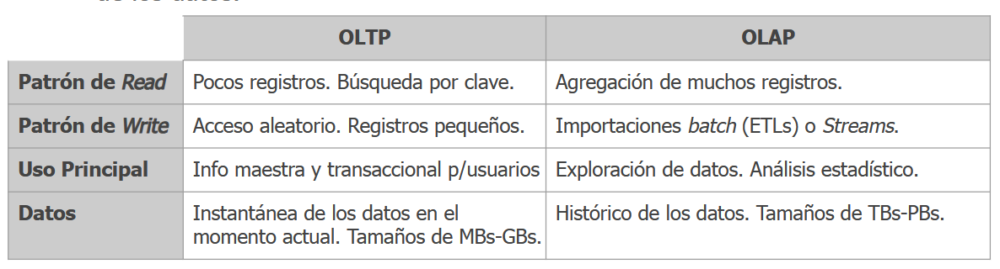

#### Tipos de almacenamientos 

- **Relacional**: hay un archivo de almacenamiento por tabla, se pueden relacionar tablas mediante foreing keys y tiene lectura por fila (cada dato es una fila)para retornar proyecciones. Es OLTP
- **Columnar**: hay un archivo de almacenamiento por tabla, para grabar datos, guardo el campo en la primera columna y en la otra guardo todos los valores uno atras de otro. Se usa cuando hay informacion que se repiten demasiado. Es más optimo para compresion, lectura y agregaciones. Es OLTP
- **Cubo de Información**: Es de tipo OLAP. Tienen tablas agrupadas por diferentes dimensiones. Por lo general tienen vistas con cosas pre calculadas. Por cada dimension, hay una oculta que define los cruces posibles.

## Partición y replicación 

### Replicación 

La información puede ser replicada para mejorar performance, pero pueden aparecer problemas de acuerdo al tipo de mecanismo usado para replicar

#### Leader based 

- Una réplica se designa como lider, la cual toma una foto de esa base (mirroring) para tener una cantidad de replicas que yo quiero. Esto designa replicas follower que solo permiten lecturas (solo se puede escribir en el lider). 
- Cuando hay una escritura en el lider, este debe despachar esos cambios a los followers.
- Puede pasar que los followers no estén actualizados al consultar

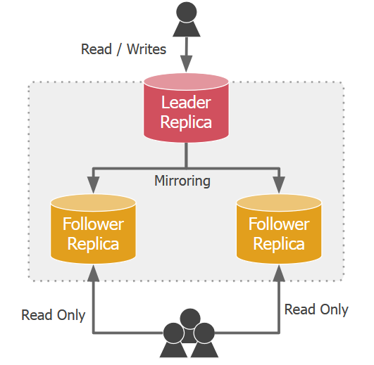

#### Multi-leader based

- Nos permite tener más de una DB que soporte lecturas y escrituras, y varios followers.
- Esto se usa cuando tengo separados la ubicación de los usuarios, y me conviene que algunos usuarios se comuniquen con un lider y otros con otro lider.
- Uno de los problemas es que puede llegar a haber conflictos. Además, no soluciona que los followers esten desactualizados
- Otros inconvenientes son: 
   - Manejo de triggers: se coloca un evento y cuando salta ese evento, se ejecuta un SQL. Si lo coloco de un lado, no se entera de los cambios del otro, si los coloco de los 2 lados, pueden ejecutarse en distintos momentos (y solo lo hace sobre info que conoce)
   - Claves incrementales 
   - Integridad de relaciones 

Para el mirroreo, las bases tienen conexiones abiertas con las replicas y si usan consistencia eventual o consistente siempre.

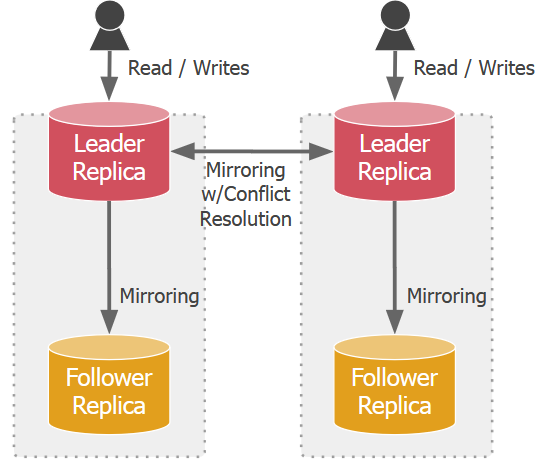

#### Leaderless based

- Es un sistema de replicación totalmente distribuido, en el que todos son lideres (no hay followers)
- Las replicas deben poder sincronizarse 
- Se pueden definir una topología para sincronisar los datos (anillo, un nodo tiene más jerarquia, etc)
- Es muy frecuente que haya conflictos, salvo que se particione. Otra alternativa es realizar un consenso entre las replicas para hacer una escritura 

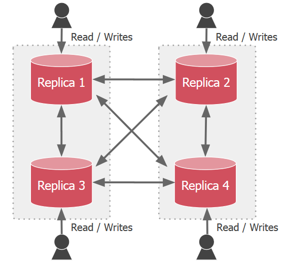

### Particionamiento

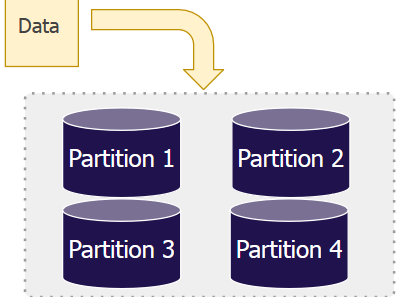

**Motivaciones**

- Performance: las consultas no afectan las performance de consultas en distintas particiones (tanto lectura como escritura)
- Conflictos: Evitar colisiones mediante una función de partición/hash que evite estos conflictos.
- Redundancia: permite la recuperación frente a fallos al permitir replicación de datos en distintas particiones (high availability)

#### Tipos de particionamiento 

##### Particionamiento horizontal

- La información se separa de a registros entre cada partición (particiono por fila)
- El registro se encuentra es una particion a la vez 

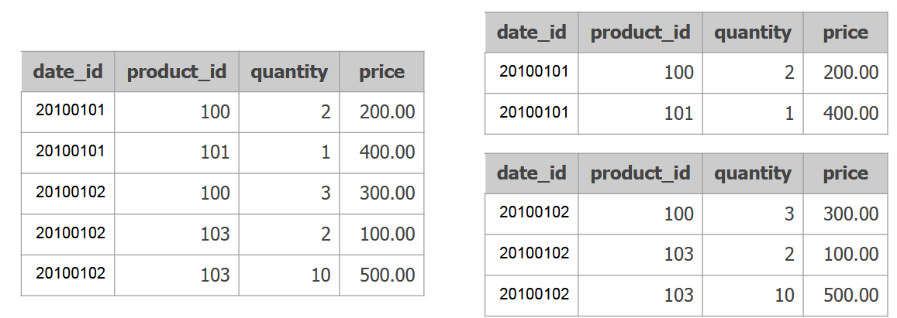

##### Particionamiento vertical 

- La información se separa respecto de sus atributos/campos entre cada partición 
- El registro esta en todas las particiones (aunque sea parcialmente) 
- Si busco una fila completa, debo traer varias particiones
- Problema: si ambas particiones son escritas al mismo tiempo, puedo agarran una parte que esta actualizada y otra que no. Se puede hacer que no se libere ninguna de estas tablas hasta que no este todo escrito

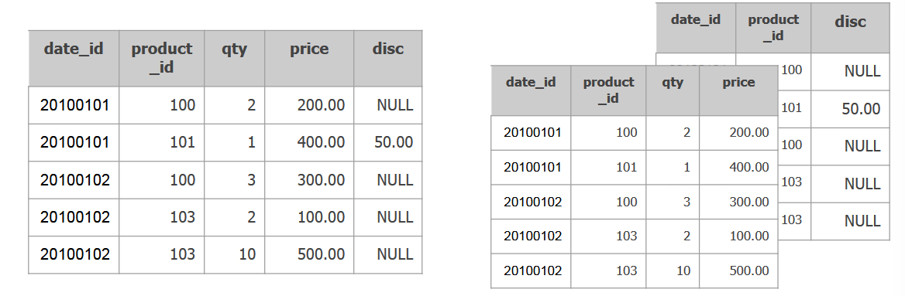

#### Funciones de partición 

- Por valor de clave (key-value): por rejemplo, agarro la primera letra del nombre
- Por rango (key-range): por ejemplo, las letras a hasta d en la particion 1, etc.
- Por Hash: teniendo buena distribución de los datos
- Mixtos: genero N shards por cada key (esto va en en la particion a, b o c). No importa donde la guardo, solo que debo guardarla 

#### Enrutamiento 

Como accedo a las particiones?  Enruto los pedidos a la particion correspondiente 

Si conosco la particion donde esta guardado, voy directo a buscarla

Si no conosco en que particion esta la data, hay que hacer algo extra:
- Voy a cualquier particion a buscar la info, si esta la obtengo. Si no esta, la particion me indica a donde ir a buscarla 
- Le pregunto a un "Sentinela" donde esta guardada la data y este me devuelve la ruta. El sentinela sabe donde esta guardada la data
- El cliente tiene las direcciones de las particiones y una funcion de hash para saber donde buscar los datos. El cliente tiene mucha más información.

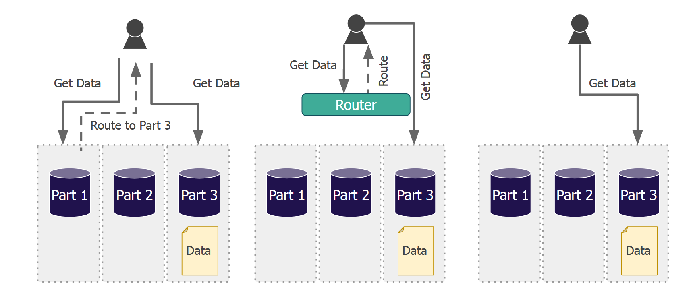

## Distributed Shared Memory (DSM)

Es la ilusion de que 2 procesos tienen memoria compartida centralizada, pero esos procesos pueden no estar en una misma computadora.

Ventajas
- Algoritmos no distribuidos pueden traducirse facilmente
- Los nodos comparten información sin conocerse

Desventajas:
- Los algoritmos se pegan a la idea de centralizado, por lo que se distribuye mal la carga de procesamiento.
- Desalienta la distribución (por eso no es recomendable usarlo)
- Genera latencia 
- Cuello de botella 
- Punto único de falla 

### Enfoque Naive 

- Hay un servidor donde se almacena la información y los cliente van alli para conseguir la información mediante requests 
- Si un cliente esta escribiendo, debe pedir el lock al servidor y lo otros van a tener que esperar a entrar en la sec. critica.
- El servidor puede tener particion de información mediante distintas memory pages 

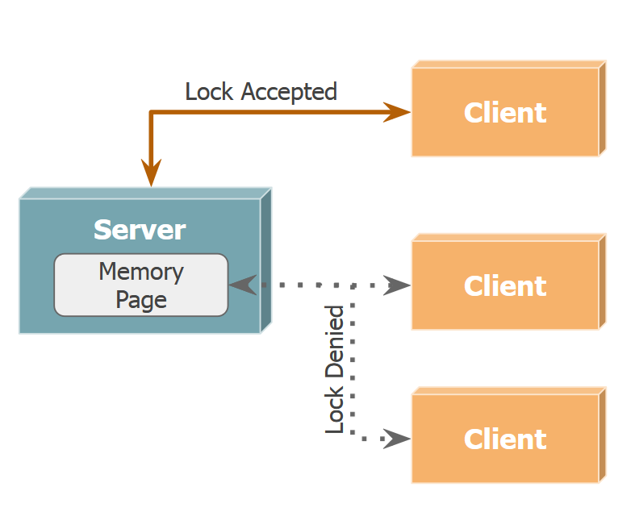

### Migración de Memory Pages 

- La info es almacenada por el servidor, pero si un cliente queire hacer una operacion con esa pagina de memoria, el cliente pide la página para él (migra los datos de la página al cliente). El cliente luego la modifica y la devuelve al servidor
- Si otro cliente quiere pedir esa página, la página "No está", pero sabe donde esta, por lo que el otro cliente puede pedir una migración a quien tenga la página para llevarsela.
- Los clientes no se hablan entre si para ejecutar operaciones 

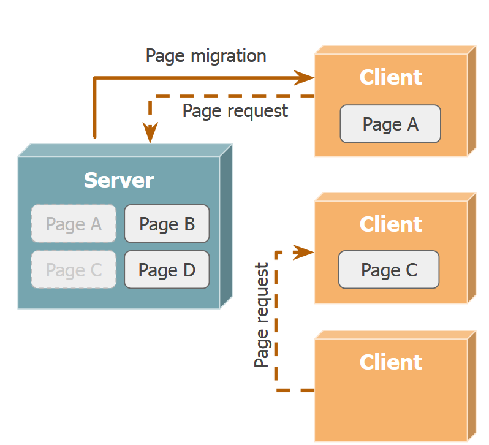

### Replicación de Memory Pages (solo lectura)

Favorece escenarios con muchas lecturas y pocas escrituras

- Las replicas de las página se piden solamente para lectura
- Si alguien quiere hacer un write en la página mirroreada, se aplica la modificación en el servidor y este se encarga de invalidar las páginas que prestó para lectura

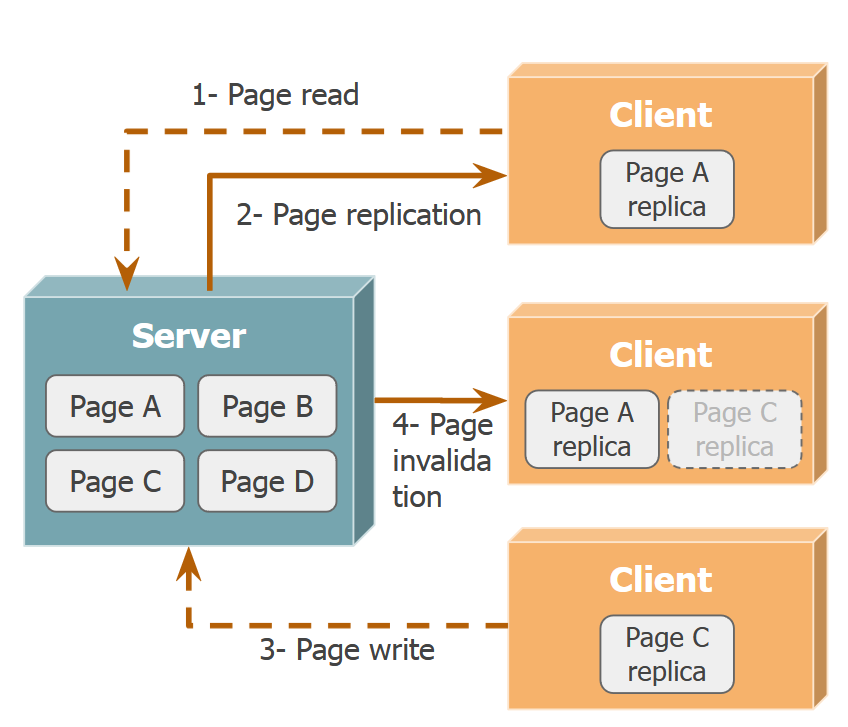

### Replicación de Memory Pages (lectura-escritura)

Es igual al caso anterior, solo que el servidor se transforma en un "secuenciador de operaciones" ya que las páginas pueden estar en distintos lugares y debe comunicarle a quienes tienen esa página que fue modificada de los cambios.

El servidor tambien aplica los cambios ante la caida de los clientes.

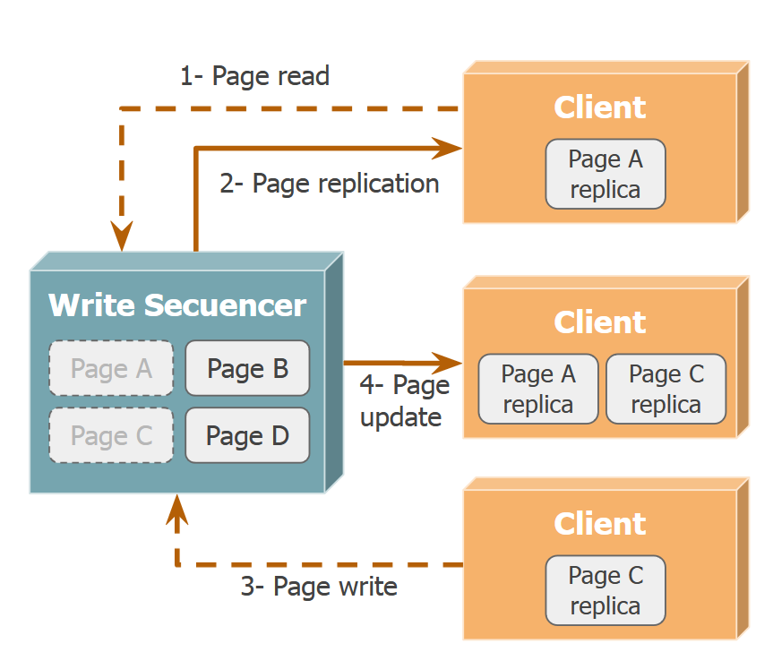

## Distributed File System (DFS)

Se usa para compartir archivos en una red, tener un esquema de control de backups, control de acceso y monitores y para permitir grandes capacidades de disco (que no entran en un solo disco)

### Factores de diseño 

**Transparencia** en cuanto a:
- Acceso a los datos 
- Localización de los datos ya que se opera sobre los archivos como si fueran locales 
- Movilidad de datos (moverlos de un lado a otro) no es percibido
- Performance: no depende de la escala y no debe afectar al cliente 
- Escala: en cuanto a cantidad

**Concurrencia**: que no requiere operaciones particulares del cliente 

**Heterogeneidad del Hardware**, es decir que no es único, pueden ser muchos elementos y muy distintos (distinta marca de memoria, distintas pcs, etc)

**Tolerancia a fallos**: si algo no anda bien, el sistema distribuido termina compensando eso.

### Caso de estudio: Network File System (NFS)

- Es un file system para un SO que se monta y  que no esta en una única computadora
- Usa una arquitectura cliente-servidor usando RPC sobre TCP o UDP
- Es un filesystem POSIX
- Cuando las apps acceden a los archivos para leer o escribir, se comunican con una nueva capa (mas lento, pero tenemos más control) llamada NFS Client que se comunica con un servidor y obtiene la respuesta del servidor.
- Puede haber muchos clientes que hacen operaciones de accesos

### Caso de estudio: Hadoop Data File System (HDFS)

- Sistema de archivos distribuido diseñado para usar hardware de bajo costo y permite hacer operaciones sobre esos archivos (map-reduce, etc.)
- No es un file system POSIX (no puedo hacer ls, cp info, etc.)
- Los elementos se pueden pensar como objetos que tienen binarios adentro y metadatos

OBS-> tiene sentido usarlo cuando hay archivos grandes 

#### Factores de diseño 
- **Tolerancia a fallos** porque son normales y es más economico adaptarse
- Favorece operaciones de **streaming** en vez de operaciones transaccionales de un solo elemento. Los datos son secuenciales o son muchos 
- Permitir portabilidad a todo tipo de hardware 
- Favorece operaciones de lectura sobre escritura (escribir 1 vez y leer muchas veces). Es tan costoso crear un archivo como modificar uno existente

#### Arquitectura

- Arquitectura maestro-esclavo

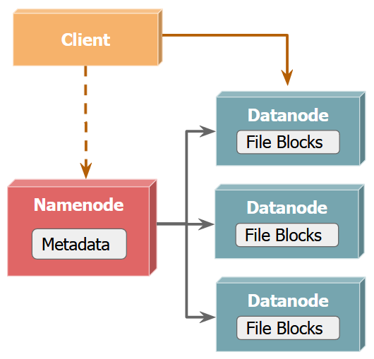
Partes:
- Namenode: conoce donde estan las partes de los archivos y la metadata de los archivos (cuando lo creo, tag, etc.)
- Datanode: Almacena los datos de los archivos

Si un cliente quiere consultar un archivo, primero le comunica al namenode, el cual le dice en que datanode esta el archivo y accederlo.

Si quiero, por ejemplo, saber cuantos archivos comienzan con una letra, no necesito acceder a los datanodes, ya que el namenode lo resuelve al tener toda la metadata.

#### Almacenamiento de datos 

- Los archivos tienen un bloque que es metadata y el binario se particionan en bloques de igual tamaño 
- Los bloques son replicados en distintos Datanodes para balancear la carga y para que el archivo sea recuperable al caerse el servidor, lo cual permite garantizar tolerancia a fallo y durabilidad de archivos de forma barata (cada server es un disco rigido) 
- El namenode tiene una lista de Datanodes por archivo
- La metadata se mantiene en memoria con un log de transacciones 

OBS -> si cambio de directorio o el nombre de archivo, esto solo se hace en el namenode ya que los datanodes no tienen nada que ver con esa operacion

#### Acceso a datos 

- Se colocan a los clientes cerca de los nodos para que puedan consumir los datos de esos nodos
- Si el cliente no tiene el namenode cerca, cuando este se comunica con el namenode (conociendo que el cliente esta en un Rack), el namenode le dice en que datanodes del Rack estan los datos que busca. Esto hace que las operaciones sean casi locales 

# Clase 14 - Sistemas elásticos y de alta disponibilidad

## Escalabilidad

Es el objetivo mas importante para los sistemas distribuidos modernos.

El objetivo de la escalabilidad es el crecimiento respecto de:
- el tamaño: agregando más recursos para soportar más cantidad de usuarios  
- la distribución geografica: moviendose/agregar recursos a una región específica si tengo mucha carga de distintas regiones 
- los objetivos administrativos del sistema: al brindar nuevos servicios, manteniendo a los otros servicios del sistema funcionando como venían funcionando.

### Características de las plataformas 

**Plataformas para alta concurrencia**:
- Plataformas tipo cloud, donde se aplican patrones conocidos para permitir el escalamiento de recursos
- El escalamiento puede ser automático
- Tiene una dependencia fuerte con una infraestructura o producto. Si quiero pasar a otra plataforma cloud, no va a ser tan sencillo 

**Arquitecturas Ad-Hoc y Personalizadas**
- Se usa para deployear en una cloud publica o en nodos físicos
- Es necesario configurar y dar soporte a lo que se deployee en la plataforma 
- Escalamiento manual o automatizado por humanos 
- Tiene la posibilidad de migrar a distintas plataformas (y DBs)

### Patrones de carga

Son importantes para definir la escalabilidad de un sistema ya que hay que configurarlos distinto dependiendo el patrón de carga

#### Tipos

**Predictable Burst** (Pico predecible)

- Sabemos que ciertos días van a haber muchas requests (por ejemplo, black friday)
- Cuando uno sabe que esta en un periodo de *consumo habitual* se le asigna al sistema una cantidad de recursos x.
- Cuando sabemos que vamos a tener un pico, aumentan los recursos duplicando/triplicando la capacidad del sistema para satisfacer esa carga

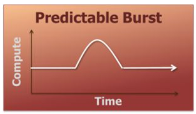

**Unpredictable Burst** 

- Sabemos que la carga va a ir fluctuando, pero no cuando van a haber picos (no agregamos nuevos clientes, ni cambamos nada)
- Lo que se hace es un analisis estadistico de la carga del sistema para ver si la carga que vemos es la que esperamos 
- Uno puede estimar cual va a ser el máximo consumo de recursos y en base a eso definir los recuros (memoria, disco, etc) que necesito para el sistema
- Por lo general, se asigna un poco más del máximo estimado

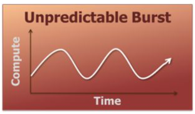

**Periodic Processing** 

- Hay sistemas que durante un tiempo del día procesan datos, luego frenan su actividad y siguen en otro momento (Ej: plazo fijo es hasta la hora x)
- En este caso, se asignan algunos recursos durante el periodo de actividad, y cuando estos inactivo se asignan esos recursos para otra parte del sistema.

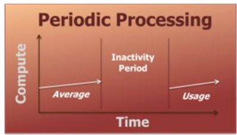

**Start Small, Grow Fast**

- La idea es hacer un crecimiento exponencial y esta relacionado a las Startups exitosas
- Empieza con un carga muy baja y cuando el servicio empieza a tomar más importancia, entonces la carga aumenta exponencialmente.
- El sistema debe ser pensado para escalar teniendo esta curva para que no nos agarre desprevenidos 

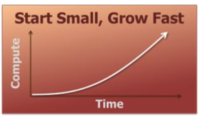

### Limitantes (Escalabilidad)

**Arquitectura y Algoritmos** 
- Si la arquitectura no fue pensada para escalar desde un principio, nos vamos a encontrar con un cuello de botella. Entonces tenemos que re-hacer la arquitectura 
- Los algoritmos son pensado en base a los datos y patrones de carga. Si no son los corrector, vamos a tener que designar tiempo para mejorarlos

**Red** 
- El sistema puede verse limitado por el ancho de banda (nos llegan mas datos/requests que soporta la red)

**Restricciones de negocio y legales** 

- Como hay infraestructura desplegada en distintos paises y quiero mover los datos de un país a otro no voy a poder hacerlo por temas legales

**Datos** (4V -> Velocity, Variety, Volume, Verasity) 

- Vamos a tener que procesar y guardar datos en nuestro sistema y si no medimos el volumen de los datos,vamos a tener problemas de capacidad 
- Tambien puede pasar que puedo guardar los datos, pero no procesarlos en el tiempo esperado 

OBS -> todos estos problemas se pueden solucionar con más presupuesto

### Tecnicas de escalabilidad

- **Escalamiento vertical**: agrego más recursos a un nodo físico
- **Escalamiento horizontal**: agregar redundancia de nodos, balanceadores de cargas o agregar servidores en otras regiones.
- **Fragmentacion de datos**: Los datos que deben estar juntos los dejamos juntos, sino los separamos (Hce que operaciones de I/O sean más rapidas y poner más nodos donde están los datos separados)
- **Componentizacion**: Separar servicios en servicios más pequeños que hagan tareas específicas
- **Optimizar algoritmos**: nos da mejora de performance y en el pasaje de mensajes 
- **Asincronismo**: nos evitamos procesar los request de forma inmediata para mejorar la performance del sistema (le respondemos en otro momento al cliente, cuando vuelva a preguntar)

OBS -> en escalamiento horizontal, se debe haber diseñado una arquitectura que permita redundancia de nodos

## Elasticidad

### Escalabilidad vs elasticidad 

**Escalabilidad**
- Es la capacidad de un sistema para adaptarse a diferentes ambientes modificando los recursos del sistema.
- Bajar el sistema y levantarlo con nuevo recursos

**Elasticidad**
- Es la capacidad de un sistema para poder modificar dinámicamente los recursos del sistema, adaptándose a los patrones de carga.
- Requiere el soporte de la infraestructura para poder lograrlo

### Componentes (mas importantes)

**Load Balancer** 
- Los servicios o instancias nuevas deben recibir tráfico apenas los agregamos 
- Los servicos o instancia que damos de baja o que estan caidos dejan de recibir tráfico
- Necesitamos poder detectar si el servicio/instancia esta preparado para recibir tráfico

**Autoscaler** 
- Sabe como deployar y terminar los componentes del sistema
- Scale Out: incrementa instancias del sistema
- Scale In: decrementa instancias del sistema
- Recibe métricas del sistema y puede incrementar o decrementar lsa instancias de acuerdo a esas métricas

**Monitoring automático**
- Nos da metricas de las instancia/servicio del sistema 
- Ej: metricas sobre CPU, memoria, I/O, etc.

[Ejemplos: min 5]

## Alta disponibilidad 

Se puede definir a la probabilidad de que nuestro sistema este disponible como:

P(disponible) = 1 - P(fallar) 

La disponibilidad de un sistema se mide por la cantidad de 9's. Por ejemplo 0.9, 0.99, etc. 

Es imposible que el sistema este 100% disponible ya que va a haber tareas de mantenimiento

**Ejemplos**

- El sistema esta disponible si los 3 están disponibles. Se multiplican las probas porque el sistema esta caído si al menos 1 esta fallando

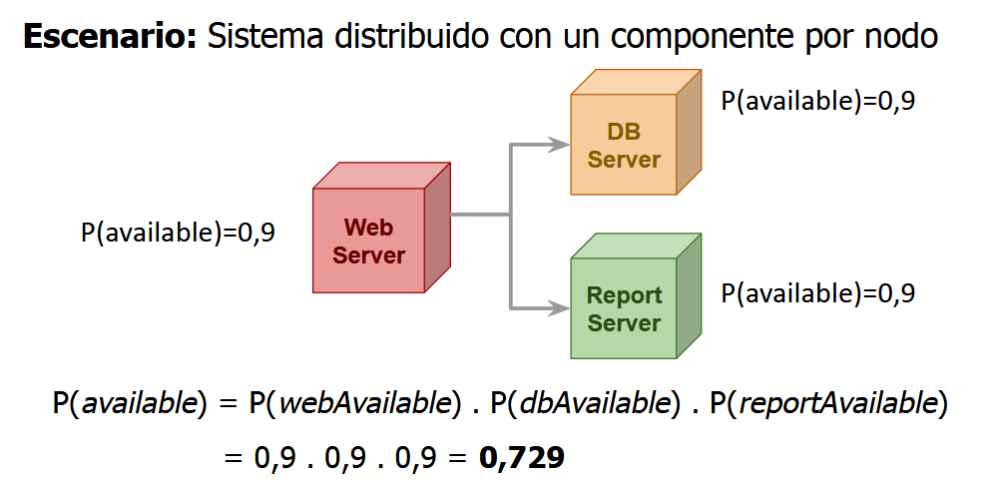

- En este caso, el sistema va a estar disponible si al menos 1 esta disponible ya que todos los nodos tienen todos los servicios. Por este motivo, se "suma" las probabilidades de fallas

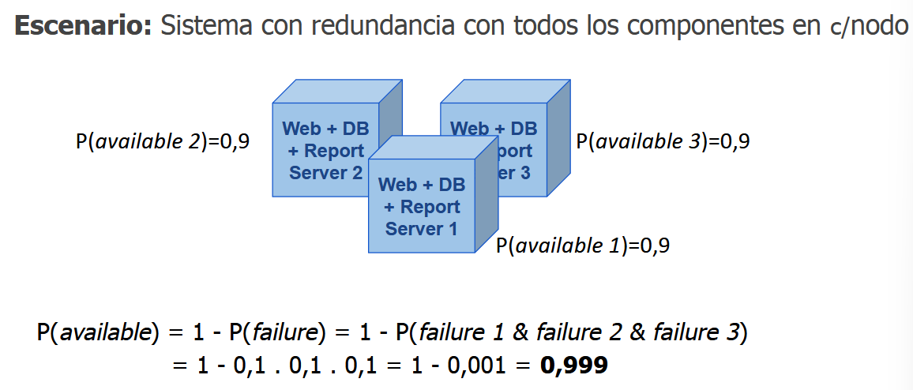

- Es como el primero, solo que ya tenemos la availability de cada cluster

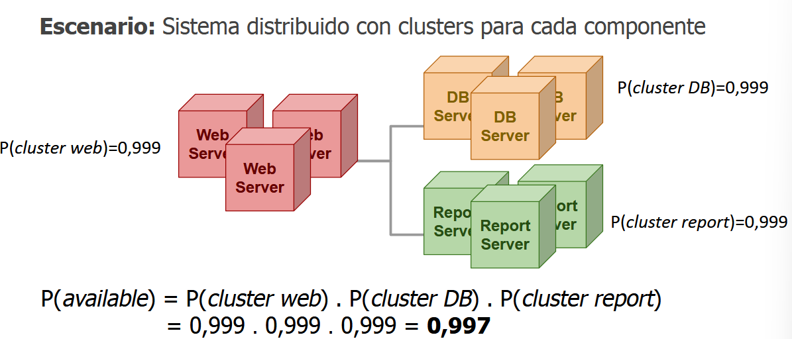

### Terminología

**Service Level Agreement** (SLA)
- Es el acuerdo pactado con el cliente 
- Se debe definir que sucede si este no se respeta

**Service Level Objectives** (SLO)
- Es lo que debe cumplir la métrica para no invalidar el SLA 
- Ej: Availiability > 99.95%

**Service Level Indicators** (SLI)
- Son las métricas a ser comparadas con los SLOs 
- Siempre deben superar al threshold del SLO 
- Requiere una plataforma de observability (no requiere todas las metricas, pueden perderse)

### Teorema CAP 

El teorema dice que solo pueden cumplirse 2 de los siguiente atributos

**Consistency**: si uno tiene datos replicados, todos los nodos me van a responder lo mismo frente a un mismo pedido

**Availability**: es la capacidad del sistema de responder cualquier pedido. La data puede ser vieja

**Partition Tolerance**: Puede lidiar con formación de grupos aislados de nodos

OBS-> Si sacrificamos partition-tolerance, no estamos usando un sistema distribuido. Se puede sacrificar consistency o availability.

## Arquitecturas orientadas a servicios 

### Monolíticas 

- Se llama asi porque a medida que uno va creciendo los servicios que entrega, crece el web server a tamaños grandes 
- El web server no se puede dividir, todo esta ahí
- Esto nos arregla muchos problemas cuando queremos desplegar algo simple 
- No queremos que le lleguen cosas al web server que alguien puede responder de antemano porque son preguntas más simples. Por eso esta la capa de Reverse Proxy
- Reverse Proxy es una capa anterior a donde esta el web server en el cual se respondes algunas consultas simples, por ejemplo archivos estáticos (no cambian nunca). Usualmente, esto no es más que otro http server que tiene un rápido acceso a archivos
- El modelo también requiere de una DB

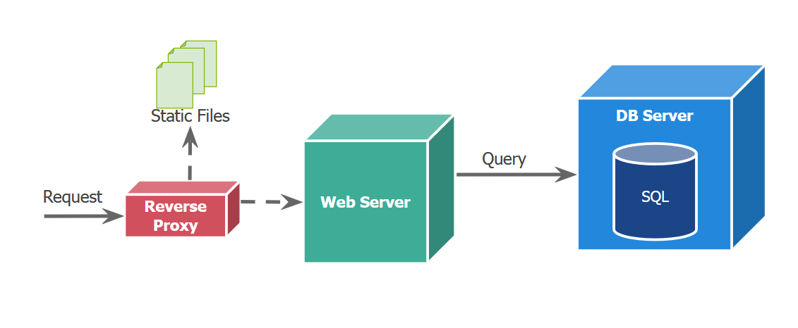

### Monolitica (escalable)

- El web server puede ser replicado y el reverse proxy puede elegir a donde va el request (dependiendo de la carga por ejemplo).
- Esto nos da posibilidad de tener ruteo de paquetes y según afinidad, nos permite escalar el monolito, pero hay un único punto de falla en el reverse proxy 
- En el caso que los datos sean muchos, se puede escalar la DBs. Una DB va a hacer de maestro y el resto esclavo (y hacer mirroring). La ventaja de esto es un menor throughput de lectura pero uno mayor de escrituras

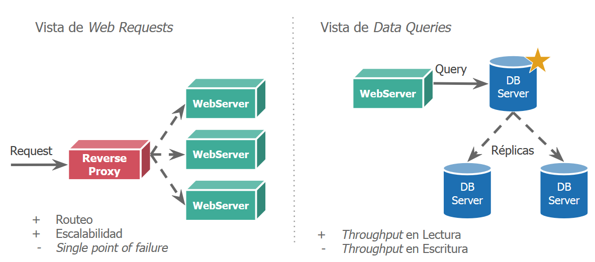

### Arquitectura Orientada a Servicios (SOA)

Es una arquitectura y un paradigma orientado al ambito corporativo que implica modelar, automatizar, etc. 

- Los elementos de las apps se los empieza a ver como los servicios que requiere nuestro negocio para poder solventar los procesos operativos.
- Tanto los clientes como apps externas acceden al registro de servicios para buscar donde esta el elemento que orquesta (es otro proceso) los procesos, los cuales usan 1 o más servicios y 1 o más DBs.
- Se hacen servicios simples donde alguien de una capa superior los usa para hacer algo más complejo.
- Todo lo que puedo transformar en un servicio, va a ser un servicio. Por ejemplo, los datos son un servicio
- Hay que tener cuidado al definir cuales son los procesos que se vinculan o definen si ya estan disponibles, se agregan al service registry
- Si esto requiere comunicacion con quienes consumen el servicio, esto se hace con un Service Bus

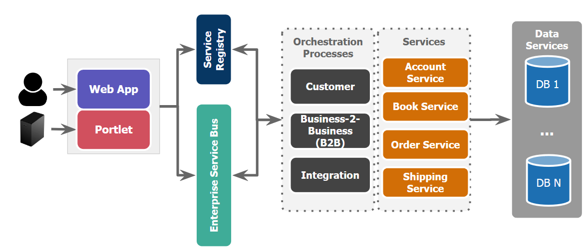

#### Caracteristicas de los servicios

**Tecnologías** 
- Web Server: SOAP + HTTP 
- Entreprise Service Buses (ESB) para emitir y recibir eventos 
- Registro para el discovery de servicios

**Procesos y servicios**
- Tiene la posibilidad de definir contratos e interfaces para hacer la interoperabilidad

### Microservicios 

- La diferencia es que si hay algo que se identifica como servicio y tiene uso de datos y no requiere cosas que esten afuera, lo convertimos en un microservicio y lo encapsulamos en un pequeño web server con una pequeña DB (siempre y cuando sea coherente)
- Los microservicios se comunican entre si para pedirse cosas
- Si alguien quiere acceder desde afuera, tendrán apps (Front Apps) con un Gateway que cumple el rol de orquestador, es decir, este conoce donde están los servicios necesarios para el request

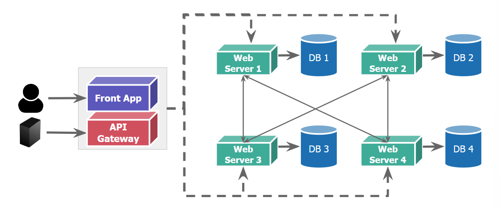

### Transicion entre arquitecturas

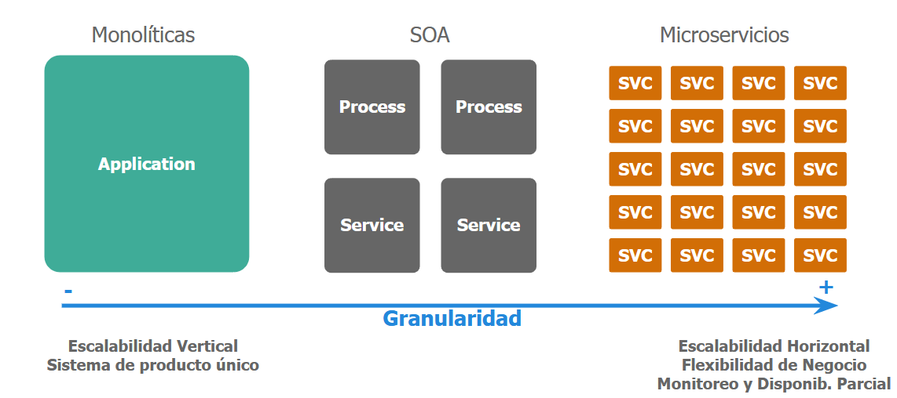

### Serverless

- Permite desplegar funciones y código en la nube. No me interesa donde esta el server 
- Puedo elegir darle más recursos a una funcion que a otra
- El problema es que se pierda la completitud que el storage le da a la app al estar juntas porque el storage paso a estar en "algun lado"
- Se usa para desplegar contenedores sin saber donde se despliegan (no tengo hardware)

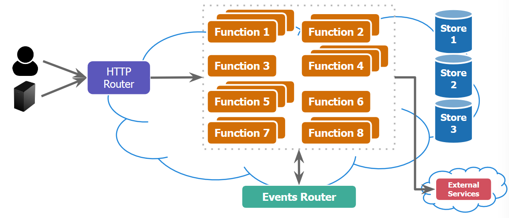

# Clase 15 - Cloud

## Cloud 

- Es una metáfora para todo lo que esta en internet y todos los servicios que ofrece 
- Es una forma de cirtualizacion que permite ofrecer recursos IT
- Es networking, infraestructura, son plataformas y son servicios que se pueden consumir

### Niveles de abstracción

#### **Software as a service** (SaaS)

- No me dejen elegir la infra ni programar código para la plataforma. Cobran por uso de cpu. 
- No puedo meter código, solo configuro.
- Ej: google drive

#### **Platform as a Service** (PaaS)

- No se como esta construida la infraestructura. Vos le pasas el código y el PaaS se encarga de hacer el despliegue.
- Son frameworks para poder desarrollar aplicaciones. Por lo general, las app hechas para correr en la nube son dificiles de usarlas localmente
- Brinda recursos expuestos como servicios (logging, monitoring, etc.)
- Ej: Google App Engine

#### **Infrastructure as a Service** (IaaS): 

- Brinda redes, storage, cpu (virtualizacion de equipos)
- Permite definir redes y tecnicas para adaptarse a cargas
- Ej: Google Cloud Storage

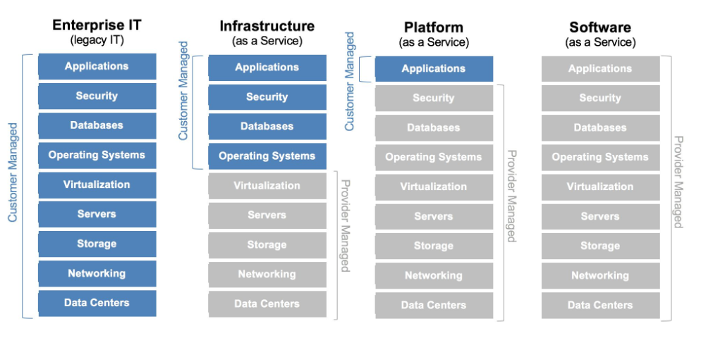

### Principales beneficios

**Accesibilidad**
- Puedo acceder desde cualquier lado 

**Time-to-market**
- Disponibilidad instantanea de los recursos. 
- Ej: puedo lanzar un servidor haciendo "2 clicks", no me preocupo por el hardware, sistema operativos, etc.

**Escalabilidad**
- Brinda capacidades "ilimitadas" de recursos: almacenamiento, ancho de banda, memoria, etc.

**Costos**
- Se paga en base a la demanda. Si crezco o uso más recursos, pago más.
- Puedo controlar el gasto dependiendo del uso 
- Estructuras accesibles, escalables y confiables que son baratas

### Publica vs. Privada

**Cloud Pública**
- Los servidores se comparten con otros usuarios
- Costos variables (pay as you go)
- Accedo mediante internet

**Cloud Privada**
- Hoy en día si una empresa tiene mas de 2 servidores, tiene una nube privada. Si tiene Datacenter, es nube privada.
- Hay empresas que requieren tener servicios privados de nube por ejemplo Bancos
- Tambien permite a la empresa tener recursos dedicados
- Costos son fijos (conviene si el costo variable aumenta mucho)
- Accedo mediante intranet

### Porque hay empresas que no pasan por completo a la nube?

**Factores Políticos**
- Están reguladas y se pierde el control de donde están los datos 
- Se pierde capacidad de influir sobre los elementos del hardware/SO, etc.

**Factores Técnicos** 
- Costos de plata y tiempo para migrar el sistema.
- Los datos sensibles pueden quedar expuestos en cualquier lugar.
- Dificultades en la construcción de los sistemas para esta arquitectura.

## Platform as a Service 

- Es tener una plataforma para desarrollar, es decir, ya estan los elementos de la infra (servidores, despliegue). Me dan todo lo que es parte de IaaS
- Hay una plataforma de desarrollo cuando hay SO definidos, librerias especiales para consumir la infra, middleware para abstraerme de problemas 
- Debe tener elementos de persistencia (se definen y te dan esos), archivos blob (binario largo), broker de informacion para transferir eventos 
- Debe contar con monitores, log de actividades, control de acceso, alertas y acciones frente a caidas 
- Me garantiza escalabilidad, hacer balanceo de carga y tiene creacion y destruccion de nodos automática.

## Caso de estudio: Google App Engine 

### Diseño 

- Escalamiento horizontal 
- Request breves y si son largos se encolan
- Independencia del SO y Hardware
- Cache 
- Colas de mensajes 
- Elasticidad 
- Herramientas de loggeo y monitoreo 
- Modelos no relacionales 

### Microservicios 

- Para desplegar el sistema, definí apps que pueden hablar o no entra ellas y que cada una defina servicios. Cada una va a tener su caché, servicio de datos y colas de tareas

### Servicios e Instancias 

Servicios == Modulos 
- Pueden desplegarse distintas versiones, donde cada version puede tener 1 o más instancias 

Instancias/App servers == Backend Servers 
- Son la unidad de procesamiento 
- Pueden ser dinámicas porque se crea la instancia a medida que crece la cantidad de requests o Residentes que escalan de forma manual
- Es importante que sea stateless y que haya alguien que bufferee las requests. Si se tarda mucho en responder las requests, se mata la instancia.

### Comunicacion interna 

**Tipos de colas**

- Push queue: la cola puede invocar cosas, no espera a que la llamen. Si habia pocos elementos del otro lado, crea más instancias. Puede hacer balanceo de carga. Debe definirse una URL para ver a donde va a mandar el paquete
- Pull queue: para procecsamientos largos o elementos que iban y volvían. Admiten etiquetas para los subscriptores

**Leasing de mensajes** 
- Los mensajes son prestados, es decir, los mensajes desaparecen de la cola, pero siguen estando hasta que alguien procese el mensaje (cuando recibe un ACK).

### Almacenamiento 

- Storage no-SQL basada big table, que usa claves y valores.
- No es bueno para consultas 
- El particionamiento de la información se hace conociendo a la raíz y a todos los hijos de una raíz y los mantiene cerca, es decir, los almacena en un mismo lugar. Hace que sea más rápido la transacción en un mismo grupo pero es costoso entre grupos.

# Clase 16 - Tolerancia a Fallos

## Tolerancia a Fallos 

Es un área de los algoritmos que estudia la necesidad de los sistemas confiables que implica la garantía de que la ejecución siempre va a estar dentro de los limites y parametros que se definieron para esos algoritmos/sistemas. Esto implica prevenir que aparezca una avería que esté fuera de los estados posibles del sistema.

Estos programas deben tolerar situaciones alternativas al camino feliz y llevar al sistema a algo dentro de los limites conocidos. Además el comportamiento frente a errores debe estar especificado

Algunas herramientas usadas para esto son replicación, votación (para llegar a un consenso para realizar una accion), recuperación, entre otras. 

En otras palabras, un sistema distribuido es tolerante a fallas si este continua operando de forma aceptable en presencia de fallos. En todo momento el sistema debe tener definido unos pasos a realizar incluso en situaciones de error.

### Tipos de fallos 

- **Fallo** (Fault): ocurre algo fuera de los parametros esperados
- **Error**: Es un error en el estado del sistema causado por un fallo
- **Avería** (Failure): Comportamiento incorrecto debido al estado erróneo del sistema 

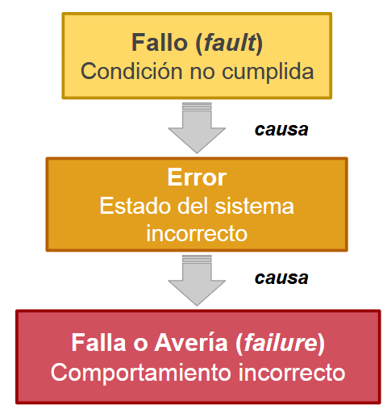

OBS -> la idea de Fault Tolerance es poder tolerar los fallos para que el sistema nunca llegue a una avería

OBS -> Un fallo parcial es cuando un componente de un sistema distribuido tiene un Error lo cual puede generar una reacción en cadena, afectando el comportamiento total del sistema

### Clasificación de fallos 

Según la frecuencia, los fallos pueden ser:

- **Transientes**: ocurren 1 vez y luego desaparecen (no vuelve a suceder en otra ejecución). Ej: desconexion de cable de red porque alguien lo desconecto.
- **Intermitentes**: ocurren de forma intermitente. Son dificiles de diagnosticar y de reproducir. Ej: El sistema a la 10 p.m tiene un conusmo de memoria/cpu muy alto, haciendo que los clientes reciban errores.
- **Permanentes**: existe hasta que el componente defectuoso se reemplace. Ej: un disco se rompe.

Según la probabilidad, los fallos pueden ser:

- **Fallo improbable**: un fallo que puede llegar a pasar en nuestro modelo, pero es poco probable.
- **Fallo imposible**: un fallo que nunca va a pasar en nuestro modelo. Ej: no tenemos en cuenta que haya una lluvia solar

Otra clasificación de fallos es:

- **Crash**: el servicio se detiene/cae 
- **Timing**: la respuesta llega fuera de los tiempos esperados
- **Omisión**: el servicio falla al responder alguna solicitudos sin darme informacion
- **Respuesta**:  la respuesta es incorrecta (valor incorrecto, etc.)
- **Arbitraria o Bizantina**: se obtiene respuestas que son engañosas o va cambiando arbitrariamente la respuesta. Por lo general, estos fallos tienen objetivos maliciosos.

### Condiciones

Las condiciones en las que opera el sistema para definir el nivel de tolerancia a fallos 

#### Condiciones de entorno

- Entorno fisico del hardware (temperatura, ubicación, resistencia a vibraciones y polvo, etc)
- Interferencia y ruido 
- Clock drift

#### Condiciones operacionales 

- Especificaciones, valores limites o tiempos de respuetas que se llevan al limite o pasan el limite, lo cual genera un estado de fallo latente en el sistema. Ej: que pasa si se pasa de temperatura? 
- Networking: ancho de banda y latencia 
- Protocolos soportados 

### Detección de errores

(Estrategias de manejo de errores)

- **Fault Removal**: encontrar y remover los errores antes de que sucedan. Ej: deteccion de errores de hardware antes de que sucedan
- **Fault Prevention/Avoidance**: evitar las condiciones que llevan a generar errores. Ej: usar componentes que impidan que hayan fallos (relojes atómicos, etc.)
- **Fault Forecasting**: determinar la probabilidad de que un componente pueda llegar a fallar y reemplazarlo antes de que falle. Ej: reemplazar piezas en un avion por tiempo de uso
- **Fault Tolerance**: Procesar errores en el sistema y tratar los mismos en vez de evitar que sucedan. La idea es llevar el sistema a algo adecuado una vez eso pase

### Resiliencia 

Es mantener un nivel aceptable de servicio aún ente fallos, es decir, toleran el fallo y pueden seguir operando ante errores como:
- Errores de configuracion o mal uso de usuarios
- Desastres naturales
- Factores politicios, económicos, etc. (Impuestos, aumento en precios, etc.)
- Ataques maliciosos

Una cosa que se puede hacer es una **Degradación suave (graceful degradation)**, en donde el comportamiento que se le entrega al usuario sea aceptable aunque alguno de los features no respondan correctamente.

### Enmascarado de errores y redundancia

La idea de la redundancia es tener :
- elementos fisicos que repliquen otros elementos
- redundancia en tanto a valores/datos
- reintentos para tolerar fallos temporales

Ejemplo: rueda de auxilio

Hay varios tipos de **replicación**

#### Activa 

Tenemos muchas réplicas de la misma máquina de estado y todas las computadoras reciben el request y lo procesasan.

Todas las réplicas realizan las operaciones en el mismo orden, lo que implica que hay Orden Total

El load balancer compara las respuestas de todas las réplicas para chequear de que sean las mismas. El problema es que el balanceador  es un único punto de falla

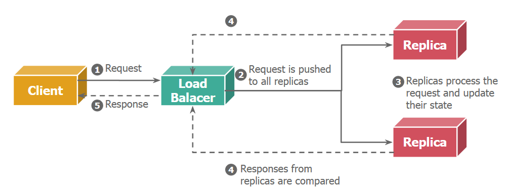

#### Semi-activa (leader-follower)

Todas las réplicas ejecutan los comandos, pero una sola (el lider) realiza las decisiones no determinísticas. Ej: algo que requiera randomicidad.

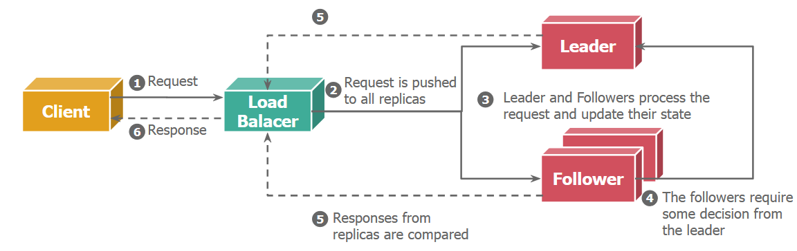

#### Pasiva 

Hay una replica primaria y varias secundarias o de backup. La replica primaria procesa un cambio de estado y envía los cambios del estado a los backup.

Si muere el Master, uno de los backups lo reemplaza

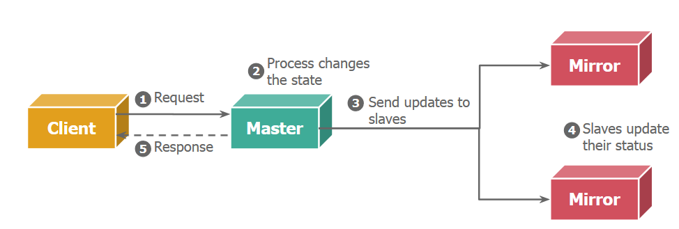

Permite tener más de un solo punto de falla y si alguno de esos se cae, no implica que el sistema se quede sin servicio/respuesta.

Hay algoritmos de consenso que nos permite elegir el lider/elemento activo. Tambíen hay fallas de particionamiento de red, que sucede cuando algunos nodos no pueden hablar con un subgrupo pero no con otro (todos son parte del mismo grupo)

### Recuperación 

¿Como me recupero de un fallo y llevo al sistema a un estado correcto?

- **Almacenamiento estable**:  alamcenamientos que permiten bajar la información, pero se reduce el tiempo de respuesta a usuarios. Sabemos que si el sistema llega a fallar, la información va a estar guardada en un lugar seguro.
- **Checkpointing**: se guarda periódicamente el estado completo del sistema en almacenamiento estable.
- **Message Logging**: se parte de un checkpoint y se repiten todos los mensajes intercambiados desde ese checkpoint
- **Consenso**: acordar con otros nodos el estado correcto

## Resilencia/Confiabilidad

En que consiste la confianza de un sistema?

- **Availability (disponibilidad)**: la probabilidad de que el sistema este operando correctamente. Debe ser alta y se mide con los 9s
- **Reliability (fiabilidad)**: la capacidad del sistema para dar servicio correcto continuamente (que responda bien las cosas que hace, no cualquier cosa). En algunos casos se sacrifica esto para poder responder rápido
- **Safety (seguridad)**: No ocurre nada catastrófico ante fallos, es decir, no el sistema no lleve los problemas a otras sistemas
- **Maintainability (mantenibilidad)**: la cantidad de tiempo que se requiere para actualizar/reparar el sistema. Si requiere poco tiempo, es mantenible
- **Durabilidad**: probabilidad de recuperar un dato que fue persistido

### Availability vs. Reliability

Para aumentar la Availability se puede hacer réplicas, pero hay que tener en cuenta que esto afecta al reliability ya que para no afectarlo no hay que dar lecturas fantasmas, no hacer que la informacion tenga estado persistente, etc. 

Cuál es la mejor opcion? La mejor opción depende de:
- Costos y presupuesto disponible 
- Performance y escalabilidad
- Necesidades de cada componente 

OBS -> el 40% de las veces, los fallos son por errores humanos 

### Maintainability

Es cuanto tiempo tarda en volver a funcionar el sistema al haber un fallo.

El problema de tener una infra mutable es que es propensa a errores. Si alguien toca el servidor para actualizar puede dejarlo en un mejor estado que antes, pero si se cae el servidor nada me asegura que el servidor funcione bien. Además, puede pasar que quedan 2 versiones corriendo al mismo tiempo en la máquina al lanzar una nueva actualización

La idea al tener una infra inmutable es generar imágenes nuevas ante cada cambio y se destruye y almacena las imágenes viejas al hacer el deploy. Esto me garantiza que las app son fijas y que nadie las cambió.

OBS -> el procesos de eliminar y desplegar la nueva imagen debe ser automatizado

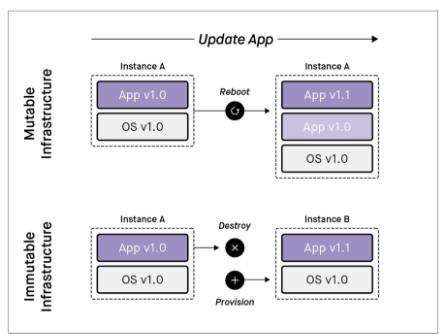

Los desarrolladores generan las imágenes (trabajando en sus entornos) y suben su codigo a un repositorio, luego pasa una herramienta de automatización para evitar errores y genera la imagen y lo sube al registry (dockerHub, AWS, etc.) y luego se depliega en testing. Una vez funciona bien la misma imágen se pasa a UserAcceptance y si esta bien, se depliega a prod.

OBS -> Nunca se cambia la imágen en las etapas. 

Todo esto nos permite tener un trazabilidad de los cambios y hacer upgrades inmmediatos. Nos da resilencia debido a que nos brinda alta disponibilidad y permite realizar health checks para testear los contenedores que estan corriendo y relanzar los container que caen. También nos permite desacoplar los sevicios que utilizo (Infraestructura, plataforma o servicios)

### Safety

El sistema debe ser recuperable (manual o automática) siempre, ante cualquier tipo de falla.

Que pasa con las fallas catastróficas? Siempre van a ocurrir ya que no son imposibles, por eso hay que establecer un proceso de Disaster Recovery (puede tardar dias a veces, pero debe ser conocidos para poder garantizar SLAs)

## Consenso

Dado un conjunto de procesos distribuidos y un punto de decision, todos los procesos acuerdan ese valor. 

Algunas hipótesis a tomar para realizar esto (sino es complicado tener en cuenta todos los casos) son:
- Canales deben ser reliable
- Todos los procesos deben poder comunicarse entre si, evitando particionamiento de red. Si un proceso no responde, se cayó
- La única falla a considerar es la caída de un proceso 
- La caída de un proceso no ocasiona la caida de otro

### Coordinación y acuerdo 

El objetivo es:
- Conseguir que un conjunto de procesos pueda realizar un conjunto de tareas siguiendo una secuencia 
- Permitir replicar información
- Evitar puntos únicos de fallo 

Los problemas a resolver son:
- Sincronizar los procesos (recursos compartidos/ esperar otro procesos)
- Elección de un procesos coordinador 
- Determinar el valor correcto de un valor 

### Algoritmo de Consenso Simple

Tenemos 3 procesos, donde tienen que acordar algo entre sí (en este caso si un valor es true o false). Los procesos toman una decisión y deben responder en conjunto (deben hacer lo mismo)

El algoritmo dice que:
- Cada proceso crea un array para guardar los valores de cada nodo. En la posición i estan los datos del proceso i, y esta dividido en "rondas"
- En la ronda 0, va vacío
- En la ronda 1, se coloca el valor propuesto por cada nodo 

Luego se itera en rondas haciendo lo siguiente: 
- por cada ronda se hace un broadcast del valor de la ronda r y le saco los valores de la ronda anterior.
- Entonces, broadcasteo los valores que se computaron en la ronda actual.
- Los valores de la ronda siguiente, van a ser lo de esta ronda
- Recibo todos los valores de uno de los demás procesos mientras la ronda siga abierta, para luego unir los datos con los de los demás procesos (se concatenan al array). Puede que más de un proceso envíe valores

Una vez terminan todas las rondas, se aplica una función de agregación sobre los valores de la ultima ronda y me quedo con un valor. Este valor va a ser el mismo para cada proceso.

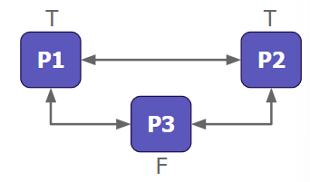

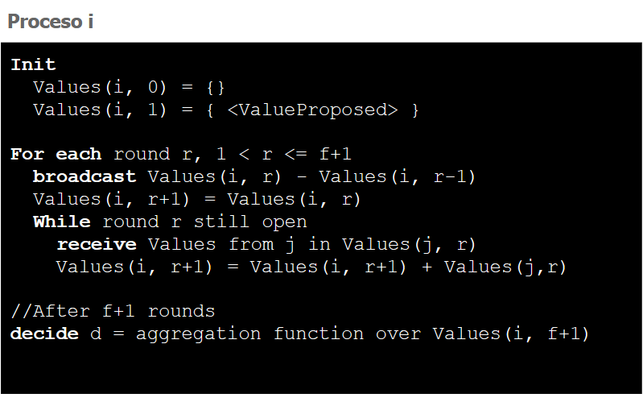

### Exclusión mutua distribuida 

El objetivo es crear un algoritmo que garantice que el recurso solo sea accedido por un elemento a la vez. La idea de ser distribuido es que utilice pasaje de mensajes para lograrlo 

Estos algoritmos deben cumplir las siguientes propiedades:
- **Safety**: solo 1 procesos tiene el recurso en todo momento
- **Liveness**: los procesos no deben esperar eternamente por mensajes que nunca van a llegar
- **Fairness**: cada procesos posee la misma prioridad para obtener el recurso y debe liberarlo en un tiempo conocido

#### Servidor central 

El servidor se encarga de controlar los accesos a recursos

- Se elige a uno de los procesos como coordinador de la sección critica.
- Los recursos tienen un identificador para que los procesos puedan obtenerlos 
- Si el recurso esta tomado, se deben encolar las request (FIFO) y el acceso a la sección critica debe ser time-bounded.

OBS -> El servidor tambien puede decidir de sacarle el recurso al proceso si se pasa de tiempo.

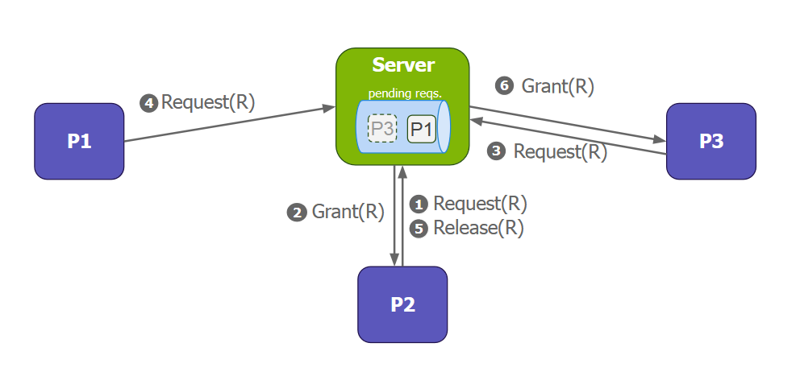

**Ventajas**
- Request se procesan en orden 
- Facil de entender e implementar 
- Los procesos conocen al servidor 
- Cantidad de conexiones es mínima (los procesos no se conocen entre sí)

**Desventajas**
- Server es punto único de fallos 
- Los procesos no pueden distinguir si el server esta caído o no 
- El servidor funciona como cuello de botella

#### Token Ring

- Se construye un anillo entre los procesos y se lesa signa un orden 
- El procesos 0 crea un token y lo va circulando por el anillo 
- Si un proceso tiene el token, puede acceder a la sección critica. Si no quiere entrar a una sección crítica, lo pasa.

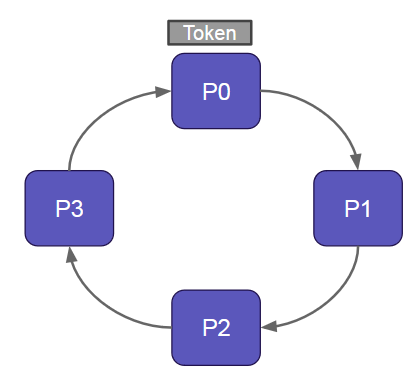

**Ventajas** 
- Facil de entender e implementar 
- No hay un servidor central 
- Exclusión mutua garantizada con el token

**Desventajas**
- Es complicado crear el anillo en forma dinámica 
- Si se cae un procesos, se debe regenerar el anillo y ver si el token sigue o no
- Se puede perder el token.
- Un procesos puede retener por mucho tiempo el token 

#### Algoritmo de Ricart & Agrawala

Es un algoritmo distribuido que usa reliable multicast y relojes lógicos

Cuando un proceso quiere acceder a una sección critica:
- Crea un request con un timestamp asociado al proceso (ID + Nombre del recurso)
- Envía el requqest a todos los procesos en el grupo 
- Espera a que todos los procesos le permitan acceder a la sección critica (Le responden OK)
- Entra a la sección critica

Cuando un proceso recibe una request:
- Si el proceso no esta interesado en acceder, responde OK
- Si el proceso esta en la sección critica, no responde y encola el mensaje (cuando sale de la SC, responde)
- Si el proceso también envio una request para acceder a la SC, se utiliza el timestamp para saber quien gana: El que tiene menor timestamp gana: si es el perdedor, envía un OK al Sender. En cambio si ganó, encola la request (mismo caso que ganar normal)

Si el receiver poseía la SC, envía OK a todos los request encolados

**EJEMPLO**

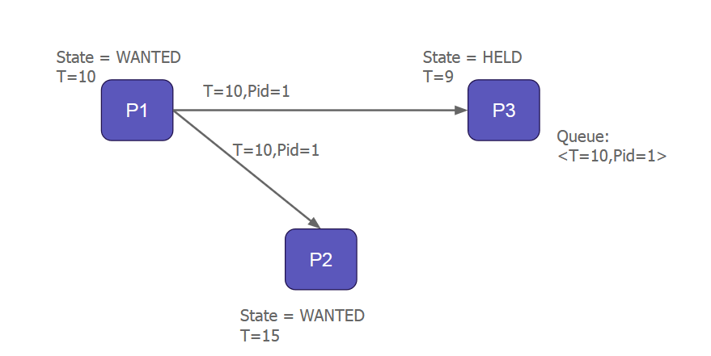
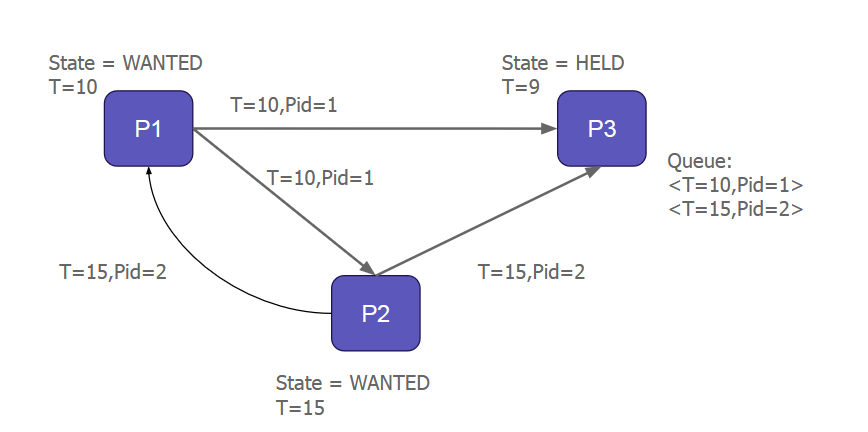
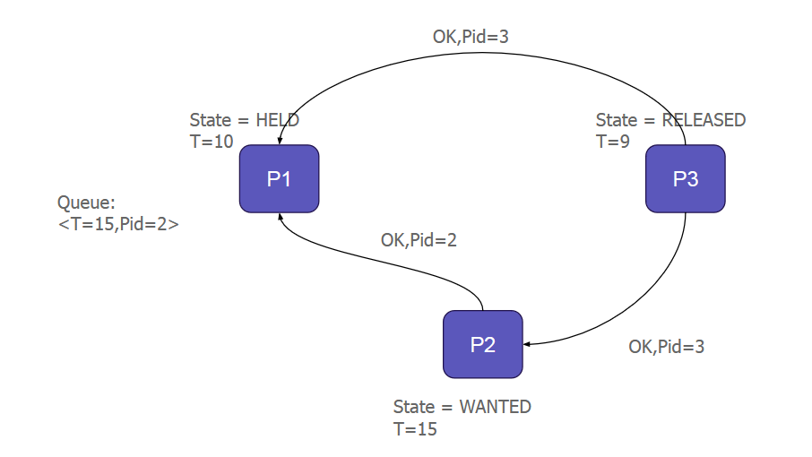

**Ventajas** 
- No hay un único punto de falla
- No hay necesidad de un coordinador

**Desventajas** 
- Hay N puntos de fallas. Si uno falla, los otros se quedan bloqueados
- Todos los procesos deben conocerse (mesh)
- Chatiness Alto
- Imposible detectar si un proceso esta caido o en la sección critica

# Clase 17 - Algoritmos de consenso 

## Elección de líder 

### **Objetivo**
- Elegir un proceso de un grupo para que tenga un rol particular 
- Permitir reelecciones si un líder se da de baja o se cae

### **Características** 
- Cualquier proceso puede comenzar una nueva elección
- El resultado de la elección de un líder debe ser única y repetible

### Propiedades

- Cada proceso tiene ID unico 
- Todos los procesos tienen un array que indica el estado del algoritmos (indefinido o id del lider). Inicialmente, el estado es indefinido
- Safety: un proceso participante posee uno de los 2 estado anteriores 
- Liveness: todos los procesos que participan en la elección terminan con el estado que no es indefinido o mueren

###  Algoritmo del anillo

#### Condiciones Iniciales 
- Cada procesos solo se comunica con su vecino 
- Los mensajes son enviados en la misma direccion 
- Al comienzo del algoritmo, todos los procesos se los marca como "no participantes"

#### Algoritmo

1- Algún proceso P se marca como participando y envía un mensaje al siguiente nodo que el es el líder (pasa su ID)

2- Si un proceso P recibe un mensaje de la elección de lider:
   a- Si su estado es "**No participando**":
   - cambia su estado a participando
   - compara el id del líder con el suyo y lo reemplaza si es mayor
   b- Si su estado es "**Participando**":
   - Si el ID recibido es menor al suyo, no reenvía el mensaje 
   - Si el ID recibido es mayor al suyo, reenvía el mensaje 
   - Si el ID recibido es igual al suyo, entonces es el **líder** 

3- Una vez se eligió el lider:
   a- Si P reconoce que es el lider
   - Se setea como "No participando"
   - Envía mensaje de "Lider elegido"
   b- Si P recibe un mensaje de "Lider elegido":
   - Cambia su estado a no participando 
   - Setea la variable "elected" con el id del lider 
   - Retransmite el mensaje siempre que el ID sea distinto al suyo

[Ejemplo de seguimiento en PDF]

### Algoritmo Bully

#### Hipotesis 
- Canales de comunicación reliables
- Cualquier procesos puede morir de forma inesperada (uso de timeout para detectar esto)
- Todos los procesos se pueden comunicar entre sí 
- Cada proceso conoce el ID asociado a todos los procesos 
- Cada proceso conoce que procesos tienen un ID mayor al suyo

#### Tipos de Mensajes 
- **Election Message**: inicia la elección de lider
- **Answer Message**: ACK al Election Message 
- **Coordinator Message**: Inica que procesos fue elegido como lider

#### Sincronismo
- Tmax = tiempo máximo de transmisión 
- Tprocess: Tiempo máximo que un proceso tarda en procesar el mensaje 
- Timeout (T) = 2 * Tmax + Tprocess -> uso para detectar caídos

#### Algoritmo
- El proceso con mayor ID puede identificarse como lider (conozco los IDs que son mas altos que yo) y manda un Coordinator Message a todos los procesos del sistema 
- Si un procesos detecta que el lider esta caído, envía Election Message a un procesos que tenga ID mayor al suyo
- Si un procesos recibe un Election Message, responde con Answer Message y comienza una nueva elección 
- Si el proceso recibe un Coordinator Message, elige al procesos que envió el mensaje como líder 
- Si un proceso que comenzo una eleccion no recibe un Answer Message luego de un tiempo T, el proceso se autoproclama lider
- Si un procesos caído vuelve a la vida, comienza una nueva elección de lider. Si tiene mayor ID, va a ser elegido como líder.

[Ejemplo de seguimiento en PDF]

## Consenso

### Definición 

 - Tenemos un conjunto de procesos que tienen que llegar a un acuerdo 
 - Cada procesos comienza con el estado "**Undecided**"
 - Cada proceso posee un array de variables: "**Decision variable**" (es el valor que propone cada proceso)
 - Cada proceso propone un valor vi
 - Los procesos se comunican entre si mediante mensajes (los valores que proponen)
 - Luego de haber recibido los mensajes de los otros procesos, los procesos aplican una función de agregación para decidir el valor (todos usan el mismo y les da el mismo valor) y cambia a su estado a "**Decided**"

### Requirimientos

**Agreement**
- El valor de la variable "**Decided**" es el mismo en todos los procesos 
- Si Pi y Pj son procesos correctos, entonces di=dj cuando su estado es "**Decided**"

**Integrity**
- Si los procesos correctos pusieron el mismo valor vi, entonces el valor de su decision variable es el mismo

**Termination**
- Eventualmente todos los procesos activos setean su decision variable

OBS -> La funcion de agregación que se elija va a terminar definiendo cual es el valor acordado (Formula de Quorum)

### Seguimiento 

En el ejemplo, los procesos deben decidir si proceder o no:

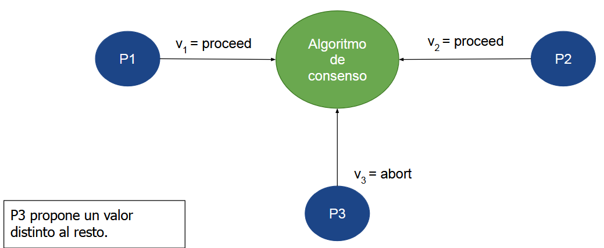

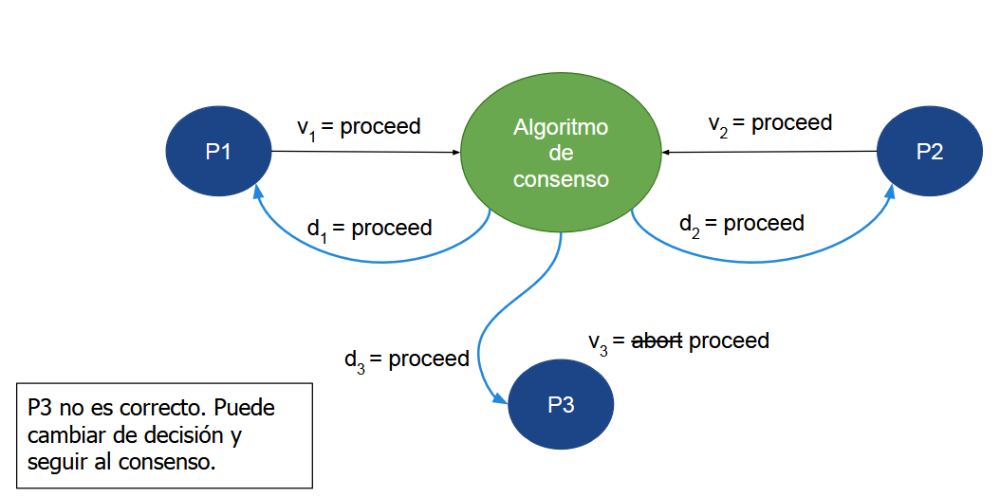

En el caso de que P3 se caiga, no hay problema porque P1 y P2 llegan a un acuerdo en el valor de la variable

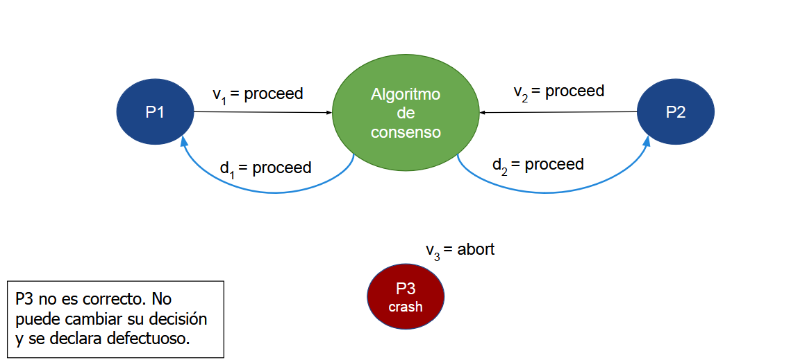

#### Algoritmo sincrónico (en clase anterior)

Tenemos N procesos, donde tienen que acordar un valor de una variable entre sí (en este caso si un valor es true o false). Los procesos toman una decisión y deben responder en conjunto (deben hacer lo mismo)

El algoritmo dice que:
- Cada proceso crea un array para guardar los valores de cada nodo. En la posición i estan los datos del proceso i, y esta dividido en "rondas"
- En la ronda 0, va vacío
- En la ronda 1, se coloca el valor propuesto por cada nodo 

Luego se itera en rondas haciendo lo siguiente: 
- por cada ronda se hace un broadcast del valor de la ronda r y le saco los valores de la ronda anterior.
- Entonces, broadcasteo los valores que se computaron en la ronda actual.
- Los valores de la ronda siguiente, van a ser lo de esta ronda
- Recibo todos los valores de uno de los demás procesos mientras la ronda siga abierta, para luego unir los datos con los de los demás procesos (se concatenan al array). Puede que más de un proceso envíe valores

Una vez terminan todas las rondas, se aplica una función de agregación sobre los valores de la ultima ronda y me quedo con un valor. Este valor va a ser el mismo para cada proceso.

## Generales Bizantinos

Es un problema relacionada a las fallas bizantinas, donde no podes asegurar/confiar en la info que llega al sistema

- Hay 3 o mas generales que deben decidir si atacan o se retiran (repiten la orden a los demás generales)
- Un comandante envía la orden de ataque/retirada
- Los generales pueden ser traicioneros, es decir, le indican a otros generales una orden distinta a la que dijo el comandante 
- El comandante puede ser traicionero, es decir, envía diferentes ordenes a distintos generales 

OBS -> el comandante/general traicionero viene a emular a un procesos que posee fallas 

### Requirimientos 

**Agreement**, **Integrity** y **Termination** (lo mismo que antes)

**Fórmula de quorum**: N >= 3f +1, donde N es la cantidad de procesos y f la cantidad de procesos traicionerosfallados 

OBS -> Si hay todos valores distintos, entonces si o si hay un traicionero y es el comandante

[Ejemplos en PDF]

## Paxos

Es un algoritmo de consenso que busca consensuar un valor.

### Caracteristicas 

- **Tolerancia a fallos**: el algoritmo va a funcionar siempre que haya más de la mitad de procesos vivos (N >= 2f +1)
- **Posibilidad de rechazar propuestas**: un pedido del un cliente puede ser rechazado (cliente puede reintentar la propuesta)

### Introducción

El cliente hace un request para setear o modificar un valor R, si lo puede hacer recibe OK, caso contrario, puede volver a intentar 

El algoritmo tambien nos asegura orden consistente (orden total) en un cluster ya que los eventos son almacenados por ID de forma incremental

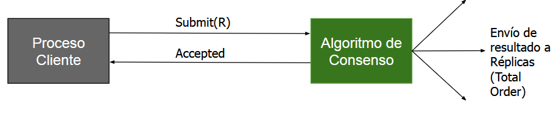

### Actores 

**Cliente**
- Realiza las requests

**Proposer** 
- Reciben las requests de los cliente y comienzan el protocolo 
- Se debe elegir un lider para evitar starvation

**Acceptor** 
- Reciben las propuestas del los Proposers
- Mantienen el estado del protocolo en almacenamiento estable 
- Existe quorum cuando la mayoría de acceptors estan vivos

**Learner**
- Cuando los acceptors llegan a un acuerdo, el Learner ejecuta el request y envía la respuesta al cliente

### Objetivo 

El objetivo es lograr que todos los Acceptors consensuen un valor V asociado a una propuesta realizada por un Proposer 

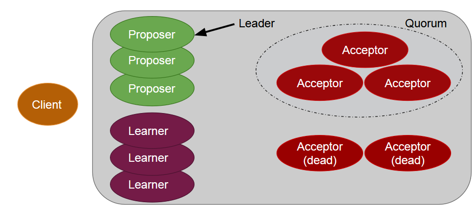 

### Seguimiento 

**Fase 0** - El cliente realiza un request al proposer

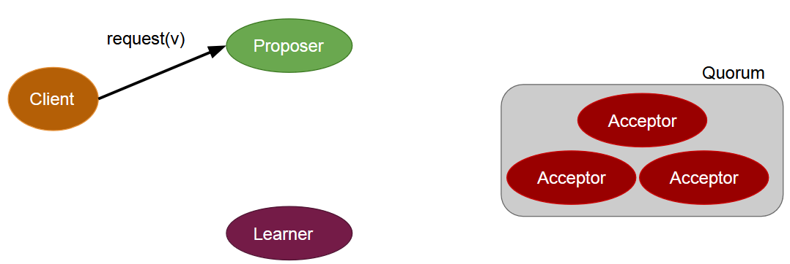

**Fase 1a** - Preparación
- El proposer crea una propuesta # N (N es mayor a cualquier propuesta que el proposer realizo anteriormente)
- Envía la propuesta a Acceptors esperando obtener Quorum. Envía un mensaje de Prepare(N) a los Acceptors 

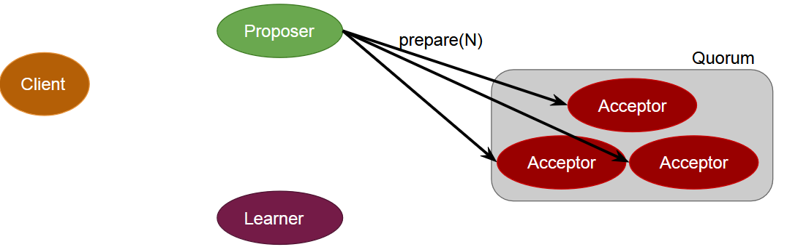

**Fase 1b** - Promesa
- Si los acceptor no prometieron nada antes, aceptan la promesa y van a rechazar cualquier request que tenga un ID menor al de la promesa aceptada
- Le responden la promesa al proposer, con el N previo (N') y el valor previo (v') (si es que habia uno antes)
- Los proposer esperan a recibir la mayoría de promesas de los Acceptors

OBS -> Se envía N' y v' para poder tolerar la caída de un Poposer, porque si se cae el proposer no habría quorum para funcionar.  (buscar otra explicación de esto, no se entiende nada)

OBS -> Un cliente puede ser rechazado si se esta procesando otro request.

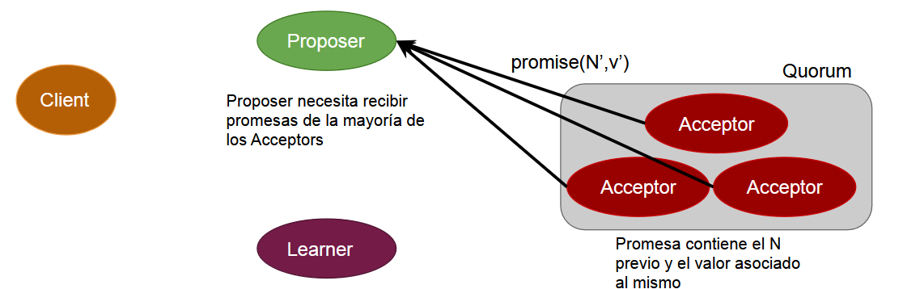

**Fase 2a** - Propose 

El proposer recibe las promesas de la mayoría:
- Rechaza todas las request que tengan un ID < N
- Envía un Propose a los Acceptors con el N recibido por los Acceptors y el valor v que llego en el request

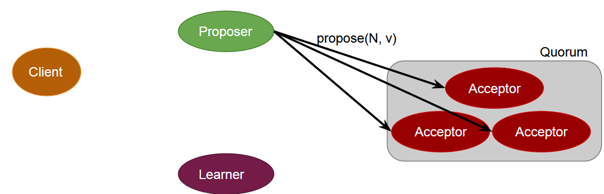

**Fase  2b** - Accept

Si la promesa es mantenida y no hubo ningún cambio en el valor de v:
- Envia accept a todos los leaerners y al Proposer que envió la request inicial 

OBS -> Si recibió un ID superior a N, no envia accept

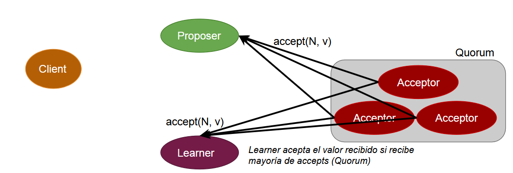

**Fase  2c** 
El learner realiza el cambio propuesto y le responde al cliente

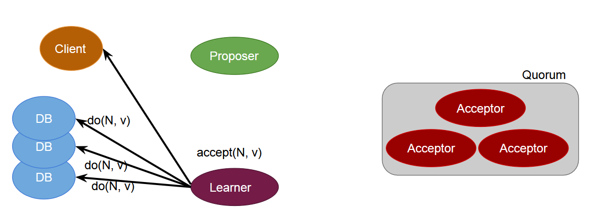

## Repasar RAFT 

http://thesecretlivesofdata.com/raft/

**Cada nodo puede estar en 3 estados**:
- Follower 
- Candidate
- Leader

**Leader Election** 

En RAFT hay 2 timeouts que controlan la eleccion de lider:
- **Election timeout**: tiempo que espera un nodo antes de convertirse en candidato (150 - 300 ms)
- **Heartbeat timeout**: tiempo cada cuanto se manda el hearbeat (Append Entries)

Inicialmente, todos los nodos empiezan es estado "Follower" y si no pueden comunicarse con el lider (no hay o se cayó), se convierten en candidatos.

El nodo elegido como candidato, se vota a si mismo antes de pedir los votos a los demas nodos. Si el nodo que recibe la solucitud de voto no voto a nadie, entonces vota al candidato (el que envio el mensaje) y resetea su Election timeout

Un nodo candidato se convierte en lider si es votado por la mayoría. Y este envia cada cierto tiempo un heartbeat a los followers.

OBS -> Si la cantidad de votos entre 2 o más nodos es la misma, se hace una re-elección hasta que se obtiene un lider

**Term**: son las "rondas" y solo puede haber un lider elegido en cada ronda. Sirve para poder soportar particionamiento de red

**Log replication**

Una vez hay un lider, todos los cambios van a pasar por este, el cual los guarda en un log y luego lo replica a los demás nodos. El lider espera a que la mayoría de nodos lo guarde antes de commitear el cambio. Una vez lo commitea, le avisa a los demás nodos y envía la respuesta al cliente (y se dice que se llega a un consenso del estado del sistema).

Para poder sincronizar los nodos, se usan los mensajes de Append Entries (mismos que los heartbeats). Una vez el lider recibe un cambio por parte de un cliente, se lo envía a los followers en el siguiente heartbeat

OBS -> Para commitear los cambios, tambien se usan los mismos heartbeats para enviar el mensaje 

**Network Partitions** 

Pasa cuando los distintos nodos no se pueden comunicar entre todos, por lo que termina habiendo multiples lideres con distinto valor de Term. 

Cuando se soluciona la particion de red, el lider con menor Term da un paso al costado y se convierte en follower del lider de mayor TERM. Esto implica que tanto el lider como los seguidores que tenia durante el particionamiento hacen un rollback de los cambios que no fueron commiteados y "duplican" el log del lider

OBS -> Que pasa si hay particion y ambos lados commitean cambios? No lo dice en la pagina esta.

# Clase 18 - Data Intensive Apps

## Big Table 

Es una plataforma (una app que se consume y se paga según el consumo) y es un concepto.

### Características 

- Big table almacena clave, datos y columnas
- Los datos son un conjunto de valores llamados columnas
- Almacena pares clave-dato, con el fin de particionar la data 
- Como son conjuntos dispersos de datos (hay conjuntos que vienen con muchos NULLs, otros con valores), lo cual me da la posibilidad de tener factores de diseño originales (es la problematica que google queria atacar)
- Los valores no se almacenan en un orden definido, sino que conocen a su "column family"

**Tablet**
- Es un conjunto de filas consecutivas de acuerdo a la clave. Las claves que esten relacionadas, las escribe una detras de otra
- Permite el balanceo de BigTable ya que permite escalar el sistema si la cantidad de datos en una Tablet crece demasiado. 

### Jerarquía

Se accede a través del Root del arbol de tablas.  Cada tabla graba clave y puedo saber donde esta el nodo siguiente para cada clave.

Las claves de la primera tabla me permiten acceder a las 2da tablas 

BigTable limita el arbol a 3 tablas y junto con el tamaño de bloques de la última tabla puedo tener muchisimos datos.  

OBS -> La velocidad es casi constante: muy lento para pocos datos y muy rápido para muchos datos. Esta optimizado para la escritura de muchos datos

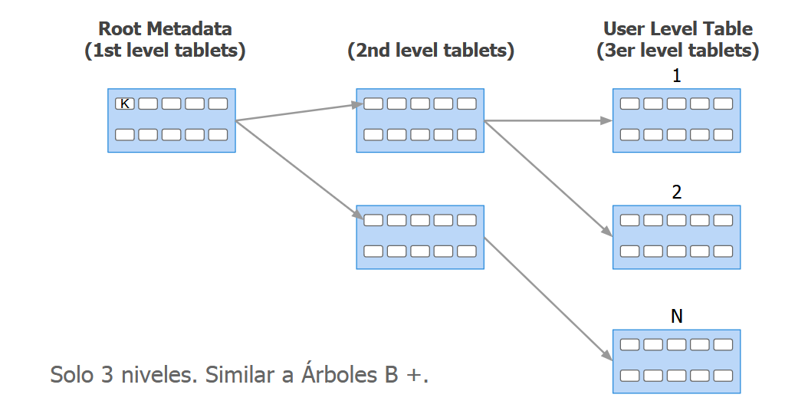

### Arquitectura

- Las tablas van a estar en servidores de tablets (como los datanodes en Hadoop)
- Las operaciones del tipo "metadata" se mandan a un Big Table Master (mainnode en hadoop). Este tipo de operaciones implican que el table master genere tablets, que avise que tiene muchos datos para ver si hace particionamiento, se encarga de ver que lockeo o no en un servidor de llaves (Chubby)

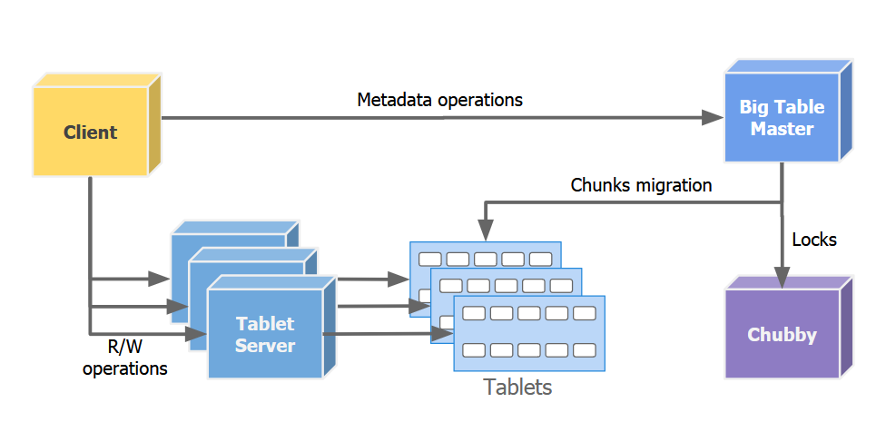

### Balanceo de Tarea 

Si la data empieza a crecer , el tablet se particiona.

Cuando llegan muchos writes, entonces el tablet hace un particionado horizontal ("multiplicación") y se queda con un clon que tiene la mitad de datos que el original.

OBS -> Si las claves son aleatorias, se va a hacer el split de tablas correctamente. Pero si hay muchas escrituras con claves similares, al splittearse deja algunos valores en una tablet y la otra tablet sigue recibiendo los requests (particiona a la mitad en letras, entonces queda mal la particion)

# Clase 19 - Intro. a Sistemas de Tiempo Real 

## Sistemas de tiempo real 

- Son sistemas en donde los importante es la evolucion del sistema en terminos de tiempo. Se indica cual es el tiempo definido para ejecutar una accion/instruccion/paso 
- La correctitud del sistema depende de entregar respuestas correctas y en tiempo correcto. Fallo en tiempo de entrega es un error muy importante porque el sistema es de tiempo real si se cumplen los plazos y tiempos definidos en las especificaciones del sistema 
- Si un sistema tiene al menos un servicio RT, entonces es RT. 

Ejemplos: mediores de señales (presion, pulsaciones, etc), marcapasos, control de aeronaves, etc. 

### Tipos de RT 

#### Hard RT

- Se debe evitar todo fallo relacionado con el tiempo de delivery 
- Perder un deadline es un fallo total del sistema
- EJ: marcapasos

#### Soft RT 

- Los fallos relacionados con el tiempo de delivery pueden ser admitidos ocasionalmente
- La utilidad de un resultado disminuye luego del deadline

### Previsibilidad

- RT implica previsibilidad, es decir, yo se que va a hacer frente a cualquier escenario, sobre todo en lo relacionado con la temporalidad
- RT no se centra en la performance 
- Un sistema puede tener tiempos lentos y aun así ser RT
- RT  se trata de hacer un correcto scheduling para que se cumplan los deadlines previstos

### Comunicación 

- Requiere de comunicación fiable y sincrónica (con deadlines bien definidos). TCP/IP no permite asegurar esto porque no es sincronico en el sentido de garantizar deadlines de tiempo (en cuanto al protocolo)
- Por eso se usa comunicación serial (Profibus), pero los equipos deben estar cerca 
- Ethernet se puede usar con un protocolo adecuado RT, para capas de transporte y superiores (evitar lo no-deterministico del procolo por colisiones, etc.)

### Fault Tolerance 

- Los sistemas ahora deben ser tolerantes a fallos de tiempo, es decir, que debe estar escrito y bien definido

Ejemplos:

**Soft RT**: En un sistema web de gran escala, el 90% de las request debe responderse en 2 segundo y el 10% restante en 10 seg. 

**Hard RT**: El 100% de los requests deben resolverse en 1 seg. Frente a errores se asume un fallo catastrófico y se recomienda Hard Reset.

### Paradigmas de trabajo 

Hay 2 formas de ver los protocolos para emitir señales y obtener respuestas

**Event-triggered**
- Tengo 2 tipos de actores, cliente y servidor. El cliente cuando esta activo y llega un evento, inicia una comunicacion con el servidor y espera la respuesta.
- El cliente debe poder controlar que la respuesta este dentro del deadline es importante. Es decir, el cliente debe poder controlar cuanto tarda en los bloques de tiempo activo para no excederse de los tiempos necesarios 
- El servidor puede ser cualquier cosa, por ejemplo un sensor
- Hay que tener en cuenta el tiempo promedio de las llamadas y compararlo con el tiempo máximo de las llamadas y dejar un buffer de tiempo

**Time-triggered** 
- Se arman ventanas de tiempos (time slot) y la operaciones se hacen triggereadas por esos tick de tiempo
- Dentro de cada time slot, se pueden emitir eventos y esperar respuestas 
- Puede pasar que la respuesta llegue en el mismo time slot, pero tambien puede llegar en el time slot siguiente y hay que tener eso en cuenta (se puede especificar que tarda 2 time slots como mucho)

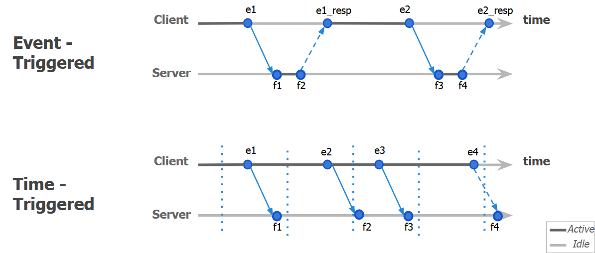

## Sistemas de control 

Todos los sistemas de control por lo general tiene que cumplir con especificaciones temporales y sean RT, pero no todo sistema RT es un sistema de control.

Un sistema de control es un conjunto de componentes que intenta controlar  (de forma manual o automatica) el comportamiento de un sistema para obtener los resultados deseados. Por ejemplo procesos quimicos, enfriadores, calentadores, termostatos, ascensores, electrodomésticos, etc.

### Nociones 

**Control**: capacidad de actuar para garantizar que suceda un algo

**Proceso**: sucesion de operaciones que se desea controlar

**Variable controlada**: valor que se mide o controla. Por lo general es la salida del sistema. EJ: tengo un Aire acondicionado, la variable que quiero controlar es la temperatura.

**Variable manipulada**: valor que se modifica para afectar el valor de la variable controlada. Ej: velocidad del ventilador, diferencia de tención, tiempo prendido del aire acondicionado.

**Perturbación**: señal que afecta la salida del sistema (var. controlada) y no me deja llegar al valor que yo quería. EJ: alguien dejo la ventana abierta y yo quiero enfriar con el aire. El sistema de control no sabe de la perturbación y encima no sucede todo el tiempo y no es constante (no sabemos como ajustar el algoritmo para que se cancele el efecto de la perturbacion)

**Planta** : sistema físico sobre el cual se trabaja y se quiere controlar

**Controlador** (referencia): sistema encargado de determinar que hay que hacer para modificar el comportamiento de la planta. Esto lo hace mediante actuadores

**Actuador**: elemento físico de la planta que permite, dado un dato, actuar en el sistema para modificar la realidad de la planta

### Lazo Abierto 

- En este tipo de sistema de control, la salida del sistema no afecta a la acción del control 
- Es un sistema de control manual

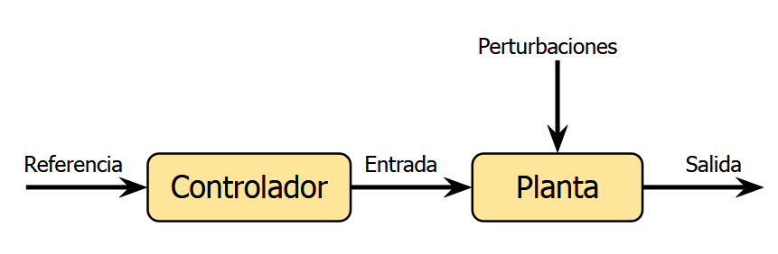

### Lazo cerrado 
- Es un sistema de control que funciona en forma automática 
- Tiene en cuenta la salida y el estado del sistema para ajustar el sistema y llevar la salida al valor deseado

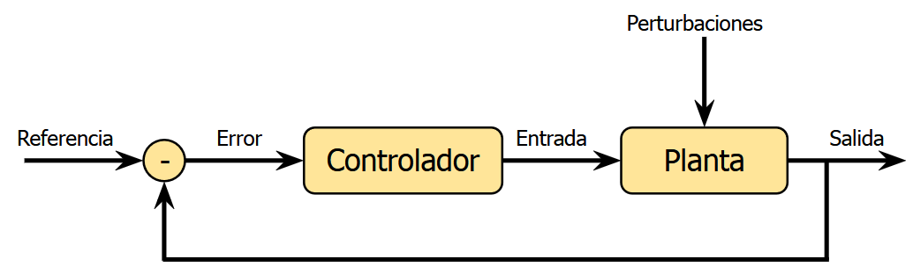

### ¿Como se porgraman estos sistemas de control? 

Se programan haciendo algo de RT:
- Arquitectura event-triggered o time-triggered 
- Scheduling non-preemptive (apropiativo), donde se apropia del control del algoritmo y no la entregan a nadie más y de acuerdo a un sistema de prioridades para poder cumplir los deadlines 
- Protocolos de comunicación específicos. No se pueden usar algoritmos de backoff ya que no son previsibles.

[Casos de estudio/Ejemplos]

# Ejercicio practico de final 

## Diseño de arquitectura de gran escala 

Pasos para resolver

Leer los requirimientos bien: 
- Con quien se debe comunicar, 
- cantidad de datos que se envian al sistema, 
- que datos se envian al sistema, 
- de que es el sistema

Hay que ver donde arranca y termina la app (scope del sistema)

Tambien hay que tener en cuenta cuales son los campos/estructuras a transmitir y los endpoints que me piden 

Una vez se tienen las cosas del requirimientos (endpoints, limites del sistema y datos), toca refinarlos:
- Defino la forma de los endpoints: /POST /api/... y el json a pasar con que datos y si debo retornar algo (un ID/URL, etc) -> se usa linea de puntos

Tambien debo ver el volumen de datos que debo guardar y que cosas guardo. Además, debo ver como particionar el storage (justificando) (Si uso ID, si uso fecha, etc.)

Al calcular el volumen de los datos, hay que acordarse de que las cuentas son parametrizables y estimar odenes de magnitud (si es del orden de KBs, MBs, GBs, etc)

Una vez esta todo el tamaño de datos, hace un diagrama de robustez o un DAG para mostrar todo. Acordarse en el diagrama de anotar que se pasa por cada cola

OBS -> Acordarse de anotar cuales son parámetros y las cosas que asumo

OBS -> Si algo no esta claro, puedo asumir cosas

OBS -> Hay que identificar lo problemas geográficos también y plantear alguna solución. En algunos casos puedo hacer server central o usar repetidores de información

OBS -> Hay que tener en cuanta si hay que almacenar mucha info o hay que descartarla.

### Deteccion de violaciones de trafico 

De los requirimientos,, se obtiene que:
- El sistema recibe imágenes y señales (tipo de luz) de los semáforos. En este caso, hay que ver cual es la resolución de las fotos.
- El sistema debe procesar las imágenes y avisar sobre infracciones. Debo poder obtener la pantente de la imágen y relacionarla con el propietario
- Debe comunicar la infraccion al dueño del vehículo y al ente regulador . En este caso debo obtener al dueño del vehículo, dada la patente.
- Acceso por parte del personal del gobierno para poder ver las infracciones. Esto también implica que hay que guardar las infracciones (puedo asumir que sea para siempre)
- Puedo asumir que la información de las imagenes y señales me las mandan a un endpoint
- Algo que no se dice, es que la dirección del semáforo es importante.

Ahora toca refinar, empezamos por los endpoints  

- Defino las rutas de los endpoints y los datos a enviar

recolectar imágenes: POST /api/photo y el json es 
{

}

Endpoint para acceder y ver infracciones ??

Luego debo ver como hago para procesar todas las imágenes que llegan y si lo hacen de forma asincronica. 

Tambien puedo definir que haya varios servidores/hubs "cercanos" a distintas zonas de los semáforos y que se comuniquen con un hub central. En este caso vamos a decir que hay un conversor cada x semáforos que recibe la info y la manda al HUB

OBS -> Puede hacerse que el hub solo mande las infracciones al servidor central y que los hubs reciban todos (funciona como filtro?)

Como defino el tamaño de los datos que recibo? Para separar los datos de grandes volumenes de los que no
- Cuanto pesa la imágen de la patente? Depende de la resolución: cadapixel tiene RGB (3 bytes por cada pixel). Si, por ejemplo, la resolución es de 600x400, tengo 240.000 pixeles y eso lo debo multiplicar por 3 bytes -> ~750.000 bytes
En este caso, asumo que esta en escala de grises (1 bytes por pixel) -> 250.000 bytes

- Cuanto pesa el string de la patente? 1 byte por cada letra, por ejemplo char[10] (aumento un poco más del limite actual)
- Nombre y dir del propietario: char[70] para el nombre ya que no hay nombres tan largos y para la dirección char[250] teniendo en cuenta distrito, subdistrito, etc
- Lugar de la infracción: char[250]
- Estado de luz: si solo envio fotos en rojo, no me importa. La luz amarilla se puede omitir, asi que por lo menos 1 bit 

En este caso, el dato representativo es el peso de la foto porque los demás pueden despreciarse

Entonces, el tamaño de cada foto es del orden de 1MB

Ahora debo estimar cuantas fotos se mandan en el sistema. Para esto debo decidir en cuanto tiempo dias/ años por tema de almacenamiento

Tambien debemos saber cuantos semáforos hay que envian imágenes, como no se cuanto hay, debo estimar/calcular cuantas intersecciones deben tener semáforo por ejemplo 1 cada 2 intersecciones en calles y en cada intersección en las avenidas. Como son despreciables la cantidad de avenidas, puedo despreciarlo y que tengo 1 semaforo cada 2 intersecciones

Ahora solo necesito calcular la cantidad de intersecciones. Para esto debo asumir/estimar cuanto tiene de largo la ciudad y en base a eso (asumiendo que es cuadrado perfecto). Por ejemplo 10 km es el largo

En 10km tengo 100 manzanas entonces tengo 100x100 cruces = 10.000

Por lo tanto la cantidad de semáforos enviando datos es de: (1/2) * 10.000 = 5000 semáforos 

Para saber cuanto se envia de datos, debo sabe cuanto se envía por semáforo cada 1 minuto por ejemplo (esto lo invento y lo dejo parametrizado). En este caso, asumo que hay 5 foto por minuto.

Por lo tanto, por día, cada semáforo saca 5 * 5000 * 60 *  24 = 36.000.000}

Por lo tanto, tengo 36 millones de megas -> 36 TBs de info. Como es muchísimo, voy a necesitar escalar el almacenamiento y un procesamiento para borrar fotos que no son infracciones.

Para evitar eso, puedo solo recibir las infracciones y no cualquier imágen. Entonces, el sistema solo recibe las fotos cuando son en rojo.

Entonces debo conocer cuantos de los autos que pasan, estan en infracción

En cuanto a la dirección de los semaforos, puedo asumir que hay una base que sabe de donde estan los semáforos y con eso puedo mandar un ID de semáforo, reduciendo los datos enviados 
